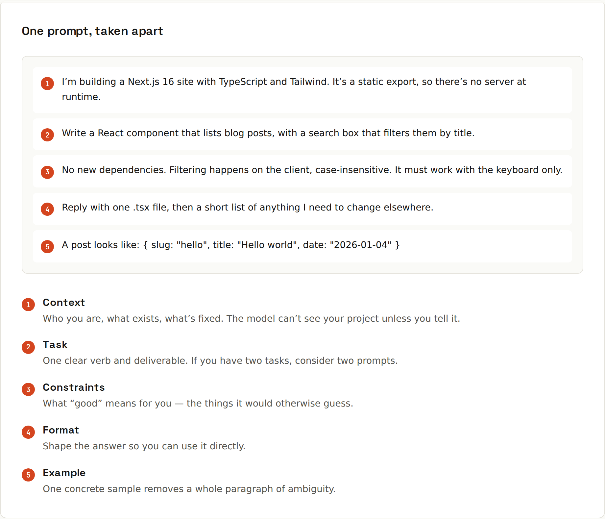

# Anatomy of a Prompt

**Five parts of a prompt that lands the first time.** Not every prompt needs all five: a quick question needs none. The more the answer depends on details only you know, the more parts you'll want.



| # | Part | What it does | Example |
|---|---|---|---|
| 1 | **Context** | who you are, what exists, what's fixed. The model can't see your project unless you tell it | "I'm building a Next.js 16 site with TypeScript and Tailwind. It's a static export, so there's no server at runtime." |
| 2 | **Task** | one clear verb and deliverable. If you have two tasks, consider two prompts | "Write a React component that lists blog posts, with a search box that filters them by title." |
| 3 | **Constraints** | what "good" means for you: the things it would otherwise guess | "No new dependencies. Filtering happens on the client, case-insensitive. It must work with the keyboard only." |
| 4 | **Format** | shape the answer so you can use it directly | "Reply with one .tsx file, then a short list of anything I need to change elsewhere." |
| 5 | **Example** | one concrete sample removes a whole paragraph of ambiguity | `A post looks like: { slug: "hello", title: "Hello world", date: "2026-01-04" }` |

## The full prompt
```
I'm building a Next.js 16 site with TypeScript and Tailwind. It's a static
export, so there's no server at runtime.

Write a React component that lists blog posts, with a search box that
filters them by title.

No new dependencies. Filtering happens on the client, case-insensitive.
It must work with the keyboard only.

Reply with one .tsx file, then a short list of anything I need to change
elsewhere.

A post looks like: { slug: "hello", title: "Hello world", date: "2026-01-04" }
```
Every sentence removes a guess: the framework version (no outdated APIs), static export (no server actions), no new libraries, accessibility, the data shape, and exactly what to return.

## Context: how much?
Enough that a competent colleague who just joined could do the task. Useful context:
- **Stack and versions** ("Java 21, Spring Boot 3.5, Gradle Kotlin DSL"),
- **the relevant code** (the function, its callers, the types involved),
- **the goal behind the task** ("so users can find old posts quickly": the model can then make sensible small decisions),
- **who the output is for** ("for a client who isn't technical", "for my apprenticeship report").

Not useful: your whole codebase, your life story, apologies, "please" repeated five times (politeness is fine; it just doesn't replace specifics).

## Task: one verb
"Write", "fix", "explain", "review", "compare", "convert", "summarise", "list". Vague verbs ("improve", "look at", "help with") produce vague answers ([[ai-prompting/Before and After]]).

## Constraints: say what "done" means
"Tests must pass", "keep the public API unchanged", "no `any` in TypeScript", "max 150 words", "use only the standard library", "must run on Java 17". If you'd reject an answer for it, say it up front.

## Format: ask for the shape you'll use
A diff, a single file, a table, JSON matching a schema ([[ai-prompting/Structured Output]]), three bullet points, "code only, no explanation", or "explain first, then code".

## Order
A good default: context → task → constraints → format → example → the material (code, document) at the end, fenced with tags or code blocks. For very long material, some models do better with the documents first and the question last: put the question after the data.

Next: see the difference in [[ai-prompting/Before and After]].
