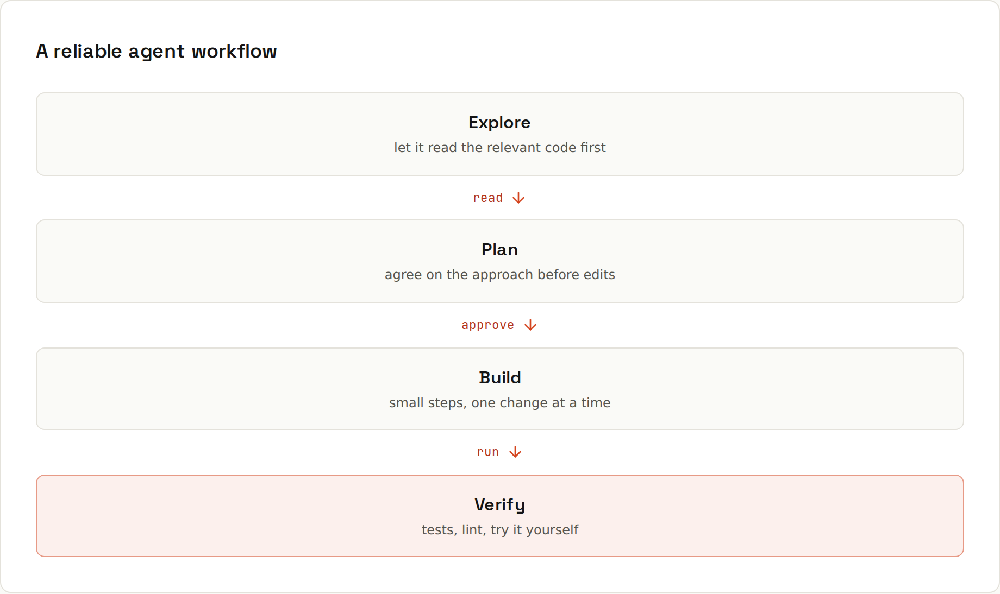

# Coding Agents

**Explore, plan, build, verify.** Agents like Claude Code, GitHub Copilot's agent mode, Cursor's agent, OpenAI Codex or Gemini CLI can read your repository, run commands and edit files. That power works best in a steady rhythm, with you reviewing every step.

## Chat assistant vs coding agent
| | Chat assistant | Coding agent |
|---|---|---|
| sees | what you paste | your repository (it searches and reads files itself) |
| does | answers with text and code | edits files, runs commands, tests, commits |
| you | copy code in and out | review diffs and approve actions |
| best for | questions, explanations, single functions | multi-file changes, bugs you can reproduce, chores |

How they work inside: [[ai-prompting/How Agents Work]].

## The rhythm
1. **Explore**: "Read the code involved in checkout and explain how the cart total is computed. Don't change anything yet."
2. **Plan**: "Propose a plan to add discount codes. List the files you'd change and any open questions." Review, correct, approve. Many agents have a dedicated **plan mode** that can't edit files.
3. **Build**: "Implement step 1 of the plan." Small steps, each reviewable.
4. **Verify**: "Run `npm test` and `npm run lint` and fix any failures." Then you check the diff and try it yourself.
5. **Commit** at each good checkpoint, so any bad step is one `git restore` away.

## Good vs bad agent tasks
| Instead of | Prefer |
|---|---|
| "Improve the app." | "The /cart page takes 3 s to load. Find why and fix it. Measure before and after with `npm run bench`." |
| letting it run for an hour on a vague task, then reviewing 60 changed files | asking for a plan first, approving it, and reviewing in small steps |
| re-explaining the project's commands and conventions every session | writing them once into `CLAUDE.md` or `AGENTS.md` ([[ai-prompting/Project Instructions]]) |
| "fix the tests" (it may weaken the tests) | "Make the failing test pass without changing the test. If you think the test is wrong, stop and tell me why." |
| "update all dependencies" | "Update `vitest` to the latest minor version, run the tests, and summarise breaking changes from the changelog." |

## Give it a way to check its work
Test commands, a linter, a type checker, a build script, a URL to load, a screenshot tool. **An agent that can verify fixes its own mistakes; one that can't just says "done".** Mention the commands in the prompt or in project instructions.

## Stay in control
- **Start from a clean working tree** (`git status`), ideally on a branch ([[git/Branches]]).
- **Keep permissions tight**: approve commands that change things (installs, deletes, pushes, deploys); allow-list read-only ones to cut the prompts.
- **Review the diff**, not the agent's summary. "All tests pass" in a summary isn't proof: look at the test output.
- **Interrupt early** when it heads the wrong way; correcting after 10 files is harder than after one.
- **Clear the context** between unrelated tasks.

## You're still the engineer
Review every diff before it ships. Never paste passwords, API keys or customer data into a prompt. Run the tests yourself. An agent saying "done" isn't proof that it works ([[ai-prompting/Reviewing AI Code]]).
