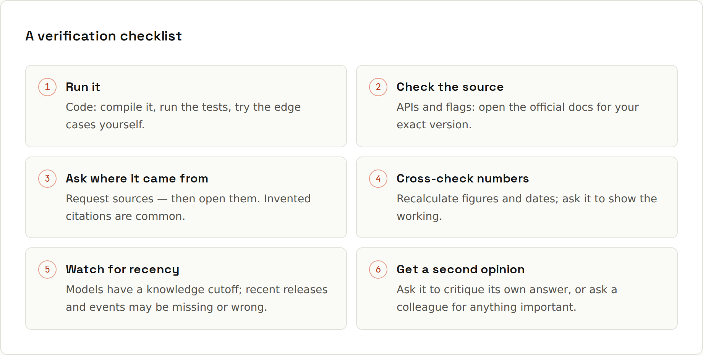

# Hallucinations

**Fluent is not the same as true.** Language models generate the most plausible continuation of text. Usually that's also correct, but when it isn't, the wrong answer sounds just as confident as a right one. That's a **hallucination**.

## Where the risk is higher
| Higher risk | Why |
|---|---|
| exact numbers, dates, prices, statistics | easy to produce plausible-but-wrong specifics |
| citations, links, paper titles, quotes | can be invented wholesale |
| niche libraries, config flags, CLI options | less training data; may blend similar tools |
| anything after the model's knowledge cutoff | it may not know, and may not say so |
| legal, medical, financial specifics | high stakes: verify with a qualified source |
| "what does my code do" without the code | it guesses from names |

## Typical coding hallucinations
- A method that "should" exist: `list.sortedByDescending { }` exists in Kotlin, but a similar-sounding one on a Java `List` may not.
- A config option from a different tool or version (a Webpack option suggested for Vite, a Next.js 12 API for Next.js 16).
- A package that doesn't exist ([[ai-prompting/Reviewing AI Code]]).
- A CLI flag that's plausible but wrong: always check `--help`.
- A "fixed" bug that was never there, or a test that tests nothing.

## Reduce it
1. **Give it the source.** Paste the docs page, the file, the error. Answers grounded in provided text are far more reliable than answers from memory.
2. **Make "I don't know" allowed.** "If you're not sure, say so rather than guessing."
3. **Ask for quotes.** "Quote the sentence from the document that supports each point."
4. **Use search-enabled tools** for current facts, and click the sources.
5. **Ask for the version** it's assuming: "Which version of the API is this for?"
6. **Break it down.** Long, complex answers accumulate errors.

## Catch it
- **Run code**: compilers and tests catch invented APIs immediately.
- **Check official docs** for any API, flag or setting you didn't know.
- **Open the links**; check that a cited source says what's claimed.
- **Ask again in a new chat**: inconsistent answers are a warning sign.
- **Be most sceptical when it tells you what you hoped to hear.**

## It's not lying
The model has no intent; it has no reliable internal sense of "I know this" vs "this sounds right". That's why verification is your job, and why grounding it in real material works so well.
