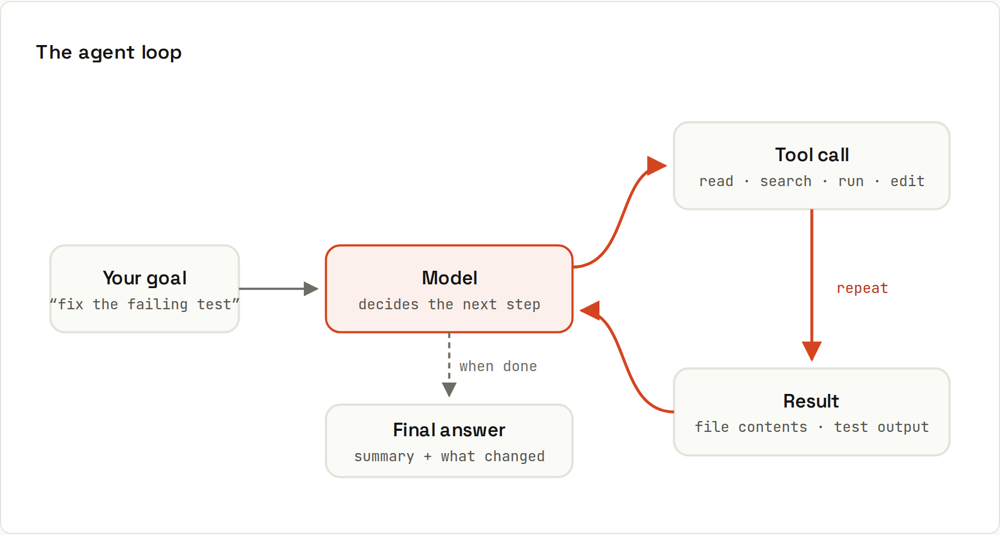

# How Agents Work

**An agent is a model in a loop with tools.** A coding agent doesn't answer in one go. It picks a tool, looks at the result, and decides what to do next, dozens of times, until the goal is met or it needs you.

## The loop
1. The app sends the model: the system prompt, **tool descriptions**, project instructions, the conversation, and your task.
2. The model answers with either text (done or asking you) or a **tool call**: a structured request like `{"tool": "read_file", "path": "src/cart.ts"}`.
3. The app **runs the tool** (possibly after asking you for permission) and appends the result to the context.
4. Back to step 2 with the new information.

The model never touches your files directly: the **app** executes tools, which is why permissions are enforced there.

## Typical tools
| Tool | Used for |
|---|---|
| read file, list files, search (grep/glob) | exploring the codebase |
| edit / write file | making changes |
| run shell command | tests, builds, linters, git |
| web search / fetch | docs, changelogs |
| browser / screenshot | checking a web UI |
| sub-agents | delegating a search or a side task with its own context |
| MCP servers | anything else: issue trackers, databases, design tools |

**MCP (Model Context Protocol)** is an open standard for connecting AI apps to tools and data sources. A "GitHub MCP server", for example, gives the agent tools for issues and pull requests.

## Why context management matters
Every file read and every command output lands in the context window ([[ai-prompting/Tokens and Context]]). An agent that reads 50 large files fills it up, and gets slower and less precise. Good agents search first and read selectively; long sessions get **compacted** (summarised). You help by:
- pointing it at the right files ("the bug is in `src/cart/`"),
- keeping project instructions short and relevant,
- starting fresh sessions for new tasks.

## Why "a way to check" matters so much
In the loop, a failed test is just another tool result. The model reads the failure and tries again. With a test suite, lint and type checks, an agent iterates towards working code. Without them, it can only guess that it's done.

## Permissions and safety
- Agents typically ask before editing files or running commands; you can allow-list safe commands (`npm test`, `git status`) and keep risky ones (`rm`, `git push`, deploys) on approval.
- **Sandboxes** (containers, cloud environments) limit what a mistake can damage.
- **Prompt injection**: text the agent reads (a web page, an issue comment, a README in a dependency) can contain instructions. An agent with broad permissions could follow them. Keep permissions tight, review actions on untrusted input, and don't give agents secrets they don't need ([[ai-prompting/Privacy and Safety]]).
- **Git is your safety net**: commit checkpoints, work on branches.

## Headless and background agents
Agents can also run without a chat window: in CI (e.g. reviewing pull requests), from the command line in scripts, or as cloud sessions you check on later. Same loop, same rules: clear task, a way to verify, limited permissions, human review before merging.
