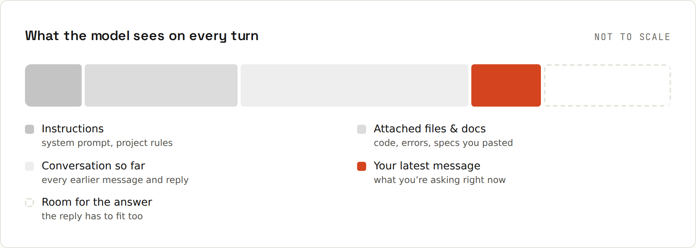

# How Models Read

**The model only knows what's in the window.** Every reply is built from one thing: the **context window**, everything sent so far in this conversation. It doesn't see your screen, your repository or your last chat unless that text is in there.

## What's in the window
| Layer | Set by | Example |
|---|---|---|
| system prompt | the app or developer | "You are a helpful assistant…", tool descriptions ([[ai-prompting/System Prompts]]) |
| project / custom instructions | you, once | "I write Kotlin; answer in German" ([[ai-prompting/Project Instructions]]) |
| attached files, search results, tool output | you or the tool | a pasted file, a web page, the output of `npm test` |
| the conversation | you and the model | every message so far |
| your latest message | you | the question |

The model reads all of it, every turn, and predicts a continuation. There's no hidden memory beyond that (unless the app adds a "memory" feature, which works by inserting saved notes into the window).

## How the answer is made
A large language model (LLM) generates text **one token at a time**, each time choosing a likely next token given everything before it ([[ai-prompting/Tokens and Context]]). It learned these probabilities from huge amounts of text, then was trained further to follow instructions and be helpful. Consequences:
- It's excellent at **patterns it has seen** many times: common code, explanations, rewording.
- It produces **fluent** text whether or not it's correct ([[ai-prompting/Hallucinations]]).
- It knows nothing after its **knowledge cutoff** unless you (or a search tool) put newer information in the window.
- The same prompt can give **different answers**: some randomness is part of generation.

## Great at / needs you for / watch out for
| Great at | Needs you for | Watch out for |
|---|---|---|
| first drafts, explanations at your level, boilerplate, refactors, translating code between languages, summarising, brainstorming | what's in your head: project conventions, the real requirements, what "done" means. It can't guess those well | confident mistakes: invented APIs, outdated versions, subtle bugs, made-up sources. Fluent isn't the same as correct |

## New topic? New chat
Long conversations fill the window with old, half-relevant material: early decisions you've since changed, code that no longer exists, error messages from three attempts ago. When you switch tasks, start fresh and paste in only what matters. Many tools let you summarise the old chat into a short brief first.

## It can't see what you can see
Frequent misunderstandings come from assuming shared context:
- "Fix the bug" → which bug? Paste the error ([[ai-prompting/Debugging with AI]]).
- "Make it look like the other page" → it has never seen the other page.
- "Use our usual style" → describe it once, in project instructions.
- "Why doesn't this work?" + a screenshot of half the code → paste the actual code as text, including imports and versions.

Next: [[ai-prompting/Tokens and Context]].
