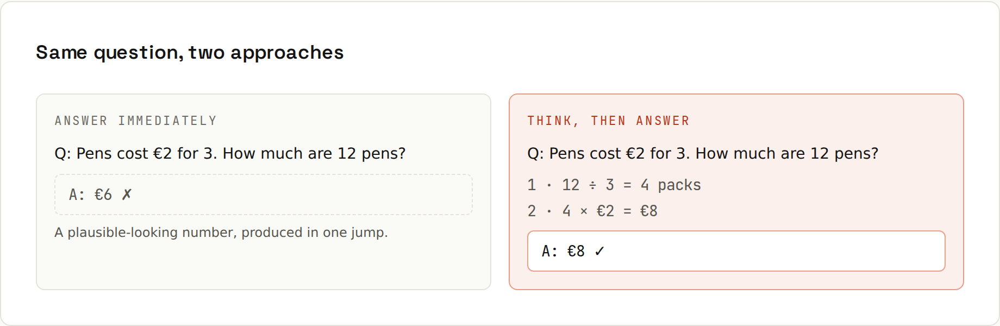

# Letting It Think

**Multi-step problems go better with visible steps.** A model produces its answer token by token. Asking it to work through the problem first, or using a model's built-in thinking mode, gives it room to get intermediate steps right before committing to an answer.



## Where it helps
| Helps a lot | Barely matters |
|---|---|
| maths and multi-step logic | simple facts and definitions |
| debugging: "why does this fail?" | rewording or translating text |
| planning a change across many files | short formatting tasks |
| comparing options against criteria | autocomplete-style code |

## How to ask for it
- "Think through this step by step before answering."
- "First list the possible causes, then pick the most likely and explain why."
- "Before you write code, describe the algorithm and its edge cases."
- "Compare the three options in a table against these criteria, then recommend one."

For debugging, asking for **hypotheses before a fix** avoids confident patches for the wrong problem ([[ai-prompting/Debugging with AI]]).

## Thinking modes
Most current models have a built-in **extended thinking / reasoning** mode: they reason internally (sometimes shown as a collapsible "thinking" section) before the visible answer. In apps it's a toggle or a model choice; in APIs, a parameter with a token budget.
- Turn it on for hard problems: tricky bugs, architecture, algorithms, long analyses.
- Leave it off for quick questions: it's slower and uses more tokens.
- With thinking enabled you rarely need "think step by step"; describing *what* to consider still helps.

## Separate reasoning from the answer
When you need a clean result (e.g. for code to parse), ask for reasoning in one place and the result in another:
```
Work out the answer inside <thinking> tags, then give only the final
number inside <answer> tags.
```

## Numbers: let it calculate, don't let it guess
Tokenizers chunk numbers oddly (`1234567890` → `123` `456` `789` `0`, see [[ai-prompting/Tokens and Context]]), so mental arithmetic on long numbers is unreliable. Better:
- ask it to write and run code (if the tool can execute code),
- or ask for the formula and compute it yourself,
- and check any figure you'll rely on.

## Reasoning isn't proof
A plausible chain of steps can still contain a wrong step, and the final answer can even disagree with the reasoning. Read the steps; they make errors easier to spot, not impossible.
