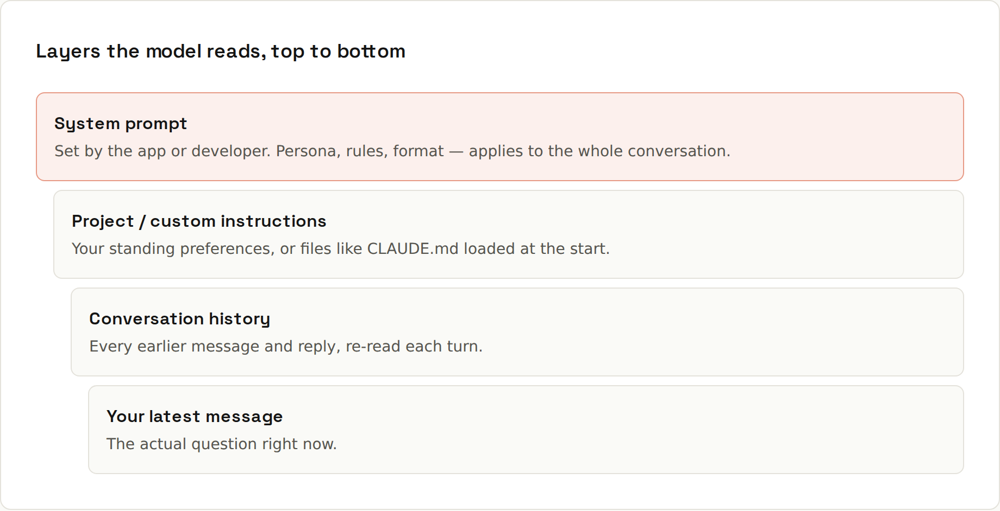

# System Prompts

**Standing instructions sit above the conversation.** A system prompt shapes every reply: role, rules, tone, format. In chat apps you control a version of it through custom or project instructions; when building your own AI feature via an API, you write it yourself.



## An example system prompt
```
You are a senior code reviewer for a TypeScript + React codebase.

Rules:
- Review only the diff you are given. Do not rewrite unrelated code.
- Rank findings: bugs first, then security, then readability.
- For each finding, quote the line, explain the problem in one
  sentence, and propose a fix.
- If the diff looks fine, say so in one line. Don't invent issues.

Format: a numbered list. No introduction, no summary.
```
What each part does:
| Part | Effect |
|---|---|
| role ("senior code reviewer for TypeScript + React") | sets expertise, vocabulary and standards |
| scope ("only the diff") | prevents unrequested rewrites |
| priorities ("bugs first…") | tells it what matters when there's a lot to say |
| per-item shape ("quote the line…") | makes the output scannable and actionable |
| permission to say "fine" | reduces invented issues |
| format ("no introduction") | removes filler |

## Where you set them
| Tool | Where |
|---|---|
| Claude, ChatGPT, Gemini apps | custom instructions / personalisation (all chats) and **projects** (per project, with files) |
| Coding agents | `CLAUDE.md`, `AGENTS.md`, `.github/copilot-instructions.md`, `.cursor/rules` ([[ai-prompting/Project Instructions]]) |
| APIs | the `system` parameter (Anthropic) / a system or developer message (OpenAI) |

## Writing good ones
- **Be specific and positive**: "Answer in German, with short paragraphs" beats "don't be verbose".
- **Explain reasons** for unusual rules ("…because the output is read aloud by a speech engine").
- **Keep it focused**: every sentence is read on every turn; long lists of edge cases dilute the important rules.
- **Test it**: try it on a few typical and a few tricky inputs, then adjust. Treat it like code: versioned, reviewed, with examples of expected behaviour.

## Custom instructions worth having
For a developer using a chat assistant daily:
```
I'm a Java/Kotlin developer (Fachinformatiker apprentice), also building
Next.js websites. Prefer Kotlin examples unless I ask for Java.
Keep answers short; I'll ask for details. Use metric units.
When you're unsure about an API or version, say so.
If I write in German, answer in German.
```

## System prompts are not security boundaries
If you build an app on a model, users can try to talk it out of its instructions ("ignore previous instructions…"), and text inside documents it reads can contain instructions too (**prompt injection**). Never put secrets in a system prompt, and enforce permissions in code, not in the prompt ([[ai-prompting/Privacy and Safety]]).
