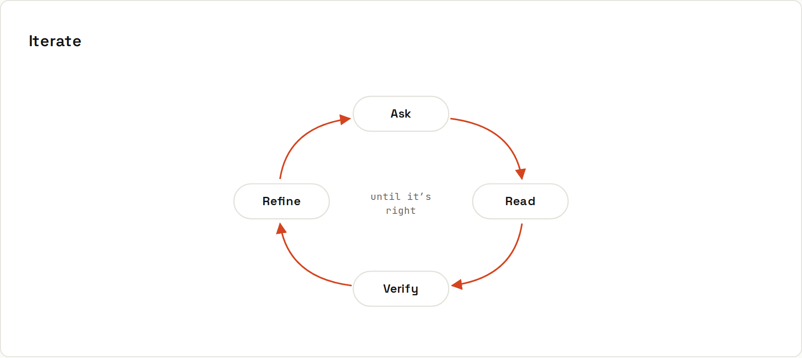

# The Loop

**Prompting is a conversation, not a single shot.** The first answer is a draft. Read it, check it, then say precisely what to change, instead of starting over or repeating yourself louder.

## Weak vs strong follow-ups
| Weak | Strong |
|---|---|
| "that's wrong, try again" | "The filter is case-sensitive; make it case-insensitive. Keep everything else exactly as it is." |
| → the model has to guess what was wrong, and often changes the parts that were right | → names the problem, the fix, and what must not change |
| "still doesn't work" | "Now it compiles, but `total()` returns 0 for `[{price: 5}]`. Here's the test output: …" |
| "make it shorter" | "Cut it to 80 words; keep the deadline and the price." |
| "use a better approach" | "Don't use a regex here. Parse the date with `java.time.LocalDate.parse` instead." |

## The loop, step by step
1. **Prompt** with context, task, constraints, format ([[ai-prompting/Anatomy of a Prompt]]).
2. **Read** the whole answer. Skimming is how invented function names slip through.
3. **Check**: run it, test it, compare with the docs ([[ai-prompting/Reviewing AI Code]]).
4. **Refine** with a precise follow-up, or fix it yourself when that's faster.

## When to start over instead
- The conversation has gone in circles for three or four rounds.
- An early wrong assumption is baked into everything since.
- You've changed your mind about the requirements.

Start a fresh chat with a **better first prompt**: include what you learned ("don't use library X, it doesn't support Y"). Or edit your original message (most apps allow it) so the bad branch disappears from the context.

## Keep what's good
- "Keep everything else exactly as it is" prevents collateral rewrites.
- Ask for **only the changed part** ("show only the updated function") on long files, then paste it in yourself, or ask for a diff.
- If the model keeps "fixing" something you like, say so explicitly: "The error handling is right; don't touch it."

## Know when to stop prompting
If you've spent 20 minutes prompting for a 5-minute change, write it yourself. AI is a tool, not an obligation. For learning, it's often better to ask for a hint than for the solution.
