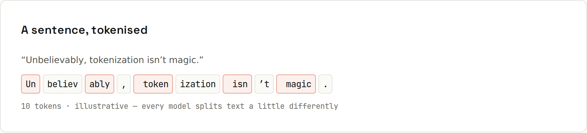

# Tokens and Context

**Models read tokens, not words.** Text is split into **tokens**: whole words, pieces of words, punctuation. Context windows, output limits and API prices are all measured in tokens.



## A real tokenizer
Output of `code/ai-prompting/tokens.py` with OpenAI's `o200k_base` tokenizer (GPT-4o family). Claude, Gemini and Llama use their own tokenizers, so exact counts differ, but the patterns are the same:
```
39 chars -> 9 tokens: ['Un', 'bel', 'ievably', ',', ' token', 'ization', " isn't", ' magic', '.']
11 chars -> 2 tokens: ['Hello', ' world']
28 chars -> 8 tokens: ['Hallo', ' Welt', ',', ' wie', ' geht', ' es', ' dir', '?']
63 chars -> 16 tokens: ['R', 'ind', 'fle', 'ische', 'tik', 'ett', 'ierungs', 'über', 'wach', 'ungs', 'auf', 'gaben', 'über', 'tragung', 'sges', 'etz']
57 chars -> 19 tokens: ['const', ' total', ' =', ' items', '.reduce', '((', 'sum', ',', ' i', ')', ' =>', ' sum', ' +', ' i', '.price', ',', ' ', '0', ');']
10 chars -> 4 tokens: ['123', '456', '789', '0']
13 chars -> 4 tokens: ['   ', ' return', ' x', ';']
2 chars -> 2 tokens: ['🙂', '👍']
```
What to notice:
- Common words are one token, **including the leading space** (`' world'`).
- Rare or long words are split into pieces (the famous German word takes 16).
- **Code** is token-hungry: punctuation and operators are separate tokens.
- **Numbers** are chunked into groups of digits, one reason models are unreliable at exact arithmetic ([[ai-prompting/Letting It Think]]).

## Rule of thumb: ≈ 4 characters per token
In English, 100 tokens is roughly 75 words. Code, numbers and many other languages (German, especially with long compounds) use more tokens for the same length.

## Two limits: context vs output
| Limit | Caps | Typical size (2026) |
|---|---|---|
| **context window** | everything the model can see at once: instructions + conversation + files + its answer | 200,000 tokens and up; some models 1 million |
| **max output** | how long a single reply can be | tens of thousands of tokens |

200,000 tokens is roughly a 500-page book, or a medium-sized codebase's most important files, not a whole enterprise repository. Coding agents therefore **search and read selectively** instead of loading everything ([[ai-prompting/How Agents Work]]).

## Temperature
An API setting for randomness: low values give focused, repeatable answers; high values give more varied ones. Chat apps choose it for you. For code, extraction and classification you want low; for brainstorming, higher.

## Why long chats get worse
Every turn re-sends the whole conversation. As it grows, costs rise, replies slow down, and important early details compete with everything since. Models attend less reliably to details buried in the middle of very long contexts. Some tools **summarise ("compact")** old context automatically, which also loses detail.

Practical consequences:
- Put the most important instructions **at the start** (system/project instructions) and restate critical constraints near the question.
- Paste the **relevant** part of a log, not 5,000 lines of it.
- Start a new chat for a new task ([[ai-prompting/How Models Read]]).

## Cost
APIs charge per token, usually more for output than input, with discounts for **cached** input (the same long prefix sent repeatedly). In a chat subscription you don't see prices, but long contexts still count toward usage limits.
