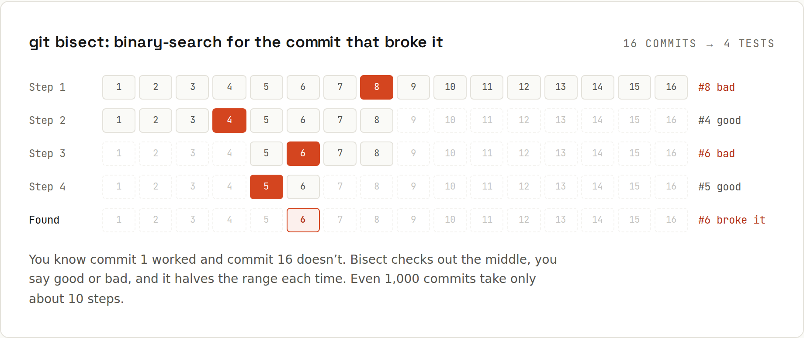

# Bisect

Something that worked in `v1.0.0` is broken now, and there are hundreds of commits in between. `git bisect` does a **binary search**: it checks out the commit in the middle, you say "good" or "bad", and it halves the range each time. 1,000 commits take about 10 tests.



## By hand
```sh
git bisect start
git bisect bad                 # the current commit is broken
git bisect good v1.0.0         # this release was fine
# Git checks out a commit in the middle. Test it, then:
git bisect good                # or: git bisect bad
# ...repeat until Git prints "<hash> is the first bad commit"
git bisect reset               # go back to where you started
```
Can't test a particular commit (it doesn't build)? `git bisect skip` picks a neighbour.

## Let a script decide
If a command can tell good from bad by its **exit code** (0 = good, 1–124 = bad, 125 = skip), Git runs the whole search on its own.

Example: `add(2, 2)` should be 4. Somewhere in 15 commits after `v1.0.0`, someone broke it. The test:
```js
// test.js
const add = require("./add"); process.exit(add(2, 2) === 4 ? 0 : 1);
```
```sh
git bisect start HEAD v1.0.0
```
```
Bisecting: 7 revisions left to test after this (roughly 3 steps)
[58691be2833ea5675e3386e7dcc929ab0db873d6] Change 7
```
```sh
git bisect run node test.js
```
```
running 'node' 'test.js'
Bisecting: 3 revisions left to test after this (roughly 2 steps)
[45b49956bdc3cb0d5e826174a2d342afd1d839cd] Change 11
running 'node' 'test.js'
Bisecting: 1 revision left to test after this (roughly 1 step)
[b3a356d639cd45cb3cdba3c89f9d9bf295082543] Change 9
running 'node' 'test.js'
Bisecting: 0 revisions left to test after this (roughly 0 steps)
[adf9f705cad8fb7a6db43a8465cd5cc781112921] Change 10
running 'node' 'test.js'
45b49956bdc3cb0d5e826174a2d342afd1d839cd is the first bad commit
commit 45b49956bdc3cb0d5e826174a2d342afd1d839cd
Author: Ada <ada@example.com>
Date:   Sat Jan 3 12:00:00 2026 +0100

    Change 11

 add.js   | 2 +-
 notes.js | 1 +
 2 files changed, 2 insertions(+), 1 deletion(-)
bisect found first bad commit
```
Four test runs for 15 commits. Look at the culprit with `git show 45b4995`, then:
```sh
git bisect reset
```
```
Previous HEAD position was adf9f70 Change 10
Switched to branch 'main'
```

## Real-world test commands
```sh
git bisect run npm test
git bisect run ./gradlew test --tests CartTest
git bisect run sh -c 'npm run build && node scripts/check-price.js'
```
Tips:
- The test must be **the same** at every commit. If your test file doesn't exist in old commits, keep it outside the repository (e.g. `/tmp/check.sh`) and run that.
- Exit with **125** when a commit can't be tested (doesn't compile): `git bisect run sh -c './gradlew build || exit 125; ./gradlew test'`.
- Bisect checks out old commits: stash or commit your work first.
- `git bisect log` shows your answers so far; `git bisect replay` repeats them.

## Terms other than good/bad
Looking for when something got *fixed* or *faster*? Rename the terms to avoid confusion:
```sh
git bisect start --term-old=slow --term-new=fast
git bisect fast HEAD
git bisect slow v1.0.0
```

## Why it's worth small commits
Bisect finds a **commit**. If that commit is "Big refactor + 3 features, 2,000 lines", you still have to search inside it. With small commits, the first bad commit usually *is* the explanation. → [[git/Commit Messages]]
