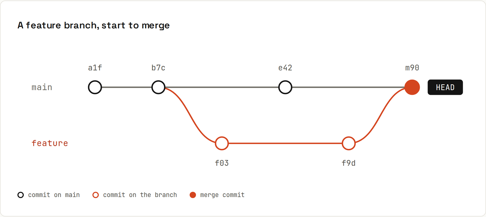

# Branches

A branch is just a **movable label on a commit**. Creating one is instant and free. Keep `main` releasable, do your work on a branch, and merge it back when it's done.



## Branch, work, merge
```sh
git switch -c feature/login   # create a branch and move onto it
```
```
Switched to a new branch 'feature/login'
```
Commit as usual. Then:
```sh
git switch main
git merge feature/login
```
```
Updating 452d49d..50ab89b
Fast-forward
 login.js | 1 +
 1 file changed, 1 insertion(+)
 create mode 100644 login.js
```
```sh
git branch -d feature/login
```
```
Deleted branch feature/login (was 50ab89b).
```
*Fast-forward*: `main` hadn't moved since the branch was created, so Git simply moved the `main` label forward. No merge commit needed. When both sides have new commits, you get a real merge: [[git/Merging]].

## What is HEAD?
`HEAD` is "where you are now", normally the branch you have checked out. Every new commit moves that branch label (and `HEAD` with it) forward by one. → [[git/Refs and HEAD]]

## Everyday branch commands
| Command | Does |
|---|---|
| `git branch` | list local branches (`*` = current) |
| `git branch -v` | … with their last commit |
| `git branch -a` | … including remote-tracking branches (`remotes/origin/…`) |
| `git branch -vv` | … with upstream and ahead/behind counts |
| `git switch <name>` | move to a branch |
| `git switch -c <name>` | create and move |
| `git switch -c <name> <start>` | create from a specific commit/branch/tag |
| `git switch -` | back to the previous branch |
| `git branch -m <new>` | rename the current branch |
| `git branch -d <name>` | delete (only if merged) |
| `git branch -D <name>` | force delete (unmerged work is lost, except via [[git/Reflog]]) |
| `git branch --merged` / `--no-merged` | which branches are (not) merged into the current one |

```sh
git branch -v
```
```
  feature/search e25efb5 Add search box
* main           bdc7cdb Merge branch 'feature/search'
```

## `switch` vs `checkout`
`git checkout` does two unrelated things: switch branches **and** restore files. Since Git 2.23, these are split into `git switch` (branches) and `git restore` (files). Old commands still work:
| Old | New |
|---|---|
| `git checkout main` | `git switch main` |
| `git checkout -b feature` | `git switch -c feature` |
| `git checkout -- file` | `git restore file` |
| `git checkout <commit>` | `git switch --detach <commit>` |

## Uncommitted changes when switching
Git carries uncommitted changes along to the other branch, **unless** they would be overwritten:
```
error: Your local changes to the following files would be overwritten by checkout:
	a.txt
Please commit your changes or stash them before you switch branches.
Aborting
```
Commit, [[git/Stash]] them, or use a [[git/Worktrees|worktree]] to have both branches checked out at once.

## Naming branches
Common conventions:
| Prefix | For |
|---|---|
| `feature/` or `feat/` | new functionality: `feature/dark-mode` |
| `fix/` or `bugfix/` | bug fixes: `fix/empty-cart-crash` |
| `hotfix/` | urgent production fixes |
| `chore/`, `docs/`, `refactor/` | maintenance |
| `release/` | release preparation (Git flow) |

Include the issue number if your team tracks issues: `fix/31-price-rounding`. Lowercase, hyphens, no spaces.

## How long should a branch live?
As short as possible: **hours to a few days**. Long-lived branches drift away from `main`, and the merge at the end becomes painful ([[git/Merge Conflicts]]). If a feature takes weeks, merge it in small pieces behind a feature flag. → [[git/Branching Strategies]]

## Branches are cheap, so use them
- Trying something risky? `git switch -c experiment`. If it fails, `git switch main && git branch -D experiment`.
- Reviewing a colleague's work? `git switch -c review origin/their-branch`.
- About to do a big rebase? `git branch backup` first. It costs nothing.
