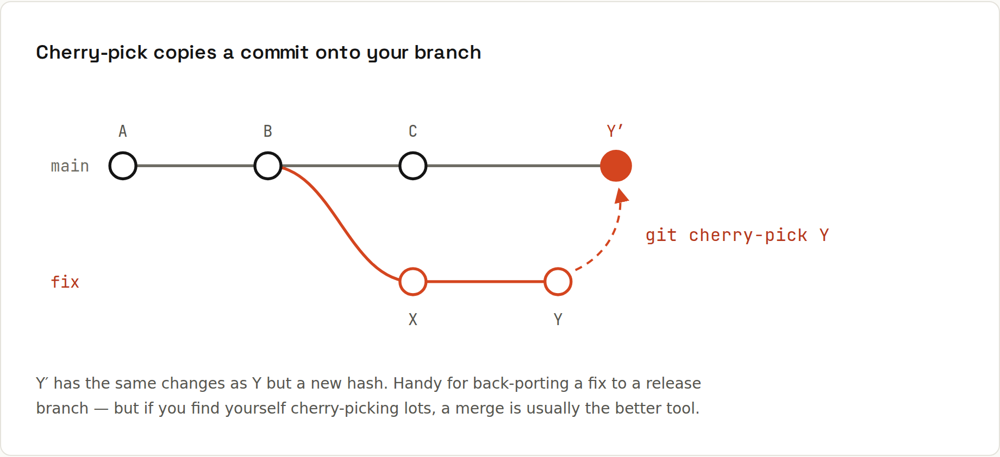

# Cherry-pick

`git cherry-pick <commit>` copies the **changes** of one commit onto your current branch, as a new commit. Classic use: a bug fix landed on `main`, and you need it on a release branch too, without everything else from `main`.



## Example: back-port a fix
`main` got a new feature (X) and a price fix. `release/1.x` needs only the fix:
```sh
git switch release/1.x
git cherry-pick 0a163ae
```
```
[release/1.x bb0be00] Fix rounding of prices
 Date: Fri Jan 2 23:00:00 2026 +0100
 1 file changed, 1 insertion(+)
 create mode 100644 fix.txt
```
```sh
git log --oneline --graph --all
```
```
* bb0be00 Fix rounding of prices
| * 0a163ae Fix rounding of prices
| * a5e1452 X: new checkout page
|/  
* a589ad8 A
```
Same change, same message and author (note the preserved `Date:`), but a **new commit** with a different hash: different parent, different hash ([[git/Objects and Internals]]). Git can still tell that the change is already on `main`:
```sh
git cherry -v main
```
```
- bb0be0045a6e956f88dcb70b3ac37453d65e8a93 Fix rounding of prices
```
`-` = an equivalent change exists upstream; `+` would mean "not yet on main".

## Options
| Command | Does |
|---|---|
| `git cherry-pick <c>` | copy one commit |
| `git cherry-pick <a> <b> <c>` | several, in this order |
| `git cherry-pick a1c..c55` | a range (**excluding** `a1c`) |
| `git cherry-pick a1c^..c55` | a range including `a1c` |
| `-x` | append "(cherry picked from commit …)" to the message: recommended for back-ports |
| `-n` / `--no-commit` | apply the changes but don't commit |
| `-m 1` | pick a merge commit (relative to its first parent) |
| `--continue` / `--skip` / `--abort` | after a conflict |

## Conflicts
Like a merge: fix the files, `git add`, `git cherry-pick --continue`. Changed your mind: `git cherry-pick --abort`. → [[git/Merge Conflicts]]

## When not to cherry-pick
Cherry-picking duplicates changes. If both copies later meet in a merge, Git usually handles it, but a history full of duplicates is confusing. Prefer:
- **merging** when you want *all* of another branch,
- **fix on the oldest branch, merge upward** (release → main) in teams with release branches,
- cherry-pick for the exceptions: back-ports, rescuing one commit from an abandoned branch, moving a commit you made on the wrong branch.

## Moving a commit to the right branch
Committed on `main` by mistake (not pushed)?
```sh
git switch feature/login
git cherry-pick main          # copy main's last commit here
git switch main
git reset --hard HEAD~1       # remove it from main
```

## Revert: the opposite
`git revert <commit>` applies the **inverse** of a commit as a new one. Same mechanics, same options (`-n`, `-m 1`, `--continue`). → [[git/Undoing Changes]]
