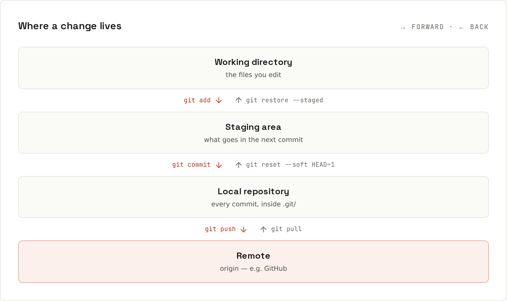

# Mental Model

Every change travels the same **four stops**. Almost every Git command moves work one stop forward or one stop back.



| Stop | What it is | Where it lives |
|---|---|---|
| **Working directory** (working tree) | the files you see and edit | your project folder |
| **Staging area** (index) | the draft of your next commit | `.git/index` |
| **Local repository** | every commit ever made, on your machine | `.git/objects` |
| **Remote** | another copy, usually on GitHub | a server, named `origin` |

## Forward and back
| Move | Forward | Back |
|---|---|---|
| working dir → staging | `git add <file>` | `git restore --staged <file>` |
| staging → repository | `git commit` | `git reset --soft HEAD~1` |
| repository → remote | `git push` | `git pull` (brings others' work down) |
| throw away edits | – | `git restore <file>` (working dir ← last commit) |

## Why a staging area?
You often change more than belongs in one commit: a bug fix *and* a renamed variable *and* a debug `println`. Staging lets you pick exactly what goes into the next snapshot, even single lines ([[git/Staging in Detail]]). One commit = one logical change makes history easy to read, review and undo.

## A commit is a snapshot, not a diff
Each commit records the **whole project** as it was: every file. That sounds wasteful, but files that didn't change are stored once and shared by all commits (they have the same content, so the same hash). Diffs are calculated when you ask for them (`git diff`, `git show`). That's why switching between versions is so fast: Git just puts the snapshot in place.

A commit also stores:
- its **parent** commit(s), which links commits into a history,
- **author** and **committer** (name, e-mail, time),
- the **message**.

Its ID (the hash, e.g. `f61c2b7`) is computed from all of that. Change anything, even one character of the message, and you get a different commit. Details: [[git/Objects and Internals]].

## Everything is local
`commit`, `log`, `diff`, `branch`, `merge` work **without a network**. Only `clone`, `fetch`, `pull` and `push` talk to a remote. Your repository is a complete copy with the full history, not a "checkout" of a server's version.

Consequences:
- Commits are private until you push. Commit early and often, clean up before pushing ([[git/Rewriting History]]).
- `origin/main` in your repository is a **bookmark** of where the server's `main` was the last time you fetched, not a live view ([[git/Remotes]]).

## The three states of a file
```
untracked ──git add──► staged ──git commit──► committed (unmodified)
                          ▲                          │
                          └──────git add◄── modified ◄┘ (you edit it)
```
`git status` always tells you which state each file is in, and the next command to move it: [[git/Daily Workflow]].
