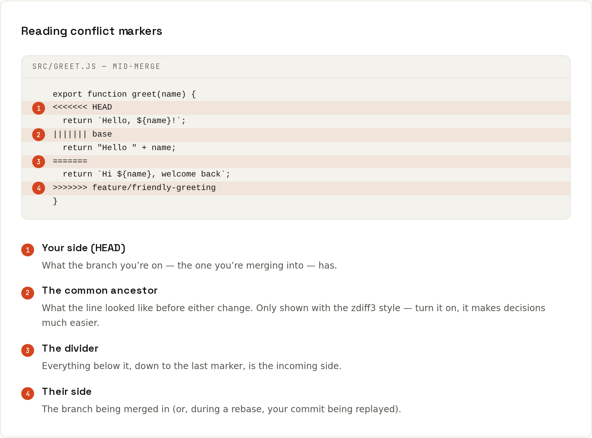

# Merge Conflicts

A conflict is Git asking you to decide, not an error. When both sides changed the **same lines**, Git can't know which version is right. It writes both into the file with markers and waits for you.



## A real conflict, start to finish
On `main`, someone made the greeting casual; on `feature/formal`, someone made it formal.
```sh
git merge feature/formal
```
```
Auto-merging greet.js
CONFLICT (content): Merge conflict in greet.js
Automatic merge failed; fix conflicts and then commit the result.
```
### 1. See what's conflicted
```sh
git status
```
```
On branch main
You have unmerged paths.
  (fix conflicts and run "git commit")
  (use "git merge --abort" to abort the merge)

Unmerged paths:
  (use "git add <file>..." to mark resolution)
	both modified:   greet.js
```
### 2. Read the markers
```sh
cat greet.js
```
```
export function greet(name) {
<<<<<<< HEAD
  return `Hi ${name}!`;
||||||| bd25c94
  return "Hello " + name;
=======
  return "Good day, " + name;
>>>>>>> feature/formal
}
```
| Section | Is |
|---|---|
| `<<<<<<< HEAD` … `\|\|\|\|\|\|\|` | **ours**: the branch you're on (`main`) |
| `\|\|\|\|\|\|\|` … `=======` | the **base**: how it was before either side changed it (only with `zdiff3`, see below) |
| `=======` … `>>>>>>> feature/formal` | **theirs**: the branch being merged in |

The base makes the decision much easier: both sides started from `"Hello " + name`; one switched to a template string, the other to a formal greeting. So the right answer probably combines both.

### 3. Edit the file
Keep one side, the other, or write a combination. **Delete all marker lines.**
```js
export function greet(name) {
  return `Good day, ${name}!`;
}
```
Then run the tests. A conflict-free merge can still be wrong; a resolved one even more so.

### 4. Mark it resolved and finish
```sh
git add greet.js
git commit --no-edit        # for a merge; during a rebase: git rebase --continue
```
```
[main b8e4a1a] Merge branch 'feature/formal'
```
```sh
git log --oneline --graph
```
```
*   b8e4a1a Merge branch 'feature/formal'
|\  
| * 483056a Formal greeting
* | bd1a84d Casual greeting
|/  
* bd25c94 Add greet
```

## You can always back out
| During | Abort with |
|---|---|
| merge | `git merge --abort` |
| rebase | `git rebase --abort` |
| cherry-pick | `git cherry-pick --abort` |
| `stash pop` | the stash is kept on conflict; `git restore .` (or `git reset --merge`) and try again |

Everything returns to the state before you started.

## Take one side for a whole file
```sh
git checkout --ours package-lock.json     # keep our version
git checkout --theirs package-lock.json   # take theirs
git add package-lock.json
```
For lock files, it's usually better to take one side and regenerate: `npm install` / `./gradlew --refresh-dependencies`.

> **Ours and theirs swap during a rebase.** Rebase replays *your* commits onto *main*, so `--ours` is main and `--theirs` is your commit. Confusing but consistent: "ours" is always the branch being built upon.

## Make conflicts easier
```sh
git config --global merge.conflictstyle zdiff3   # show the base version too (Git 2.35+)
git config --global rerere.enabled true          # reuse resolutions you've done before
git mergetool                                    # open a visual 3-way merge tool
```
IntelliJ IDEA's merge tool (three panes: yours, result, theirs) is one of the best; VS Code has a merge editor too. → [[IDEs/Git in the IDE]]

## Understanding the combined diff
While conflicted, `git diff` shows a *combined* diff with two columns of `+`/`-`, one per parent:
```diff
diff --cc greet.js
index eba409c,36cf25d..0000000
--- a/greet.js
+++ b/greet.js
@@@ -1,3 -1,3 +1,9 @@@
  export function greet(name) {
++<<<<<<< HEAD
 +  return `Hi ${name}!`;
++||||||| bd25c94
++  return "Hello " + name;
++=======
+   return "Good day, " + name;
++>>>>>>> feature/formal
  }
```
Most people prefer looking at the file or a merge tool. `git diff --ours` / `--theirs` / `--base` compare with one side only.

## Other kinds of conflict
| Status | Meaning | Resolve by |
|---|---|---|
| `both modified` | same lines changed | editing, as above |
| `both added` | both created a file with the same name | combine or rename |
| `deleted by us` / `deleted by them` | one side deleted, the other modified | `git rm <file>` to delete, or `git add <file>` to keep |
| rename/rename | both renamed the same file differently | pick a name, `git add`/`git rm` |

## Fewer conflicts in the first place
- Pull or rebase onto `main` often. Small drifts merge easily.
- Keep branches and pull requests short-lived.
- Don't reformat whole files in a feature branch; do it in a separate commit or PR.
- Agree on a formatter (Prettier, ktlint, Spotless) so whitespace never conflicts.
- Split huge files that everybody edits (routing tables, `strings.xml`, constants).
