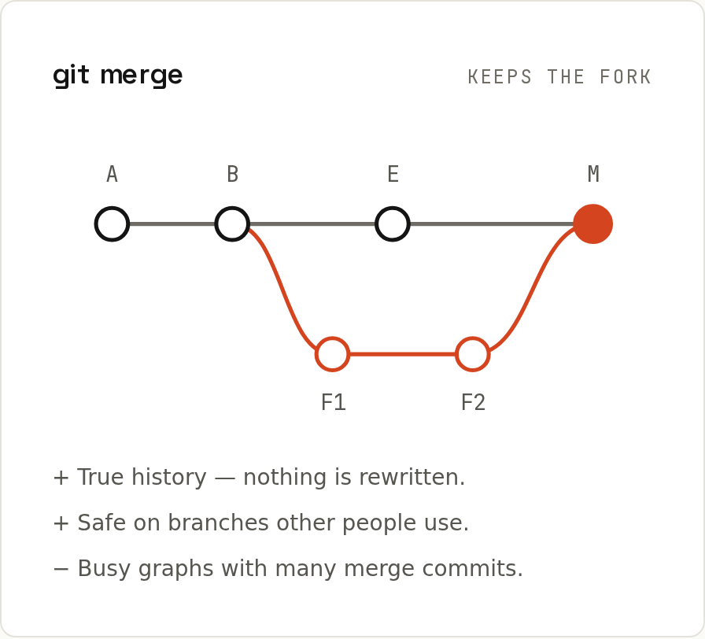

# Merging

`git merge <branch>` brings the commits of another branch into the current one. There are two cases, and Git picks automatically.



## Fast-forward
If the current branch has **no new commits** since the other branch split off, Git just moves the label forward:
```sh
git switch main
git merge feature/login
```
```
Updating 452d49d..50ab89b
Fast-forward
 login.js | 1 +
 1 file changed, 1 insertion(+)
 create mode 100644 login.js
```
No new commit is created; history stays a straight line.

## Three-way merge
If **both** branches have new commits, Git combines them in a new **merge commit** with two parents. It compares both tips with their common ancestor (the *merge base*), hence "three-way":
```sh
git merge feature/search
```
```
Merge made by the 'ort' strategy.
 search.js | 1 +
 1 file changed, 1 insertion(+)
 create mode 100644 search.js
```
```sh
git log --oneline --graph
```
```
*   bdc7cdb Merge branch 'feature/search'
|\  
| * e25efb5 Add search box
* | 22e0ab4 Update a.txt on main
|/  
* 50ab89b Add login form
* 452d49d Initial commit
```
`ort` ("Ostensibly Recursive's Twin") is Git's default merge algorithm since 2.34. Without `--no-edit`, Git opens your editor with the message `Merge branch 'feature/search'`; saving accepts it.

If both sides changed the same lines, the merge stops with a conflict: [[git/Merge Conflicts]].

## Merge options
| Option | Effect | When |
|---|---|---|
| `--no-ff` | always create a merge commit, even if fast-forward is possible | keep a visible "this was a feature" bubble in history |
| `--ff-only` | refuse unless it's a fast-forward | "update my main, but never create a merge" (`git pull --ff-only`) |
| `--squash` | combine all the branch's changes into the staging area; you commit them as **one** commit | tidy history of many small WIP commits |
| `--abort` | undo a merge that stopped with conflicts | you changed your mind |
| `-X ours` / `-X theirs` | resolve conflicting hunks automatically in favour of one side | generated files, careful otherwise |

### Squash merge
```sh
git merge --squash feature/dark
```
```
Updating bdc7cdb..4b454e6
Fast-forward
Squash commit -- not updating HEAD
 dark.css | 2 ++
 1 file changed, 2 insertions(+)
 create mode 100644 dark.css
```
```sh
git commit -m "Add dark mode (#12)"
```
```
[main 9c24aa1] Add dark mode (#12)
 1 file changed, 2 insertions(+)
 create mode 100644 dark.css
```
The two branch commits ("Add dark mode", "Tune dark colours") became one commit on `main`. The branch itself isn't marked as merged, so delete it with `git branch -D`. GitHub's *Squash and merge* button does exactly this ([[github/Pull Requests]]).

## Merge vs rebase
Both end with `main` containing your work; they differ in the history they leave. Merge records that the work happened in parallel. Rebase rewrites it as if you had started from the latest `main`. → [[git/Rebasing]]

| | Merge | Rebase |
|---|---|---|
| History | true, with forks and merge commits | straight line |
| Rewrites commits? | no | yes (new hashes) |
| Safe on shared branches? | yes | only on your own |
| Conflicts | resolved once, in the merge commit | possibly once per replayed commit |

## Undoing a merge
- **Not pushed:** `git reset --hard ORIG_HEAD` (Git saves the pre-merge position in `ORIG_HEAD`).
- **Pushed:** `git revert -m 1 <merge-commit>`: a new commit that undoes the changes. `-m 1` says "keep the first parent's side" (usually `main`). Note that re-merging the same branch later won't bring those changes back automatically; you'd revert the revert.

## Who changed what in a merge
```sh
git log --first-parent --oneline main   # just the merges and direct commits on main
git show <merge-commit>                 # combined diff (only lines that differ from both parents)
git diff <merge-commit>^1 <merge-commit> # everything the merge brought into main
```
