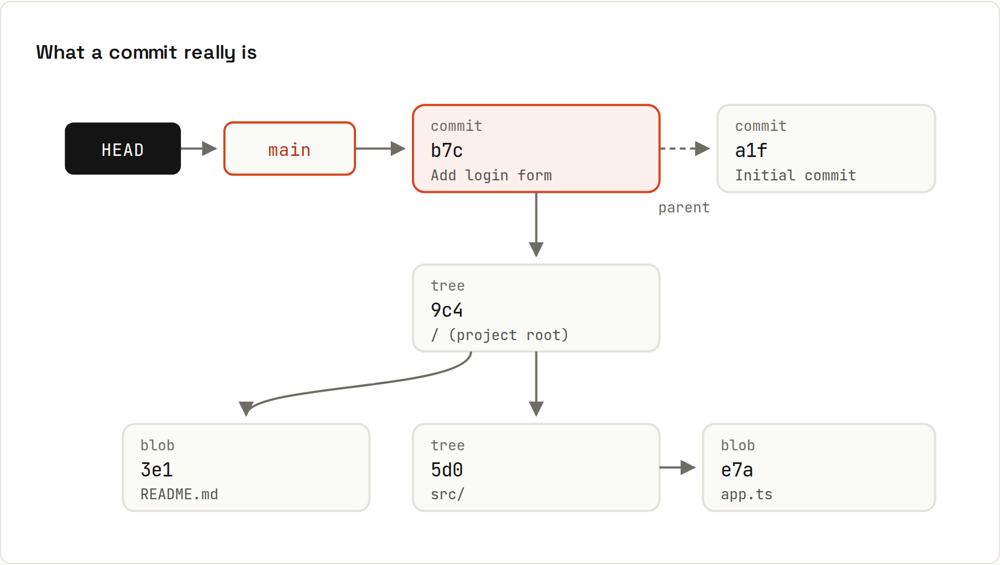

# Objects and Internals

Everything Git stores lives in `.git/objects`, named by a hash of its content. Once you see the objects, commands like `reset`, `rebase` and `cherry-pick` stop feeling like magic.



## Four kinds of object
| Type | Stores | Example |
|---|---|---|
| **blob** | the contents of one file (no name, no date) | `# Shop` |
| **tree** | a directory: names → blob or tree hashes, plus file modes | `README.md → a006…`, `src/ → da1d…` |
| **commit** | one tree (the snapshot), parent commit(s), author, committer, message | "Greet the shop" |
| **tag** | an annotated tag: a name, a message and a pointer to a commit | `v1.2.0` |

A **ref** (branch, tag name, `HEAD`) is not an object: it's a small file containing a hash. → [[git/Refs and HEAD]]

## Look inside for yourself
A repository with two commits: `README.md` and `src/app.js`.
```sh
cat .git/HEAD
```
```
ref: refs/heads/main
```
`HEAD` points to the branch `main`…
```sh
cat .git/refs/heads/main
```
```
5a04454c1b40b13281836e6996960717de3370fb
```
…and a branch is just a commit hash in a file. What is that object?
```sh
git cat-file -t HEAD
```
```
commit
```
```sh
git cat-file -p HEAD
```
```
tree e53283081218128a9f1cdf18bbad92a7f616a175
parent 459d3a80f3258721073e8c2483000c6e49f63012
author Ada <ada@example.com> 1767276000 +0100
committer Ada <ada@example.com> 1767276000 +0100

Greet the shop
```
That's the entire commit: a tree, a parent, two signatures (Unix time + time zone) and the message. Follow the tree:
```sh
git cat-file -p 'HEAD^{tree}'
```
```
100644 blob a00621bb3a9b990ee018f8d04c2d3140800d6ca6	README.md
040000 tree da1de24fd5c192c046e5ca249fa208ea45d5555e	src
```
```sh
git cat-file -p HEAD:README.md
```
```
# Shop
```

## Content addressing
The name of an object **is** the SHA-1 hash of its content. Hash a string yourself and you get the same ID Git uses for `README.md`:
```sh
echo "# Shop" | git hash-object --stdin
```
```
a00621bb3a9b990ee018f8d04c2d3140800d6ca6
```
Consequences:
- **Identical files are stored once**, in every commit and every folder.
- **A commit's hash covers everything**: its tree (so every file), its parent (so the entire history before it), author, date and message. Change any of it and you get a new commit with a new hash. That's why rebasing or amending "rewrites" history: the old commits aren't changed, new ones are made.
- **Corruption is detectable.** If a byte on disk flips, the hash no longer matches.
- **Hashes are global.** The same commit has the same hash on your laptop and on GitHub.

Git is moving from SHA-1 to SHA-256 (`git init --object-format=sha256`), but SHA-1 repositories remain the default and GitHub doesn't support SHA-256 repositories yet.

## Short hashes
Any unambiguous prefix works: `git show 5a04454` = `git show 5a04454c1b40…`. Git shows 7+ characters and uses more when a repository gets big enough that 7 could clash.

## Packfiles and garbage collection
New objects are stored as individual zlib-compressed files (*loose objects*):
```sh
git count-objects -v
```
```
count: 9
size: 36
in-pack: 0
packs: 0
size-pack: 0
prune-packable: 0
garbage: 0
size-garbage: 0
```
9 objects: 2 commits, 4 trees (the root and `src/`, each in two versions, because `src/app.js` changed) and 3 blobs (`README.md` once, shared by both commits, and two versions of `app.js`). From time to time (and on `push`/`clone`), Git packs objects into **packfiles**, storing similar objects as deltas against each other. So although a commit is conceptually a full snapshot, the repository on disk is highly compressed. `git gc` runs this manually; normally `git gc --auto` does it for you.

Unreachable objects (e.g. commits you reset away) are kept for a while so the [[git/Reflog]] can rescue them, then pruned (default: 2 weeks after they become unreachable and the reflog entry expired).

## What's in `.git/`
| Path | Content |
|---|---|
| `HEAD` | what's checked out |
| `config` | repository settings, remotes ([[git/Configuration]]) |
| `objects/` | all objects, loose and packed |
| `refs/heads/`, `refs/tags/`, `refs/remotes/` | branches, tags, remote-tracking branches |
| `packed-refs` | many refs in one file (after `gc`) |
| `index` | the staging area (binary) |
| `logs/` | the reflog |
| `hooks/` | scripts run on events ([[git/Hooks]]) |

Don't edit these by hand; use `git update-ref`, `git symbolic-ref` or normal commands. Reading them is harmless and instructive.

## Why this matters
- `git branch x` is instant: it writes one 41-byte file.
- `git reset` just moves a ref to another commit ([[git/Reset in Depth]]).
- `git rebase` and `git cherry-pick` create **new** commits with the same changes; the originals still exist until garbage-collected ([[git/Rebasing]]).
- Two branches pointing to the same commit are exactly the same state; there's no "copy".
