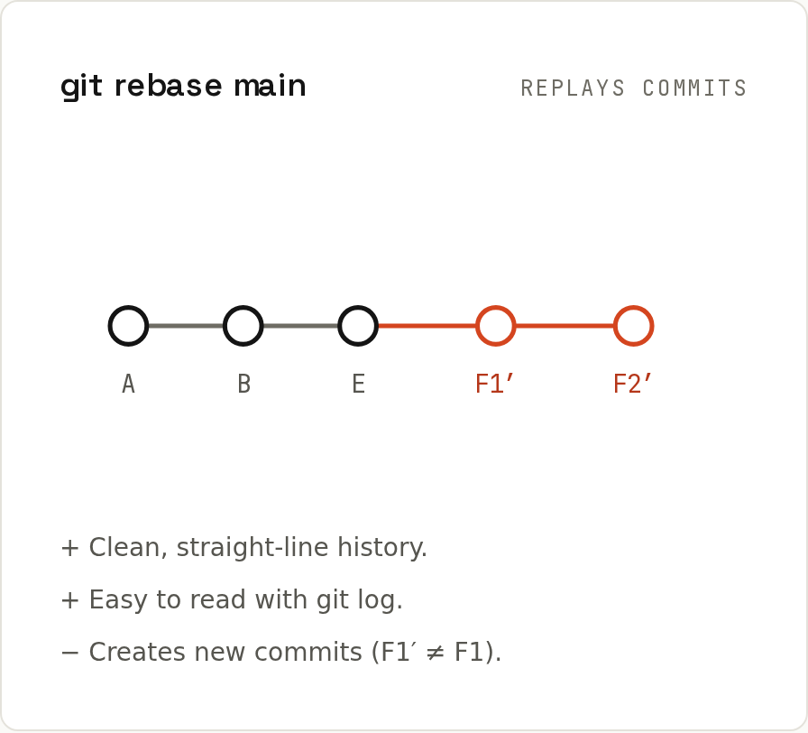

# Rebasing

`git rebase main` takes the commits of your current branch and **replays** them, one by one, on top of `main`. The result looks as if you had started your work from the latest `main`.



## Example
`feature` has F1 and F2; meanwhile `main` got E:
```sh
git log --oneline --graph --all
```
```
* 31e091f E
| * 97af21f F2
| * a88a087 F1
|/  
* 3767159 B
* 9a95dcc A
```
```sh
git switch feature
git rebase main
```
```
Successfully rebased and updated refs/heads/feature.
```
```sh
git log --oneline --graph --all
```
```
* efae200 F2
* cb61340 F1
* 31e091f E
* 3767159 B
* 9a95dcc A
```
F1 and F2 got **new hashes** (`a88a087` → `cb61340`): they're new commits with the same changes but a different parent. Now `main` can fast-forward:
```sh
git switch main
git merge feature
```
```
Updating 31e091f..efae200
Fast-forward
 f1.txt | 1 +
 f2.txt | 1 +
 2 files changed, 2 insertions(+)
```

## The golden rule
> **Only rebase commits that exist nowhere but your machine** (or your own branch that nobody else uses).

Rebasing commits someone else already pulled rewrites history under their feet: their copy still has the old commits, and the next pull mixes old and new versions of the same work. Use merge for shared branches like `main`.

Rebasing your own feature branch that's already on GitHub is fine, but you must force-push, and always with the lease:
```sh
git push --force-with-lease
```
`--force-with-lease` refuses if the remote branch contains commits you haven't seen (someone else pushed), unlike plain `--force`, which silently deletes them.

## Conflicts during a rebase
Each commit is replayed separately, so a conflict can stop the rebase at any commit:
```
Auto-merging cart.js
CONFLICT (content): Merge conflict in cart.js
error: could not apply b03fefd... Raise price
hint: Resolve all conflicts manually, mark them as resolved with
hint: "git add/rm <conflicted_files>", then run "git rebase --continue".
hint: You can instead skip this commit: run "git rebase --skip".
hint: To abort and get back to the state before "git rebase", run "git rebase --abort".
Could not apply b03fefd... Raise price
```
`git status` tells you exactly where you are:
```
interactive rebase in progress; onto 3df9f0d
Last command done (1 command done):
   pick b03fefd Raise price
No commands remaining.
You are currently rebasing branch 'feature' on '3df9f0d'.
  (fix conflicts and then run "git rebase --continue")
  (use "git rebase --skip" to skip this patch)
  (use "git rebase --abort" to check out the original branch)

Unmerged paths:
  (use "git restore --staged <file>..." to unstage)
  (use "git add <file>..." to mark resolution)
	both modified:   cart.js
```
| Command | Does |
|---|---|
| fix the file, `git add <file>`, `git rebase --continue` | go on with the next commit |
| `git rebase --skip` | drop this commit entirely |
| `git rebase --abort` | go back to exactly where you were before |

During a rebase, "ours" and "theirs" are swapped compared to a merge: **ours = the branch you rebase onto (main), theirs = your commit being replayed.** Details: [[git/Merge Conflicts]].

Resolving the same conflict again and again? Enable `rerere` ("reuse recorded resolution"): `git config --global rerere.enabled true`.

## `pull --rebase`
The most common rebase: your local `main` has commits and the server has new ones. `git pull --rebase` fetches and replays your unpushed commits on top, avoiding a pointless merge commit. See the real example in [[git/Remotes]].

## `--onto`: move a branch to another base
You branched `feature-b` off `feature-a`, but `feature-a` was abandoned. Move only `feature-b`'s own commits onto `main`:
```sh
git rebase --onto main feature-a feature-b
```
Read it as: "take the commits after `feature-a` up to `feature-b`, and replay them onto `main`".

## Interactive rebase
`git rebase -i` lets you edit the list of commits before replaying: reorder, squash, reword, drop. That's the main tool for cleaning up before a pull request: [[git/Rewriting History]].

## Useful options
| Option | Effect |
|---|---|
| `--autostash` | stash uncommitted changes before, pop after |
| `--autosquash` | move `fixup!` commits into place (with `-i`) |
| `--rebase-merges` | keep merge commits instead of flattening them |
| `--exec "npm test"` | run a command after each replayed commit; stops if it fails |
| `--update-refs` | also move other branches that point into the rebased range (stacked branches) |

## Merge or rebase: which should I use?
- Updating **your** feature branch with the latest `main`: rebase (clean) or merge (safe). Team preference.
- Bringing a finished feature into `main`: usually a pull request with merge, squash or rebase-merge, as the repository is configured ([[github/Pull Requests]]).
- Anything other people have already pulled: **merge**.
