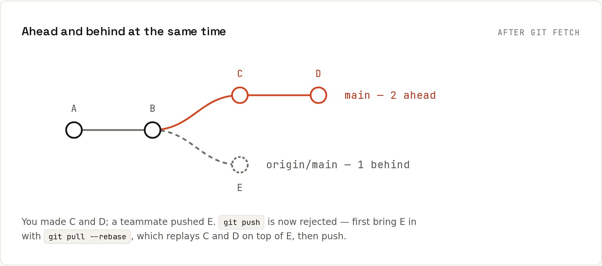

# Remotes

A **remote** is another copy of the repository, usually on GitHub. Your repository keeps read-only **remote-tracking branches** like `origin/main`: bookmarks of where the server's branches were when you last looked. `git fetch` updates them; nothing else touches your own branches until you merge, rebase or pull.



## fetch, pull, push
| Command | Updates `origin/*` | Changes your branch | Use it to |
|---|---|---|---|
| `git fetch` | yes | no | see what's new without touching your work |
| `git pull` | yes | yes: merge | catch up; may create a merge commit |
| `git pull --rebase` | yes | yes: rebase | catch up with a straight history |
| `git push` | yes | no (moves the remote) | publish your commits |
| `git push --force-with-lease` | yes | no | overwrite your own rebased branch safely |

## A real session: ahead and behind at the same time
Set up the remote and publish `main`:
```sh
git remote add origin git@github.com:ada/shop.git
git push -u origin main
```
```
To github.com:ada/shop.git
 * [new branch]      main -> main
branch 'main' set up to track 'origin/main'.
```
```sh
git remote -v
```
```
origin	git@github.com:ada/shop.git (fetch)
origin	git@github.com:ada/shop.git (push)
```
A teammate pushes a commit. Meanwhile you commit B and C and try to push:
```sh
git push
```
```
To github.com:ada/shop.git
 ! [rejected]        main -> main (fetch first)
error: failed to push some refs to 'github.com:ada/shop.git'
hint: Updates were rejected because the remote contains work that you do not
hint: have locally. This is usually caused by another repository pushing to
hint: the same ref. If you want to integrate the remote changes, use
hint: 'git pull' before pushing again.
hint: See the 'Note about fast-forwards' in 'git push --help' for details.
```
Git protects the teammate's commit: a push may only move the remote branch **forward**. Fetch to see what's there:
```sh
git fetch
```
```
From github.com:ada/shop
   5e2aab2..2f4688d  main       -> origin/main
```
```sh
git status
```
```
On branch main
Your branch and 'origin/main' have diverged,
and have 2 and 1 different commits each, respectively.
  (use "git pull" if you want to integrate the remote branch with yours)
```
```sh
git log --oneline --graph --all
```
```
* f8fb81e C
* e242463 B
| * 2f4688d Teammate: add t.txt
|/  
* 5e2aab2 A
```
```sh
git branch -vv
```
```
* main f8fb81e [origin/main: ahead 2, behind 1] C
```
```sh
git log --oneline main..origin/main     # what the server has that you don't
```
```
2f4688d Teammate: add t.txt
```
Replay your two commits on top of the teammate's:
```sh
git pull --rebase
```
```
Successfully rebased and updated refs/heads/main.
```
```sh
git log --oneline --graph --all
```
```
* 86f15c4 C
* 4f53a20 B
* 2f4688d Teammate: add t.txt
* 5e2aab2 A
```
Now the push is a fast-forward:
```sh
git push
```
```
To github.com:ada/shop.git
   2f4688d..86f15c4  main -> main
```
With a plain `git pull` (merge), you'd get an extra "Merge branch 'main' of github.com:ada/shop" commit instead. Harmless, but noisy. Recent Git versions ask you to choose once: `git config --global pull.rebase true` (or `false` for merge, or `pull.ff only` to refuse anything but fast-forwards).

## Publishing a new branch
```sh
git switch -c feature/login
git push -u origin feature/login
```
```
To github.com:ada/shop.git
 * [new branch]      feature/login -> feature/login
branch 'feature/login' set up to track 'origin/feature/login'.
```
`-u` (`--set-upstream`) links the local branch to the remote one, so later `git push`/`git pull` need no arguments and `git status` can show ahead/behind. With `push.autoSetupRemote=true`, a plain `git push` does this automatically.
```sh
git branch -vv
```
```
* feature/login 07b5e3a [origin/feature/login] Login
  main          86f15c4 [origin/main] C
```

## Everyday remote commands
```sh
git remote -v                         # list remotes and their URLs
git fetch --prune                     # update origin/*, forget branches deleted on the server
git branch -vv                        # every branch, its upstream, ahead/behind
git log --oneline origin/main..main   # what you would push
git switch feature/x                  # a branch that only exists on origin: creates a local tracking branch
git push origin --delete feature/x    # delete a branch on the server
git remote set-url origin git@github.com:ada/shop.git   # switch from HTTPS to SSH
```

## `origin` and `upstream`
- `origin` is simply the default name for the remote you cloned from. You can rename it or have several.
- When you **fork** a project, your fork is `origin` and the original is conventionally added as `upstream`:
```sh
git remote add upstream https://github.com/owner/project.git
git fetch upstream
git rebase upstream/main          # bring your branch up to date with the original project
```
→ [[github/Forks and Cloning]]

## HTTPS or SSH?
| | HTTPS `https://github.com/ada/shop.git` | SSH `git@github.com:ada/shop.git` |
|---|---|---|
| Auth | personal access token (via a credential manager) | SSH key |
| Firewalls | works everywhere (port 443) | port 22 (or `ssh.github.com:443`) |
| Setup | sign in once with the credential manager | create and upload a key once |

Both are fine; SSH is the most convenient once set up. → [[github/Authentication]]

## Force pushing
Needed only after rewriting commits you already pushed (rebase, amend). Use:
```sh
git push --force-with-lease
```
It refuses if the remote has commits you haven't fetched, so you can't wipe out a teammate's push by accident. Protect `main` from force pushes entirely with branch rules ([[github/Protecting Main]]).
