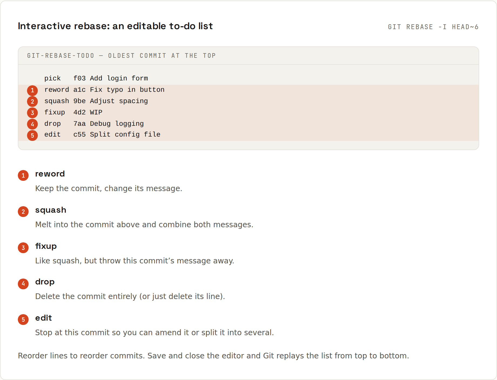

# Rewriting History

Messy WIP commits are fine while you work. Before opening a pull request, you can reorder, merge, rename or drop them, as long as the branch is **still yours alone**. Reviewers read a story instead of your trial and error.

> Rewriting creates **new** commits (new hashes). Never rewrite commits that others have already based work on, e.g. `main`. For your own pushed feature branch, update it with `git push --force-with-lease`.

## Amend the last commit
```sh
git commit --amend -m "Better message"        # change the message
git add forgotten.js && git commit --amend --no-edit   # add a forgotten file
git commit --amend --reset-author --no-edit   # fix author after changing user.email
```

## Interactive rebase
`git rebase -i <base>` opens an editable **to-do list** of all commits after `<base>`, oldest first. Change the words, reorder lines, save, close: Git replays the list.



A real example. The branch `feature/login` has a meaningless "wip" commit and a fix for the first commit:
```sh
git log --oneline
```
```
3f1f823 fixup! Add login form
01b3fe8 Style login form
700b3c8 wip
75e48cc Add login form
64d5c21 Initial commit
```
```sh
git rebase -i --autosquash main
```
The editor opens with:
```
pick 75e48cc Add login form
fixup 3f1f823 fixup! Add login form
pick 700b3c8 wip
pick 01b3fe8 Style login form

# Rebase 64d5c21..3f1f823 onto 64d5c21 (4 commands)
#
# Commands:
# p, pick <commit> = use commit
# r, reword <commit> = use commit, but edit the commit message
# e, edit <commit> = use commit, but stop for amending
# s, squash <commit> = use commit, but meld into previous commit
# f, fixup [-C | -c] <commit> = like "squash" but keep only the previous
#                    commit's log message, unless -C is used, in which case
#                    keep only this commit's message; -c is same as -C but
#                    opens the editor
# x, exec <command> = run command (the rest of the line) using shell
# b, break = stop here (continue rebase later with 'git rebase --continue')
# d, drop <commit> = remove commit
# …
# These lines can be re-ordered; they are executed from top to bottom.
#
# If you remove a line here THAT COMMIT WILL BE LOST.
```
`--autosquash` already moved the `fixup!` commit under the commit it fixes. Saving unchanged gives:
```
Successfully rebased and updated refs/heads/feature/login.
```
```sh
git log --oneline
```
```
b290189 Style login form
d6420ee wip
c23db17 Add login form
64d5c21 Initial commit
```
Now give "wip" a real name: run `git rebase -i main` again and change its `pick` to `reword`. Git stops for the new message:
```
[detached HEAD b634c4a] Validate the login form
 Date: Thu Jan 1 14:00:00 2026 +0100
 1 file changed, 1 insertion(+)
 create mode 100644 login.js
Successfully rebased and updated refs/heads/feature/login.
```
```sh
git log --oneline
```
```
dd57ae9 Style login form
b634c4a Validate the login form
c23db17 Add login form
64d5c21 Initial commit
```

### The commands
| Command | Does |
|---|---|
| `pick` | keep the commit as it is |
| `reword` | keep it, edit the message |
| `edit` | stop after this commit so you can change it (`git commit --amend`, or split it: `git reset HEAD~` and commit in pieces), then `git rebase --continue` |
| `squash` | melt into the previous commit, combine both messages |
| `fixup` | melt into the previous commit, keep only the previous message |
| `drop` (or delete the line) | remove the commit |
| `exec <cmd>` | run a command (e.g. tests) at this point |
| reorder lines | reorder commits |

Stuck or confused? `git rebase --abort` restores everything. Finished and regret it? [[git/Reflog]].

## Fixup commits: fix now, tidy later
When you notice a mistake in an earlier commit of your branch, commit the fix marked for that commit:
```sh
git commit --fixup=75e48cc          # message becomes "fixup! Add login form"
git rebase -i --autosquash main     # fixups jump into place automatically
git push --force-with-lease         # update your already-pushed branch
```
Enable `git config --global rebase.autoSquash true` to make `--autosquash` the default.

## `--force-with-lease`, never plain `--force`
`--force` overwrites the remote branch no matter what. If a colleague pushed a commit to your branch in the meantime, it's gone. `--force-with-lease` only overwrites if the remote is still where your `origin/…` bookmark says it was. Even safer: `--force-with-lease --force-if-includes`.

## Squash everything into one commit
Simplest way, without interactive rebase:
```sh
git reset --soft main
git commit -m "Add login form"
```
Often you don't need to: GitHub's *Squash and merge* does it when the pull request is merged ([[github/Pull Requests]]).

## Split a commit
```sh
git rebase -i main          # mark the commit with "edit"
git reset HEAD~             # uncommit it; changes are now unstaged
git add -p && git commit -m "First part"
git add -p && git commit -m "Second part"
git rebase --continue
```

## Remove a file from all of history
For a leaked secret or a huge file. Use **git-filter-repo** (the recommended successor to `git filter-branch`):
```sh
pip install git-filter-repo
git filter-repo --path secrets.env --invert-paths
git filter-repo --strip-blobs-bigger-than 50M
```
This rewrites **every** commit hash. Everyone must re-clone, forks keep the old history, and GitHub may cache old commits. For secrets, **revoking the secret** is the actual fix; rewriting just cleans up. → [[github/Security]]

## Changing the author of many commits
```sh
git rebase -i main --exec 'git commit --amend --no-edit --reset-author'
```
Every commit after `main` gets your current `user.name`/`user.email`.

## When not to rewrite
- `main`, `develop`, release branches: never.
- A branch a colleague has checked out: ask first, or merge instead.
- Commits already in a merged pull request: they're history now.
