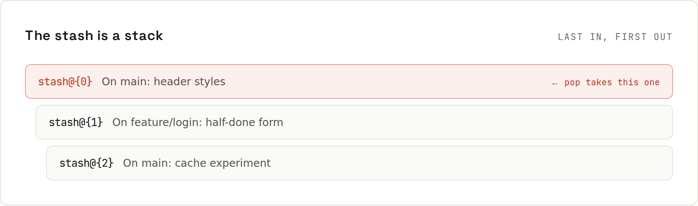

# Stash

Half-finished work and an urgent bug on another branch? `git stash` shelves your uncommitted changes and gives you a clean working directory. Later, you bring them back.



## The basics
```sh
git stash push -m "header styles"
```
```
Saved working directory and index state On main: header styles
```
Give stashes a name: after a week, "WIP on main" tells you nothing. By default, **untracked files stay behind**; include them with `-u`:
```sh
git stash -u
```
```
Saved working directory and index state WIP on main: 5efd8a8 Initial commit
```
The stash is a **stack**: the newest entry is `stash@{0}`.
```sh
git stash list
```
```
stash@{0}: WIP on main: 5efd8a8 Initial commit
stash@{1}: On main: header styles
```
Look inside an entry before applying it:
```sh
git stash show -p 'stash@{1}'
```
```diff
diff --git a/style.css b/style.css
index c0e1a88..fe94e2f 100644
--- a/style.css
+++ b/style.css
@@ -1 +1,2 @@
 body{}
+header{}
```
Bring back the top entry and remove it from the stack:
```sh
git stash pop
```
```
On branch main
Changes not staged for commit:
  (use "git add <file>..." to update what will be committed)
  (use "git restore <file>..." to discard changes in working directory)
	modified:   app.js

Untracked files:
  (use "git add <file>..." to include in what will be committed)
	notes.txt

no changes added to commit (use "git add" and/or "git commit -a")
Dropped refs/stash@{0} (e3657e962bd43d0d70e0c51ea1bbbeb1fb4688f2)
```
```sh
git stash list
```
```
stash@{0}: On main: header styles
```

## All the commands
| Command | Does |
|---|---|
| `git stash` / `git stash push -m "msg"` | stash tracked changes (staged and unstaged) |
| `git stash -u` | … including untracked files |
| `git stash -a` | … including ignored files too |
| `git stash push -p` | choose hunks interactively |
| `git stash push -- path/` | stash only some paths |
| `git stash --keep-index` | stash only what's **not** staged (test exactly what you'll commit) |
| `git stash list` | list entries |
| `git stash show -p stash@{n}` | show an entry's diff |
| `git stash pop` | apply the top entry and drop it |
| `git stash apply stash@{n}` | apply without dropping |
| `git stash drop stash@{n}` | delete one entry |
| `git stash clear` | delete all (careful) |
| `git stash branch <name> [stash@{n}]` | new branch from the commit the stash was made on, apply it there, drop it |

## Conflicts when popping
If the stashed changes conflict with what's in the working directory now, `pop` applies what it can, marks conflicts, and **keeps** the stash entry (so nothing is lost). Resolve like a merge conflict ([[git/Merge Conflicts]]), then `git stash drop`. If the branch moved on a lot, `git stash branch fix-later` applies the stash on its original commit, which never conflicts.

## Typical workflow
```sh
git stash push -u -m "half-done search"   # park it
git switch main && git pull
git switch -c hotfix/login
# … fix, commit, push …
git switch feature/search
git stash pop                             # continue where you left off
```
Stashes are **local** and not tied to a branch. They're easy to forget: check `git stash list` now and then.

## Stash or commit?
For anything longer than a quick switch, a **WIP commit** on your branch is often better: it's on the right branch, can be pushed as a backup, and is easy to find. Clean it up later with `git reset --soft HEAD~1` or an interactive rebase ([[git/Rewriting History]]). Or avoid switching at all with a second [[git/Worktrees|worktree]].

## Lost a stash?
A dropped stash is an unreachable commit. Find it with:
```sh
git fsck --unreachable | grep commit
git stash apply <hash>
```
