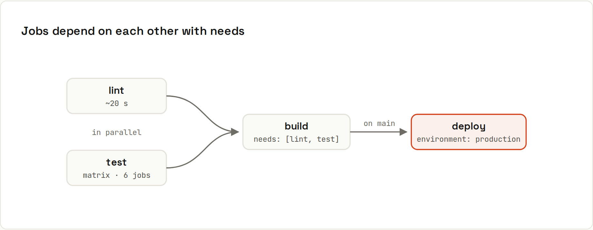
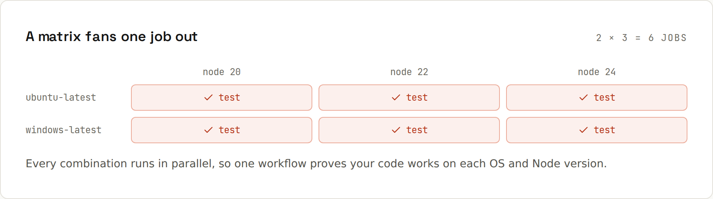

# Actions in Depth

Once the basic workflow runs, a few features make it faster, broader and safer: job graphs, matrices, caches, artifacts and concurrency.

## Vocabulary
| Term | Meaning |
|---|---|
| **workflow** | a YAML file in `.github/workflows/`: one automated process |
| **event** | what starts it: `push`, `pull_request`, `schedule`, `workflow_dispatch`, `release`… |
| **job** | a group of steps on one fresh runner; jobs run **in parallel** unless linked with `needs` |
| **step** | one command (`run:`) or one reusable action (`uses:`) |
| **runner** | the machine: GitHub-hosted Ubuntu/Windows/macOS, or self-hosted |
| **action** | a reusable step, e.g. `actions/checkout`, published in a repository |
| **artifact** | files a job uploads for later jobs or for download (build output, reports) |
| **cache** | files reused between runs (dependencies) |
| **secret** | an encrypted value injected at runtime, masked in logs |
| **environment** | a deploy target with its own secrets, required reviewers and wait timers |

## Job graphs with `needs`


`lint` and `test` run in parallel; `build` waits for both; `deploy` waits for `build`. If any fails, the dependants are skipped.

## Matrices


One job definition, many combinations: 2 operating systems × 3 Node versions = 6 jobs in parallel.

## Everything together
```yaml
name: CI (matrix)
on:
  push:
    branches: [main]
  pull_request:

concurrency:
  group: ${{ github.workflow }}-${{ github.ref }}
  cancel-in-progress: true          # a new push cancels the old run

permissions:
  contents: read                    # least privilege for GITHUB_TOKEN

jobs:
  lint:
    runs-on: ubuntu-latest
    steps:
      - uses: actions/checkout@v5
      - uses: actions/setup-node@v5
        with:
          node-version: 22
          cache: npm
      - run: npm ci
      - run: npm run lint

  test:
    strategy:
      fail-fast: false              # let the other combinations finish
      matrix:
        os: [ubuntu-latest, windows-latest]
        node: [20, 22, 24]
    runs-on: ${{ matrix.os }}
    steps:
      - uses: actions/checkout@v5
      - uses: actions/setup-node@v5
        with:
          node-version: ${{ matrix.node }}
          cache: npm                # reuse downloaded packages between runs
      - run: npm ci
      - run: npm test

  build:
    needs: [lint, test]
    runs-on: ubuntu-latest
    steps:
      - uses: actions/checkout@v5
      - uses: actions/setup-node@v5
        with:
          node-version: 22
          cache: npm
      - run: npm ci
      - run: npm run build
      - uses: actions/upload-artifact@v4
        with:
          name: site
          path: out/
          retention-days: 7

  deploy:
    needs: [build]
    if: github.ref == 'refs/heads/main'
    runs-on: ubuntu-latest
    environment: production         # can require a manual approval
    steps:
      - uses: actions/download-artifact@v5
        with:
          name: site
          path: out/
      - run: ./scripts/deploy.sh out/
        env:
          DEPLOY_TOKEN: ${{ secrets.DEPLOY_TOKEN }}
```

## Matrix options
```yaml
strategy:
  fail-fast: false        # default true: one failure cancels the rest
  max-parallel: 2
  matrix:
    os: [ubuntu-latest, windows-latest]
    java: [21, 25]
    include:
      - os: ubuntu-latest
        java: 27
        experimental: true
    exclude:
      - os: windows-latest
        java: 25
continue-on-error: ${{ matrix.experimental == true }}
```

## Caching
| Approach | How |
|---|---|
| built into setup actions | `cache: npm` / `pnpm` / `yarn` (setup-node), `cache: gradle` / `maven` (setup-java) |
| Gradle | `gradle/actions/setup-gradle` caches smarter than a plain cache |
| anything else | `actions/cache` with a key: |

```yaml
- uses: actions/cache@v4
  with:
    path: ~/.cache/ms-playwright
    key: playwright-${{ runner.os }}-${{ hashFiles('package-lock.json') }}
    restore-keys: playwright-${{ runner.os }}-
```
The **key** changes when the lock file changes, so the cache is rebuilt exactly when dependencies change. Caches are limited to 10 GB per repository and evicted after 7 days unused.

## Artifacts
Jobs don't share a disk. To pass files (build output, test reports, screenshots) between jobs or keep them for download, upload and download **artifacts**:
- `actions/upload-artifact` with `name`, `path`, `retention-days`,
- `actions/download-artifact` in a later job (`needs:` it),
- downloadable from the run page for the retention period (default 90 days).

## Concurrency
```yaml
concurrency:
  group: ${{ github.workflow }}-${{ github.ref }}
  cancel-in-progress: true
```
Only one run per group at a time: pushing twice quickly to a PR cancels the first run. For **deploys**, use `cancel-in-progress: false` so a running deploy finishes and the next one waits.

## Timeouts and retries
- `timeout-minutes: 15` on jobs (default is 6 hours!) or steps.
- Flaky network step? Retry inside the script, or `continue-on-error: true` for non-critical steps. Don't paper over flaky tests: fix them.

## Service containers
Need a database for tests?
```yaml
jobs:
  test:
    runs-on: ubuntu-latest
    services:
      postgres:
        image: postgres:17
        env:
          POSTGRES_PASSWORD: test
        ports: ["5432:5432"]
        options: --health-cmd pg_isready --health-interval 5s
    steps:
      - uses: actions/checkout@v5
      - run: ./gradlew test
        env:
          DB_URL: jdbc:postgresql://localhost:5432/postgres
```

## Making CI fast
1. Cache dependencies.
2. Run independent jobs in parallel (lint ∥ test).
3. Cancel superseded runs with `concurrency`.
4. Use `paths` filters for docs-only changes (careful with required checks: [[github/Protecting Main]]).
5. Shard long test suites across a matrix.
6. Keep images small; avoid installing what the runner already has.
