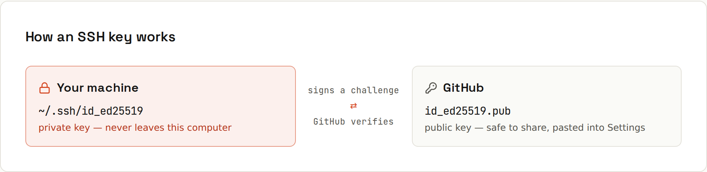

# Authentication

GitHub stopped accepting account passwords for Git operations in 2021. Prove who you are in one of two ways: **HTTPS with a token** (handled by a credential manager) or an **SSH key**.

| Method | Good for | Watch out |
|---|---|---|
| `gh` / Git Credential Manager (HTTPS) | most people: works everywhere, even behind strict firewalls | log in again if the token expires |
| SSH key | developers on their own machines | protect the private key with a passphrase |
| Fine-grained personal access token | scripts and tools that need limited access to specific repositories | give it an expiry and the fewest permissions; never commit it |
| `GITHUB_TOKEN` in Actions | workflows acting on their own repository | set `permissions:` to the minimum ([[github/Actions Security]]) |

## Option A: SSH key


An SSH key is a pair: the **private** key stays on your computer (never share it), the **public** key goes to GitHub. When you connect, your machine proves it has the private key without sending it.

```sh
ssh-keygen -t ed25519 -C "ada@example.com"   # press Enter for the default path, set a passphrase
cat ~/.ssh/id_ed25519.pub                     # copy this line
```
GitHub → *Settings → SSH and GPG keys → New SSH key* → paste. Test:
```sh
ssh -T git@github.com
```
```
Hi ada! You've successfully authenticated, but GitHub does not provide shell access.
```
Switch an existing HTTPS clone to SSH:
```sh
git remote set-url origin git@github.com:ada/shop.git
```

### Don't type the passphrase every time
- **macOS**: add to `~/.ssh/config`:
  ```
  Host github.com
    AddKeysToAgent yes
    UseKeychain yes
    IdentityFile ~/.ssh/id_ed25519
  ```
- **Windows**: enable the *OpenSSH Authentication Agent* service, then `ssh-add`.
- **Linux**: most desktops run an agent; otherwise `eval "$(ssh-agent -s)" && ssh-add`.

### Port 22 blocked?
Company or school firewalls sometimes block SSH. GitHub also answers on port 443:
```
Host github.com
  Hostname ssh.github.com
  Port 443
  User git
```

### Two accounts (private and work)
```
# ~/.ssh/config
Host github-work
  HostName github.com
  IdentityFile ~/.ssh/id_ed25519_work
```
Clone work repositories as `git@github-work:company/app.git`.

## Option B: HTTPS via a credential manager
The easiest: let the GitHub CLI handle it.
```sh
gh auth login          # pick HTTPS, log in through the browser
gh auth setup-git      # Git now asks gh for credentials
gh auth status         # check which account you're using
```
Alternatively **Git Credential Manager** (included in Git for Windows; installable on macOS/Linux) opens a browser login the first time you push and stores the token in the system keychain.

## Personal access tokens (PATs)
For scripts, servers or tools that can't use a browser login:
- **Fine-grained** tokens (recommended): limited to chosen repositories and permissions (e.g. *Contents: read*), with a mandatory expiry.
- **Classic** tokens: broad scopes (`repo`, `workflow`, …). Avoid unless a tool requires them.

*Settings → Developer settings → Personal access tokens*. Use the token instead of a password; store it in a secret manager or CI secret, never in the repository.

## Deploy keys
An SSH key attached to **one repository** (Settings → Deploy keys), read-only by default. Perfect for a server that only needs to `git pull` one private repository, like a web server deploying a site.

## Two-factor authentication
GitHub requires 2FA for everyone who contributes code. Use an authenticator app or a passkey/security key; save the recovery codes somewhere safe (a password manager). Losing both your device and the codes can mean losing the account.

## Troubleshooting
| Message | Fix |
|---|---|
| `Permission denied (publickey).` | key not loaded or not on GitHub: `ssh-add -l`, `ssh -vT git@github.com` |
| `remote: Support for password authentication was removed` | you typed your password over HTTPS: use `gh auth login` or a token |
| `remote: Repository not found.` | wrong URL, or your account has no access (private repository), or the wrong account is logged in |
| `The authenticity of host 'github.com' can't be established` | first connection: compare the fingerprint with GitHub's published SSH fingerprints, then type `yes` |

More in [[github/Common Errors]].
