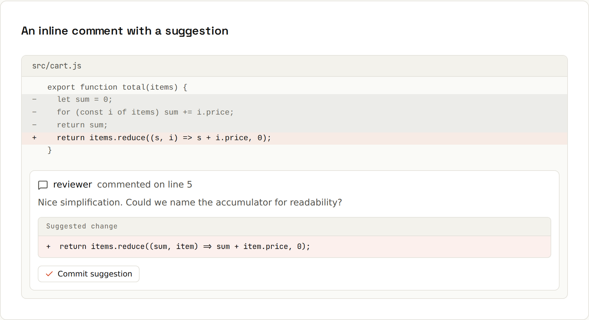

# Code Review

Review the change, not the person. A good review catches bugs, spreads knowledge, and keeps the codebase consistent, without turning into an argument about taste.

## Submitting a review
On the PR's *Files changed* tab, click a line (or drag across several) to comment. Collect comments, then *Review changes*:
| Submit as | Means |
|---|---|
| **Comment** | feedback, no verdict yet |
| **Approve** | good to merge (possibly after small nits) |
| **Request changes** | must be addressed before merging (blocks merging if reviews are required) |

## Suggestion blocks


In a review comment, wrap replacement code in a `suggestion` block:
````markdown
```suggestion
  return items.reduce((sum, i) => sum + i.price * i.qty, 0);
```
````
The author clicks *Commit suggestion* (or batches several), and it becomes a commit on their branch. Perfect for typos and small fixes: no back-and-forth.

## As the author: make it easy to review
- **Keep PRs small.** Under ~400 changed lines gets real attention.
- **Explain why** in the description; add screenshots or a short video for UI.
- **Review your own diff first.** Remove debug code and unrelated changes.
- **Point reviewers to the tricky parts** with your own comments on the diff.
- **Reply to every comment**, even if it's just "done", and resolve threads you've addressed.
- **Don't take it personally.** The comment is about the code.

## As the reviewer: be useful and kind
- **Ask questions** instead of issuing orders: "What happens if the list is empty?"
- **Label optional feedback** with `nit:` so the author knows it doesn't block.
- **Let linters and formatters argue about style.** Humans review logic, naming, design, tests.
- **Point out what's good**, too.
- **Review promptly.** A PR waiting three days goes stale and collects conflicts.
- **Run it** when in doubt: `gh pr checkout 42`.

## What to look for
| Area | Questions |
|---|---|
| Correctness | Does it do what the PR says? Edge cases: empty, null, huge, concurrent? |
| Tests | Is the new behaviour tested? Would the test fail without the fix? |
| Design | Is it in the right place? Duplicates existing code? Simpler way? |
| Naming and readability | Would a newcomer understand it in six months? |
| Security | User input validated? Secrets in code or logs? SQL/HTML injection? |
| Performance | Loops over database calls? Huge allocations? |
| Scope | Unrelated changes mixed in? |

## Conventional comments
Some teams prefix comments to make intent explicit:
```
praise: Nice use of a sealed interface here.
nit: `usr` → `user`
question: Do we need to handle a null price?
suggestion: Extract this into a `PriceFormatter`.
issue (blocking): This drops the discount when quantity > 99.
```

## CODEOWNERS: request the right reviewers automatically
`.github/CODEOWNERS` maps paths to people or teams. They're auto-requested as reviewers, and a ruleset can **require** their approval ([[github/Protecting Main]]).
```
*                 @ada                  # default owner for everything
/docs/            @shop-org/docs        # a team owns the docs
*.kt              @shop-org/android
/.github/         @shop-org/platform    # workflow changes need platform review
```
The **last matching** pattern wins.

## Review tools on GitHub
- *Viewed* checkbox per file; changed files re-appear if new commits touch them.
- *Changes since your last review* filter.
- Multi-line comments (drag in the gutter).
- **Copilot code review** can be requested like a human reviewer for a first pass. Treat its comments like a junior colleague's: often useful, sometimes wrong. → [[ai-prompting/Coding Agents]]

## Review in the IDE
IntelliJ IDEA and VS Code (GitHub Pull Requests extension) show PRs, diffs and comments inside the editor, with full navigation and the ability to run the code. → [[IDEs/Git in the IDE]]
