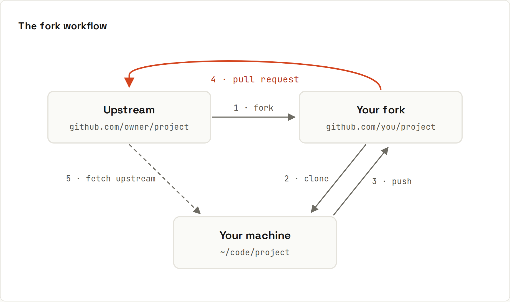

# Forks and Cloning

**Clone** = copy a repository to your machine. **Fork** = copy a repository to *your GitHub account*. You fork a project you can't push to, push to your fork, then ask the original project to pull your changes in.



## Clone
```sh
git clone git@github.com:ada/shop.git           # SSH
git clone https://github.com/ada/shop.git       # HTTPS
gh repo clone ada/shop                          # with the GitHub CLI
git clone --depth 1 <url>                       # only the latest snapshot (fast, for CI or just reading)
```
Cloning downloads the full history and sets up `origin` pointing to where you cloned from.

## Fork, clone and stay current
```sh
gh repo fork owner/project --clone   # fork + clone in one go
cd project
git remote -v
```
```
origin    git@github.com:ada/project.git (fetch)
origin    git@github.com:ada/project.git (push)
upstream  git@github.com:owner/project.git (fetch)
upstream  git@github.com:owner/project.git (push)
```
`origin` = your fork (you push here), `upstream` = the original (you pull from here). Forking on the website? Add upstream yourself: `git remote add upstream https://github.com/owner/project.git`.

### Before every new piece of work
```sh
git fetch upstream
git switch main
git rebase upstream/main          # or: git merge upstream/main
git push origin main              # keep your fork's main in sync too
git switch -c fix/typo-in-readme
```
Or click *Sync fork* on your fork's GitHub page, then `git pull`.

### Keep your fork's `main` clean
Never commit to `main` in a fork. Always branch. Then syncing is always a fast-forward, and each pull request contains only its own changes.

## Opening the pull request
Push your branch to **your fork** (`git push -u origin fix/typo-in-readme`). GitHub shows a *Compare & pull request* banner on both the fork and the original. The PR goes from `ada:fix/typo-in-readme` into `owner:main`. → [[github/Pull Requests]], [[github/Open Source]]

Tick **Allow edits by maintainers** so maintainers can push small fixes directly to your branch.

## On your own team? Skip the fork
If you have write access to the repository, clone it directly and push branches to it. Forks are for projects you don't own. Branches in one repository are simpler: one remote, shared CI secrets, easy checkouts of colleagues' branches.

## Forks and Actions
Workflows in a fork don't run until you enable them on the fork's Actions tab. Pull requests **from** forks run the upstream's workflows with **read-only** permissions and **without secrets**, so a stranger can't steal them with a malicious PR. → [[github/Actions Security]]

## Checking out someone's PR locally
```sh
gh pr checkout 42
# or without gh:
git fetch origin pull/42/head:pr-42 && git switch pr-42
```
