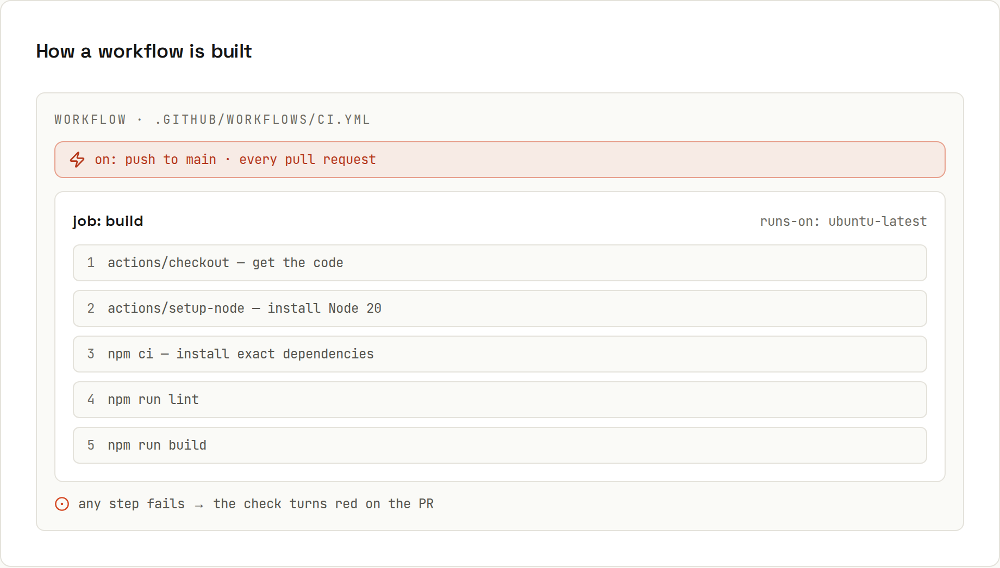

# GitHub Actions

GitHub Actions run your scripts on every push. A **workflow** is a YAML file in `.github/workflows/`. An **event** triggers it, it starts **jobs** on fresh machines (**runners**), and each job runs its **steps** in order.



## Your first workflow
`.github/workflows/ci.yml`:
```yaml
name: CI
on:
  push:
    branches: [main]
  pull_request:

jobs:
  build:
    runs-on: ubuntu-latest
    steps:
      - uses: actions/checkout@v5
      - uses: actions/setup-node@v5
        with:
          node-version: 22
          cache: npm
      - run: npm ci
      - run: npm run lint
      - run: npm test
      - run: npm run build
```
Commit and push it. The *Actions* tab shows the run; the PR shows a ✓ or ✗ check next to each commit.

## Reading it line by line
| Line | Meaning |
|---|---|
| `name: CI` | shown in the Actions tab |
| `on: push: branches: [main]` | run when commits are pushed to `main` |
| `on: pull_request:` | … and for every PR (on each push to its branch) |
| `jobs: build:` | one job with the ID `build` (the name used for required checks) |
| `runs-on: ubuntu-latest` | a fresh Ubuntu virtual machine, deleted afterwards |
| `uses: actions/checkout@v5` | a reusable **action**: clone the repository into the runner |
| `uses: actions/setup-node@v5` + `with:` | install Node 22 and cache npm downloads |
| `run: npm ci` | a shell command; if it exits non-zero, the job fails |

## Java / Kotlin with Gradle
```yaml
name: Gradle
on:
  push:
    branches: [main]
  pull_request:

permissions:
  contents: read

jobs:
  build:
    runs-on: ubuntu-latest
    steps:
      - uses: actions/checkout@v5
      - uses: actions/setup-java@v5
        with:
          distribution: temurin
          java-version: 21
      - uses: gradle/actions/setup-gradle@v5   # caches ~/.gradle, shows a build summary
      - run: ./gradlew build
      - uses: actions/upload-artifact@v4
        if: failure()                          # test reports only when something broke
        with:
          name: test-reports
          path: build/reports/tests/
```
Maven: `run: mvn -B verify` and `cache: maven` in `setup-java`.

## Runners
| Runner | Notes |
|---|---|
| `ubuntu-latest` | the default choice; fastest to start, cheapest |
| `windows-latest` | Windows-specific tests; minutes count 2× on private repos |
| `macos-latest` | iOS/macOS builds; minutes count 10× on private repos |
| `ubuntu-24.04-arm` | ARM64 Linux |
| self-hosted | your own machine or server; you maintain it |

Free plan: unlimited minutes for public repositories, 2,000 minutes/month for private ones.

## Where do actions come from?
`uses: owner/repo@version` points to a GitHub repository. `actions/*` are GitHub's own; the **Marketplace** lists thousands more. Anything you `uses:` runs with your workflow's permissions: pin third-party actions to a commit SHA ([[github/Actions Security]]).

## Seeing what happened
- Actions tab → run → job → expand a step to see its log.
- *Re-run failed jobs*; *Re-run with debug logging* for more detail.
- `gh run watch` / `gh run view --log-failed` in the terminal ([[github/GitHub CLI]]).
- A red ✗ on a PR links straight to the failing job.

## Checking workflows before pushing
**actionlint** catches typos, wrong expressions and invalid keys:
```sh
actionlint      # in the repository root
```
Every workflow in this guide passes it. Most IDEs also validate workflow YAML against GitHub's schema.

## What to automate
| Workflow | Page |
|---|---|
| lint, test, build on every PR | this page, [[github/Actions in Depth]] |
| deploy on push to `main` | [[github/Deploying with Actions]] |
| publish a release on a tag | [[github/Releases and Pages]] |
| dependency updates | Dependabot ([[github/Security]]) |
| nightly jobs, manual buttons | [[github/Workflow Syntax]] |
| shared CI for many repositories | [[github/Reusable Workflows]] |

## This site ships this way
Every push to `main` on lfdiego.xyz triggers a workflow that connects to the server over SSH and runs a deploy script, which builds the static site and imports these very wiki pages. Shipping a change is just `git push`. → [[github/Deploying with Actions]]
