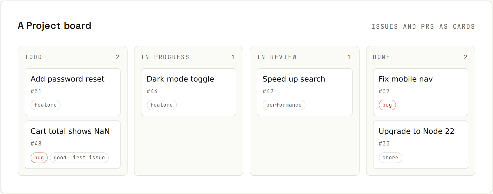

# Issues and Projects

**Issues** track the work: a bug, a feature idea or a task, with a discussion thread. **Labels** categorise it, **milestones** group it, and a **Project** board shows it moving to done.



## A good issue
### Bug report
- **Steps to reproduce**, numbered.
- **Expected vs. actual** behaviour.
- **Environment**: version, browser or OS, and any error output (as text, in a code block).
- A **screenshot** or a **minimal code sample**.

### Feature request
- The **problem** first ("I can't find old orders"), then the proposed solution.
- Who needs it and how often.

## Issue forms
Templates in `.github/ISSUE_TEMPLATE/` turn the *New issue* page into a form, so reports arrive with the information you need:
```yaml
# .github/ISSUE_TEMPLATE/bug.yml
name: Bug report
description: Something isn't working
labels: [bug]
body:
  - type: textarea
    id: steps
    attributes:
      label: Steps to reproduce
      placeholder: "1. Go to /cart  2. Remove the last item"
    validations:
      required: true
  - type: textarea
    id: expected
    attributes:
      label: What did you expect, and what happened instead?
  - type: input
    id: version
    attributes:
      label: Version
```
Add `.github/ISSUE_TEMPLATE/config.yml` with `blank_issues_enabled: false` to force the forms, and `contact_links` to send questions to Discussions instead.

## Organising issues
| Tool | Use |
|---|---|
| **Labels** | kind (`bug`, `feature`, `docs`), area (`cart`, `auth`), status (`needs-info`), `good first issue` |
| **Assignees** | who is working on it |
| **Milestones** | a release or deadline: "v2.0", "Launch" with a progress bar |
| **Issue types** (organizations) | Bug / Feature / Task as a first-class field |
| **Sub-issues** | break an epic into child issues, with progress |
| **Relationships** | "blocked by" / "blocking" |
| **Pinned issues** | up to 3 important issues at the top |

## Linking PRs to issues
- `Closes #12`, `Fixes #12`, `Resolves #12` in a PR description (or commit message) closes the issue when merged into the default branch.
- Just mentioning `#12` links them without closing.
- In another repository: `owner/repo#12`.
- The issue's sidebar shows linked PRs and branches; *Create a branch* on an issue makes `12-fix-cart-crash` for you.

## Projects
A **Project** is a board or table of issues and PRs, possibly from several repositories:
- **Views**: Board (Kanban columns by status), Table (spreadsheet), Roadmap (timeline by dates).
- **Custom fields**: Status, Priority, Size/estimate, Iteration (sprints), dates.
- **Automation**: new items → *Todo*, PR merged → *Done*, closed issues archived.
- **Charts** (Insights): burn-up, items by status.

A small team setup: one Project, a board grouped by **Status** (Todo / In progress / In review / Done), a **Priority** field, and a weekly **Iteration**.

## Searching and filtering
```
is:issue is:open label:bug no:assignee
is:pr is:open review-requested:@me
is:issue author:@me sort:updated-desc
is:open milestone:"v2.0" -label:wontfix
```
Save frequent searches as bookmarks. More syntax: [[github/Searching GitHub]].

## Discussions and closing
- **Discussions** (enable in Settings) are for questions, ideas and announcements that aren't actionable work; answers can be marked. Keeps issues focused.
- Close issues with a **reason**: *completed* or *not planned* (duplicate, won't fix). Add a comment explaining why.
- **Lock** heated conversations; **transfer** issues to the right repository.

## From the terminal
```sh
gh issue create --title "Cart crashes on empty cart" --label bug
gh issue list --label bug --assignee @me
gh issue develop 12 --checkout      # branch linked to issue 12
gh issue close 12 --reason "not planned"
```
