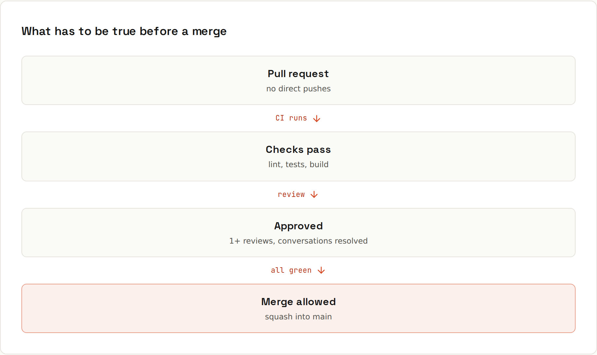

# Protecting Main

Rules make the safe path the only path. **Rulesets** (*Settings → Rules → Rulesets*) stop anyone, including you on a bad day, from pushing broken or unreviewed code straight to `main`.



> **Plans:** rulesets and branch protection are free on **public** repositories. On **private** repositories they need GitHub Pro (personal accounts) or Team (organizations).

## The rules that matter
| Rule | What it prevents |
|---|---|
| **Require a pull request before merging** | pushing straight to `main` |
| **Required approvals** (1–2) | merging code nobody else has read |
| **Dismiss stale approvals when new commits are pushed** | approving v1, merging v2 |
| **Require review from Code Owners** | changes to sensitive paths without the owner ([[github/Code Review]]) |
| **Require status checks to pass** | merging a red build |
| **Require branches to be up to date** | checks that passed against an old `main` |
| **Require conversation resolution** | merging with open review threads |
| **Require linear history** | merge commits on `main` (forces squash or rebase) |
| **Require signed commits** | unverified authors |
| **Block force pushes** | rewriting `main` |
| **Restrict deletions** | deleting `main` |
| **Require merge queue** | busy repositories where PRs keep going stale while waiting |

## A sensible default for a small team
Ruleset *Protect main*, target: default branch:
- Require a pull request, **1 approval**, dismiss stale approvals.
- Require status checks: your CI job names (e.g. `build`, `test`).
- Require conversation resolution.
- Block force pushes and deletions.
- Bypass list: empty (or admins, for emergencies only).

Working alone? Still require a PR and status checks (with 0 approvals): CI must be green before anything reaches `main`, and every change has a PR page documenting it.

## Status checks
A *required* check is identified by its **job name** (e.g. `build` from the workflow's `jobs: build:`). It only appears in the list after it has run at least once. If a required check never runs (e.g. a path filter skipped the workflow), the PR waits forever: prefer jobs that always run and decide inside what to do. → [[github/GitHub Actions]]

## Rulesets vs classic branch protection
Classic *branch protection rules* still work. **Rulesets** are the newer system:
- several rulesets can apply at once (they stack),
- target branches **and tags** by pattern (`release/*`, `v*`),
- an *Evaluate* mode shows what would be blocked without enforcing,
- organization-wide rulesets for all repositories (Team/Enterprise plans),
- visible to everyone with read access, so contributors know the rules.

## Protecting tags
A ruleset targeting `v*` tags with *Restrict creations/updates/deletions* means only release managers (or a release workflow) can create version tags, and nobody can move them. → [[github/Releases and Pages]]

## Merge queue
With many PRs, "require up to date" creates a race: rebase, wait for CI, someone merged first, rebase again. A **merge queue** takes over: approved PRs join a queue, GitHub tests each one merged with everything ahead of it, and merges them in order. Workflows must also run on the `merge_group` event:
```yaml
on:
  pull_request:
  merge_group:
```

## Environments and deploy protection
Protecting `main` is half the story: also protect **where it deploys**. Environments can require manual approval and restrict which branches may deploy. → [[github/Secrets and Environments]]
