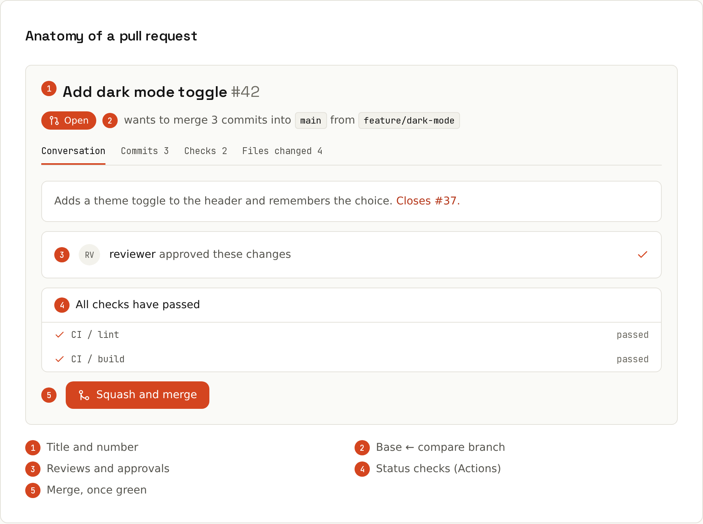

# Pull Requests

A pull request (PR) is **a conversation about a branch**. It shows the diff, runs your checks, collects review comments, and updates itself every time you push to the branch.



## The loop, step by step
1. **Branch.** One branch per change.
   ```sh
   git switch -c fix/empty-cart
   ```
2. **Commit and push.**
   ```sh
   git push -u origin fix/empty-cart
   ```
   Git prints a link: `remote: Create a pull request for 'fix/empty-cart' on GitHub by visiting: …`
3. **Open the PR.** Say what changed and why. Write `Closes #12` to close issue 12 automatically on merge.
   ```sh
   gh pr create --fill          # title/body from your commits; --draft if not ready
   ```
4. **Review and checks.** Answer comments by pushing more commits; the PR updates itself. CI results appear as checks ([[github/GitHub Actions]]).
5. **Merge.** Pick a merge method (below), then delete the branch.
6. **Clean up locally.**
   ```sh
   git switch main && git pull && git branch -d fix/empty-cart
   ```
   After a squash merge, use `-D`: Git can't tell the branch was merged because the commits differ.

## Writing a good description
```markdown
## What
The cart page crashed when the last item was removed.

## Why
`total()` called `reduce` without an initial value on an empty array.

## How
- Pass 0 as the initial value
- Add a test for the empty cart

## Screenshots
(before / after, for UI changes)

Closes #12
```
Put this in `.github/pull_request_template.md` and every new PR starts with it.

## Draft pull requests
Open a PR early as a **draft** to show work in progress, get early feedback and let CI run. Drafts can't be merged; click *Ready for review* when done.

## Merge methods
| Merge method | Result on `main` | Use when |
|---|---|---|
| **Create a merge commit** | all branch commits + one merge commit | you want the full, true history |
| **Squash and merge** | one single commit for the whole PR | branch commits are messy: the common default |
| **Rebase and merge** | branch commits replayed, no merge commit | commits are already clean and meaningful |

Repository admins choose which buttons exist (Settings → General). Many teams allow only *Squash and merge*: every PR becomes one commit on `main` with the PR title as message, e.g. `Fix crash when cart is empty (#42)`. The underlying Git operations: [[git/Merging]].

## Keeping a PR up to date
If `main` moved on and the PR conflicts or is required to be up to date:
- **Update branch** button on the PR (merge or rebase `main` into it), or locally:
```sh
git fetch origin
git rebase origin/main          # or: git merge origin/main
git push --force-with-lease     # after a rebase
```
Conflicts are resolved locally like any other ([[git/Merge Conflicts]]). GitHub's web conflict editor handles simple cases.

## Auto-merge and merge queues
- **Auto-merge**: *Enable auto-merge* on a PR; GitHub merges it as soon as the required reviews and checks pass.
- **Merge queue**: on busy repositories, PRs queue up and are tested together with everything ahead of them before merging, so `main` never breaks from two PRs that were fine separately. → [[github/Protecting Main]]

## Linking issues
Keywords in the PR description (or a commit message) close issues when the PR is merged into the default branch: `close`, `closes`, `closed`, `fix`, `fixes`, `fixed`, `resolve`, `resolves`, `resolved` + `#12` (same repository) or `owner/repo#12`. Just mentioning `#12` links without closing. → [[github/Issues and Projects]]

## Useful PR features
| Feature | What for |
|---|---|
| **Files changed** tab, *Viewed* checkboxes | review file by file; viewed files collapse |
| Hide whitespace (⚙ in the diff) | review reindented code |
| **Commits** tab | review commit by commit |
| Request reviewers / assignees / labels | who reviews, who's responsible, what kind of change |
| `@mention` | notify someone |
| Suggested changes | reviewers propose code the author applies with one click ([[github/Code Review]]) |
| **Checks** tab | CI logs |
| Deployments | preview URLs from Vercel/Netlify/Pages |

## Size matters
PRs under ~400 changed lines get real attention; 2,000-line PRs get "LGTM". Split big work:
- separate refactoring PRs from behaviour changes,
- land preparatory changes first,
- hide unfinished features behind a flag and merge in steps ([[git/Branching Strategies]]).

## From the terminal
```sh
gh pr create --fill --draft
gh pr list --author @me
gh pr view 42 --web
gh pr checkout 42
gh pr checks 42 --watch
gh pr merge 42 --squash --delete-branch
```
→ [[github/GitHub CLI]]
