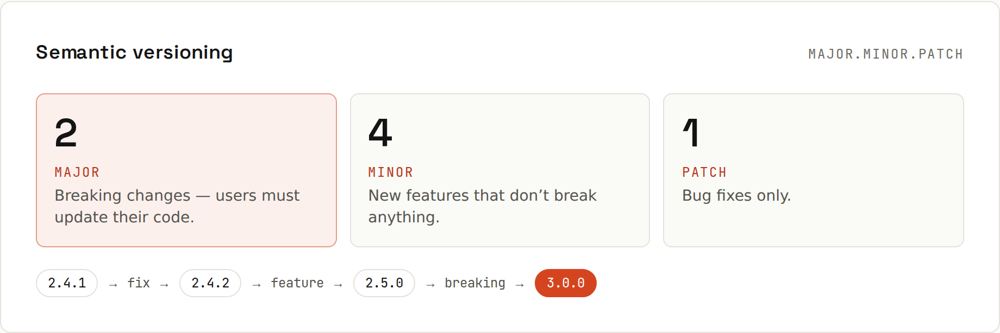

# Releases and Pages

Version your releases; host static sites for free.

## Semantic versioning


| Part | Bump when | Example |
|---|---|---|
| **MAJOR** | breaking changes: users must update their code | `1.4.2 → 2.0.0` |
| **MINOR** | new features, backwards compatible | `1.4.2 → 1.5.0` |
| **PATCH** | bug fixes only | `1.4.2 → 1.4.3` |

- Pre-releases: `2.0.0-beta.1`, `2.0.0-rc.1` (sort before `2.0.0`).
- `0.x.y`: anything may change; not stable yet.
- Tags usually carry a `v`: `v2.0.0`.

Websites and apps often don't need SemVer; a date (`2026.09.27`) or build number is fine. Libraries that others depend on do.

## A GitHub Release
A **release** = a Git tag + release notes + optional downloadable files (*assets*): installers, jars, zips.
```sh
git tag -a v2.5.0 -m "v2.5.0"
git push origin v2.5.0
gh release create v2.5.0 --generate-notes   # notes built from merged PRs
gh release upload v2.5.0 dist/app.zip       # attach build files
```
`--generate-notes` lists merged PRs and new contributors since the last release. Group them by label with `.github/release.yml`:
```yaml
changelog:
  categories:
    - title: 🚀 Features
      labels: [feature]
    - title: 🐛 Fixes
      labels: [bug]
    - title: Other changes
      labels: ["*"]
```
Mark a release as **pre-release** for betas, or **latest** explicitly. Every release page also offers the source code as zip/tar.gz automatically.

## Releasing from a workflow
Push a tag, let Actions build and publish:
```yaml
name: Release
on:
  push:
    tags: ['v*']

permissions:
  contents: write                   # needed to create the release

jobs:
  release:
    runs-on: ubuntu-latest
    steps:
      - uses: actions/checkout@v5
      - uses: actions/setup-java@v5
        with:
          distribution: temurin
          java-version: 21
      - uses: gradle/actions/setup-gradle@v5
      - run: ./gradlew shadowJar
      - name: Create the GitHub release
        env:
          GH_TOKEN: ${{ github.token }}
          TAG: ${{ github.ref_name }}
        run: gh release create "$TAG" build/libs/*.jar --generate-notes --verify-tag
```
Protect `v*` tags with a ruleset so only this process creates them ([[github/Protecting Main]]). Tools like **release-please** or **semantic-release** go further: they read [[git/Commit Messages|Conventional Commits]], decide the next version, update the changelog and open a release PR.

## GitHub Pages
Free static hosting straight from a repository.
1. Build your site to static files (HTML, CSS, JS).
2. *Settings → Pages*: deploy from a branch (e.g. `/docs` on `main`), or from an Actions workflow ([[github/Deploying with Actions]]).
3. It's served at `https://<user>.github.io/<repo>/`, or `https://<user>.github.io/` for a repository named `<user>.github.io`.

### Custom domain
- Settings → Pages → *Custom domain*: `www.example.com`.
- DNS: a `CNAME` record `www → <user>.github.io`; for the apex domain `example.com`, `A` records to GitHub's Pages IPs (listed in GitHub's docs) or an `ALIAS`/`ANAME`.
- Tick **Enforce HTTPS** once the certificate is issued (automatic, Let's Encrypt).
- Verify the domain for your account/organization to prevent takeovers.

### Limits and gotchas
- Static files only: no server code, no database. Frameworks with a static export (Next.js `output: 'export'`, Astro, Vite, Hugo) work well.
- Sites under `/<repo>/` need the framework's base path configured (`basePath` in Next.js, `base` in Vite), or CSS and links point to the wrong place.
- Soft limits: 1 GB site size, 100 GB bandwidth per month, 10 builds per hour (branch deploys).
- Pages sites are **public** (private visibility only on Enterprise).
- Not for commercial web shops or SaaS (terms of service); a business site or portfolio is fine.

## Changelogs
Keep a human-written `CHANGELOG.md` ("Keep a Changelog" format: *Added / Changed / Fixed / Removed* per version), or rely on generated release notes. Either way, link releases from the README.
