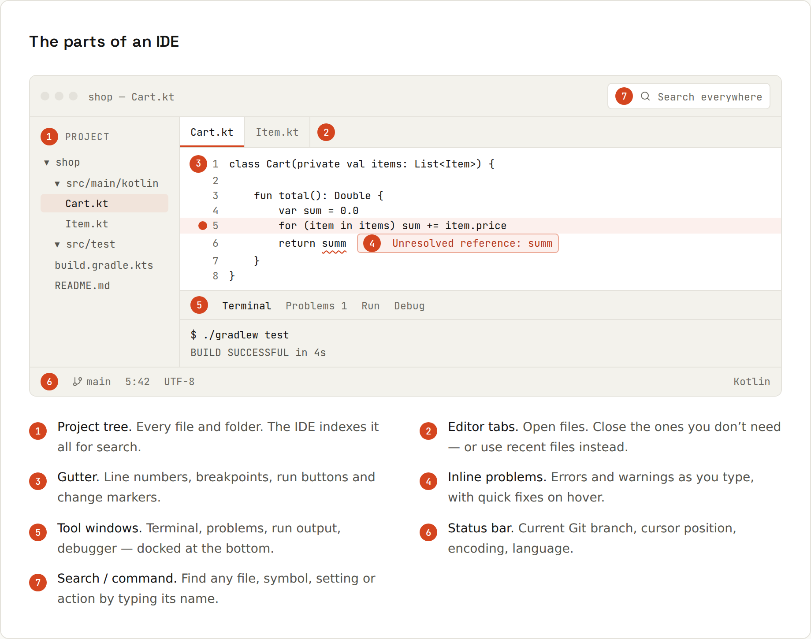

# IDEs

An **IDE** (Integrated Development Environment) is an editor that understands your code: it builds a model of the whole project (types, calls, imports) and uses it to help you write, navigate, change, run and debug code. This guide covers **IntelliJ IDEA** (the standard for Java and Kotlin) and **VS Code** (the standard for JavaScript/TypeScript and the web) side by side.

> Shortcuts are the **default Windows/Linux keymaps** of IntelliJ IDEA and VS Code. On macOS, <kbd>Ctrl</kbd> is usually <kbd>⌘</kbd> and <kbd>Alt</kbd> is <kbd>⌥</kbd>. The configuration files on these pages are in `code/ides/` and validated as JSON/EditorConfig.

## Learning path
| Step | Read | You'll be able to… |
|---|---|---|
| 1 | [[ides/What an IDE Does]] · [[ides/IntelliJ vs VS Code]] · [[ides/Anatomy]] | pick a tool and find your way around the window |
| 2 | [[ides/Shortcuts]] · [[ides/Navigation]] | move through a codebase without the mouse |
| 3 | [[ides/Editing]] · [[ides/Live Templates and Snippets]] · [[ides/Refactoring]] | write and change code fast and safely |
| 4 | [[ides/Debugging]] · [[ides/Debugging in Depth]] | find bugs by looking instead of guessing |
| 5 | [[ides/Running and Run Configurations]] · [[ides/Testing in the IDE]] | run apps and tests with one key |
| 6 | [[ides/Git in the IDE]] | commit, diff, resolve conflicts visually |
| 7 | [[ides/Project Setup]] · [[ides/Settings and Formatting]] · [[ides/Extensions and Plugins]] · [[ides/Built-in Tools]] | set up projects the way teams do |
| 8 | [[ides/AI in the IDE]] | use AI assistants well |

When the IDE misbehaves: [[ides/Troubleshooting]]. Quick lookups: [[ides/Cheat Sheet]], [[ides/Glossary]].

## If you remember only one shortcut
**Find Action** (IntelliJ, <kbd>Ctrl</kbd>+<kbd>Shift</kbd>+<kbd>A</kbd>) and the **Command Palette** (VS Code, <kbd>Ctrl</kbd>+<kbd>Shift</kbd>+<kbd>P</kbd>) run any command by name, and show its shortcut next to it, so you pick up the rest as you go.
