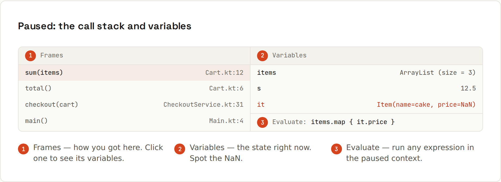

# Debugging in Depth

**Breakpoints that think, and a debugger that can time-travel a little.**

## Kinds of breakpoint
| Breakpoint | Pauses when… | Set it |
|---|---|---|
| **Line** | this line is about to run | click the gutter |
| **Conditional** | an expression is true, e.g. `order.id() == 1042` | right-click the breakpoint |
| **Logpoint** | never: prints a message and keeps running ("println debugging without editing code") | IntelliJ: breakpoint → uncheck *Suspend*, check *Evaluate and log*; VS Code: right-click gutter → *Add Logpoint* |
| **Exception** | an exception is thrown, even if something catches it | IntelliJ: *View Breakpoints* (<kbd>Ctrl</kbd>+<kbd>Shift</kbd>+<kbd>F8</kbd>) → + → Java Exception Breakpoint; VS Code: Breakpoints panel → *Caught/Uncaught Exceptions* |
| **Method** | a method is entered or exits (slower, use sparingly) | click the gutter on the method signature |
| **Field watchpoint** | a field is read or changed | click the gutter on the field |
| **Hit count / pass count** | the N-th time | breakpoint properties |
| **Dependent** | only after another breakpoint was hit | IntelliJ: *Disable until hitting…* |

An **exception breakpoint** on `NullPointerException` stops exactly where the null was dereferenced, with all variables visible, instead of you reading a stack trace after the fact.

## Paused: the call stack and variables


Each **frame** in the call stack is one method call with its own variables. Clicking `checkout()` two frames up shows the values the caller had when it called `total()`: often where the wrong value came from.

## Evaluate expression
<kbd>Alt</kbd>+<kbd>F8</kbd> (IntelliJ) / the Debug Console (VS Code) runs any code in the paused context: `cart.items().stream().filter(i -> i.price() < 0).toList()`. Also for calling methods, trying a fix, or inspecting a huge collection.

## Restart frame and hot swap
- **Drop frame / Restart frame**: missed the interesting moment? Re-run the current method from its start (side effects already done stay done).
- **Hot swap**: change a method body while paused, rebuild (<kbd>Ctrl</kbd>+<kbd>F9</kbd> in IntelliJ), and the JVM loads the new code without restarting the app. Adding methods or fields needs a restart (or JetBrains Runtime with enhanced hot swap). Spring Boot DevTools restarts quickly for bigger changes.

## Remote debugging a JVM (e.g. in Docker or on a test server)
Start the JVM with the debug agent:
```sh
java -agentlib:jdwp=transport=dt_socket,server=y,suspend=n,address=*:5005 \
     -jar app.jar
# IntelliJ: Run → Edit Configurations → + → Remote JVM Debug → port 5005
```
- `suspend=y` waits for the debugger before `main` runs (for start-up bugs).
- Expose port 5005 only on a trusted network or through an SSH tunnel (`ssh -L 5005:localhost:5005 server`): anyone connecting can run code in your JVM.
- Pausing a breakpoint on a shared server pauses everyone's requests: prefer logpoints there.

## VS Code: launch.json
Launch and attach configurations live in `.vscode/launch.json` (`code/ides/launch.json`):
```json
{
  "version": "0.2.0",
  "configurations": [
    {
      "type": "node",
      "request": "launch",
      "name": "Debug server",
      "program": "${workspaceFolder}/src/server.js",
      "env": { "NODE_ENV": "development" }
    },
    {
      "type": "node",
      "request": "attach",
      "name": "Attach to node --inspect",
      "port": 9229
    },
    {
      "type": "java",
      "request": "attach",
      "name": "Attach to JVM on 5005",
      "hostName": "localhost",
      "port": 5005
    }
  ]
}
```
Start any of them from the Run and Debug view (<kbd>Ctrl</kbd>+<kbd>Shift</kbd>+<kbd>D</kbd>).

## Debugging concurrency
- Breakpoints can suspend **one thread** or **all** (IntelliJ: breakpoint properties). For races, suspending one thread changes timing: logpoints disturb less.
- The Threads/Frames view shows all threads; IntelliJ's *Coroutines* tab shows Kotlin coroutines.
- `jstack <pid>` / *Get Thread Dump* shows what every thread is doing, and detects deadlocks ([[java/Concurrency Basics]]).

## When breakpoints don't hit
- You started with **Run** instead of **Debug**.
- The running code isn't the code you see: rebuild, or the app runs an old JAR/container.
- The breakpoint is disabled, conditional, or in a line with no executable code.
- Different process: a forked JVM (Gradle test workers), a child process, a browser tab vs Node.
- Source maps missing for bundled JavaScript ([[javascript/DevTools]]).
