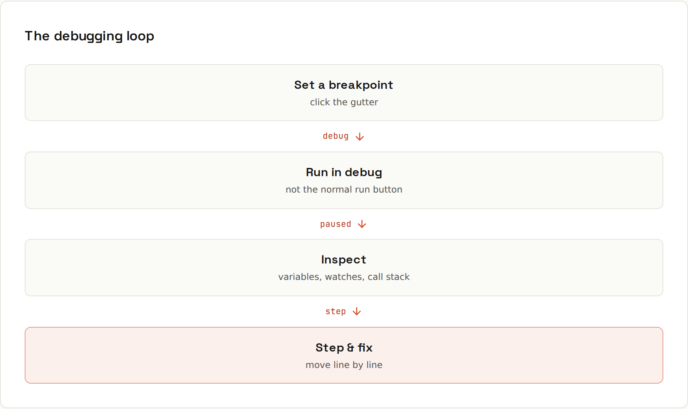
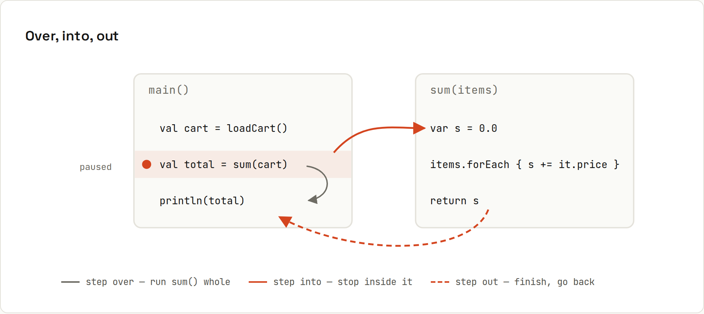

# Debugging

**Stop guessing with `println`: pause the program and look.** Set a breakpoint, start in debug mode, and execution stops on that line with every variable visible. Then move through the code one step at a time.

## The loop
1. **Set a breakpoint**: click the gutter next to a line (red dot).
2. **Run in debug mode**, not the normal run (🐞 instead of ▶).
3. **Inspect**: when execution stops, hover variables, look at the Variables panel and the call stack.
4. **Step** through the code and watch values change.
5. **Fix**, then run again.

## Stepping: over, into, out

| Debugger | IntelliJ IDEA | VS Code |
|---|---|---|
| Toggle breakpoint | <kbd>Ctrl</kbd>+<kbd>F8</kbd> | <kbd>F9</kbd> |
| Start debugging | <kbd>Shift</kbd>+<kbd>F9</kbd> | <kbd>F5</kbd> |
| **Step over**: run this line, stop at the next | <kbd>F8</kbd> | <kbd>F10</kbd> |
| **Step into**: enter the called method | <kbd>F7</kbd> | <kbd>F11</kbd> |
| **Step out**: finish this method, stop in the caller | <kbd>Shift</kbd>+<kbd>F8</kbd> | <kbd>Shift</kbd>+<kbd>F11</kbd> |
| Run to cursor | <kbd>Alt</kbd>+<kbd>F9</kbd> | right-click → *Run to Cursor* |
| Resume (to the next breakpoint) | <kbd>F9</kbd> | <kbd>F5</kbd> |
| Evaluate expression | <kbd>Alt</kbd>+<kbd>F8</kbd> | Debug Console |
| Stop | <kbd>Ctrl</kbd>+<kbd>F2</kbd> | <kbd>Shift</kbd>+<kbd>F5</kbd> |

**Step over** when you trust the called method, **step into** when the bug may be inside it, **step out** when you went too deep. IntelliJ's *Smart Step Into* (<kbd>Shift</kbd>+<kbd>F7</kbd>) lets you pick which call on a line to enter (`total(parse(input))`).

## What you see when paused
- **Variables**: every local variable, parameter and `this`, expandable into objects and collections.
- **Call stack (frames)**: how you got here; click a frame to see its variables ([[ides/Debugging in Depth]]).
- **Watches**: expressions re-evaluated at every stop (`cart.items().size()`).
- **Inline values**: IntelliJ and VS Code show variable values right next to the code lines.
- **Console**: the program's output so far.

You can **change** a variable's value while paused (right-click → *Set Value*) to test "what if" without restarting.

## Conditional breakpoints
Right-click a breakpoint and add a condition like `item.price() < 0`. The program only pauses when it's true: perfect for the one bad item in a loop of ten thousand.

## A debugging mindset
1. **Reproduce** the bug reliably, ideally with a test.
2. **Form a hypothesis** ("the discount is applied twice").
3. **Place the breakpoint** where the hypothesis can be checked, not at the start of `main`.
4. **Compare** actual values with expected ones; the first place they differ is near the bug.
5. **Fix, then keep the test** so the bug can't return.

Reading the stack trace first often tells you where to put the breakpoint ([[java/Exceptions]], [[javascript/Error Handling]]).

## Debugging JavaScript
- **Browser**: DevTools → Sources has the same breakpoints and stepping ([[javascript/DevTools]]). VS Code can launch and debug Chrome directly.
- **Node**: VS Code's *JavaScript Debug Terminal* debugs any `node`/`npm` command you run in it, no configuration needed.

Advanced breakpoints, remote debugging and hot swap: [[ides/Debugging in Depth]].
