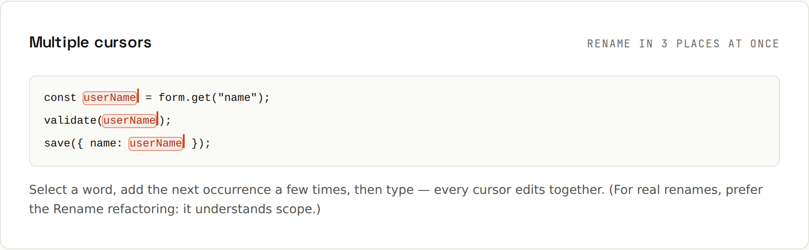
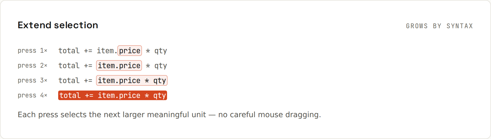

# Editing

**Edit many places at once, and select by meaning.** A handful of editing commands save more time than typing faster ever could.

## Multiple cursors

Rename a local variable in three places, add the same suffix to ten lines, turn a column of values into a list: place several cursors and type once.
| Action | IntelliJ IDEA | VS Code |
|---|---|---|
| Add next occurrence | <kbd>Alt</kbd>+<kbd>J</kbd> | <kbd>Ctrl</kbd>+<kbd>D</kbd> |
| Remove last occurrence | <kbd>Alt</kbd>+<kbd>Shift</kbd>+<kbd>J</kbd> | <kbd>Ctrl</kbd>+<kbd>U</kbd> |
| Select all occurrences | <kbd>Ctrl</kbd>+<kbd>Alt</kbd>+<kbd>Shift</kbd>+<kbd>J</kbd> | <kbd>Ctrl</kbd>+<kbd>Shift</kbd>+<kbd>L</kbd> |
| Add cursor with the mouse | <kbd>Alt</kbd>+<kbd>Shift</kbd>+click | <kbd>Alt</kbd>+click |
| Column (box) selection | <kbd>Alt</kbd>+drag, or <kbd>Alt</kbd>+<kbd>Shift</kbd>+<kbd>Insert</kbd> for column mode | <kbd>Shift</kbd>+<kbd>Alt</kbd>+drag |
| Cursors above/below | <kbd>Ctrl</kbd> <kbd>Ctrl</kbd> (hold) + <kbd>↑</kbd>/<kbd>↓</kbd> | <kbd>Ctrl</kbd>+<kbd>Alt</kbd>+<kbd>↑</kbd>/<kbd>↓</kbd> |

For renaming **symbols** (methods, classes, fields), use Rename refactoring instead: it also updates other files ([[ides/Refactoring]]).

## Extend selection

Select by **syntax**, not characters: each press grows the selection to the next enclosing unit (word → expression → statement → block → method).
| Action | IntelliJ IDEA | VS Code |
|---|---|---|
| Extend selection | <kbd>Ctrl</kbd>+<kbd>W</kbd> | <kbd>Shift</kbd>+<kbd>Alt</kbd>+<kbd>→</kbd> |
| Shrink selection | <kbd>Ctrl</kbd>+<kbd>Shift</kbd>+<kbd>W</kbd> | <kbd>Shift</kbd>+<kbd>Alt</kbd>+<kbd>←</kbd> |

Combine with cut, copy, extract variable or "surround with".

## Lines
| Action | IntelliJ IDEA | VS Code |
|---|---|---|
| Move line up / down | <kbd>Alt</kbd>+<kbd>Shift</kbd>+<kbd>↑</kbd>/<kbd>↓</kbd> | <kbd>Alt</kbd>+<kbd>↑</kbd>/<kbd>↓</kbd> |
| Move statement (keeps syntax valid) | <kbd>Ctrl</kbd>+<kbd>Shift</kbd>+<kbd>↑</kbd>/<kbd>↓</kbd> | – |
| Duplicate line | <kbd>Ctrl</kbd>+<kbd>D</kbd> | <kbd>Shift</kbd>+<kbd>Alt</kbd>+<kbd>↓</kbd> |
| Delete line | <kbd>Ctrl</kbd>+<kbd>Y</kbd> | <kbd>Ctrl</kbd>+<kbd>Shift</kbd>+<kbd>K</kbd> |
| Join lines | <kbd>Ctrl</kbd>+<kbd>Shift</kbd>+<kbd>J</kbd> | – (Command Palette: *Join Lines*) |
| New line below, from anywhere in the line | <kbd>Shift</kbd>+<kbd>Enter</kbd> | <kbd>Ctrl</kbd>+<kbd>Enter</kbd> |

Note the clash: <kbd>Ctrl</kbd>+<kbd>D</kbd> duplicates a line in IntelliJ but adds the next occurrence in VS Code.

## Completion
| Action | IntelliJ IDEA | VS Code |
|---|---|---|
| Basic completion | <kbd>Ctrl</kbd>+<kbd>Space</kbd> | <kbd>Ctrl</kbd>+<kbd>Space</kbd> |
| Type-matching completion | <kbd>Ctrl</kbd>+<kbd>Shift</kbd>+<kbd>Space</kbd> | – |
| Complete current statement (adds `;`, braces) | <kbd>Ctrl</kbd>+<kbd>Shift</kbd>+<kbd>Enter</kbd> | – |
| Parameter hints | <kbd>Ctrl</kbd>+<kbd>P</kbd> | <kbd>Ctrl</kbd>+<kbd>Shift</kbd>+<kbd>Space</kbd> |
| Accept and replace the word | <kbd>Tab</kbd> (<kbd>Enter</kbd> inserts) | <kbd>Tab</kbd> / <kbd>Enter</kbd> |

In IntelliJ, typing `ArrayList` and accepting completion adds the import; typing a camel-case abbreviation (`gBN` → `getByName`) works too.

## Postfix completion (IntelliJ)
Type an expression first, then what to do with it:
| Type | Becomes |
|---|---|
| `names.for` | `for (String name : names) { }` |
| `user.nn` | `if (user != null) { }` |
| `calculate().var` | `var result = calculate();` |
| `"hi".sout` | `System.out.println("hi");` |
| `list.stream` | `list.stream()` |
| `x > 0.if` | `if (x > 0) { }` |
| `value.return` | `return value;` |
| `items.fori` | `for (int i = 0; i < items.size(); i++) { }` |

More templates: [[ides/Live Templates and Snippets]].

## Surround and unwrap
IntelliJ <kbd>Ctrl</kbd>+<kbd>Alt</kbd>+<kbd>T</kbd> surrounds a selection with `if`, `try/catch`, `for`, a region… <kbd>Ctrl</kbd>+<kbd>Shift</kbd>+<kbd>Delete</kbd> unwraps. VS Code: *Surround With* via the Command Palette or snippet extensions.

## Clipboard history
IntelliJ <kbd>Ctrl</kbd>+<kbd>Shift</kbd>+<kbd>V</kbd> pastes from the last copied items. Windows <kbd>Win</kbd>+<kbd>V</kbd> does the same system-wide.
