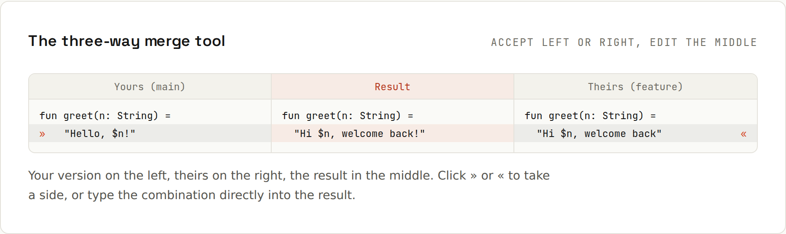

# Git in the IDE

**Commit, diff and resolve conflicts visually.** Every IDE Git button runs a [[Git]] command; the IDE adds diffs you can read at a glance, partial staging with checkboxes, and a three-way merge tool.

## Everyday actions
| Action | IntelliJ IDEA | VS Code |
|---|---|---|
| Commit window / Source Control | <kbd>Ctrl</kbd>+<kbd>K</kbd> | <kbd>Ctrl</kbd>+<kbd>Shift</kbd>+<kbd>G</kbd> |
| Push | <kbd>Ctrl</kbd>+<kbd>Shift</kbd>+<kbd>K</kbd> | Command Palette → *Git: Push* (or the sync button) |
| Update / pull | <kbd>Ctrl</kbd>+<kbd>T</kbd> | Command Palette → *Git: Pull* |
| Branches | click the branch name in the title/status bar | click the branch name in the status bar |
| Show diff of a changed file | select it in the commit view, <kbd>Ctrl</kbd>+<kbd>D</kbd> | click the file in Source Control |
| Rollback changes | <kbd>Ctrl</kbd>+<kbd>Alt</kbd>+<kbd>Z</kbd> | *Discard Changes* (↶) |
| Compare with branch | right-click → *Git → Compare with Branch* | Timeline / GitLens |
| Show history for selection | right-click → *Git → Show History for Selection* | Timeline view / GitLens |
| Blame (annotate) | right-click the gutter → *Annotate with Git Blame* | GitLens inline blame |

## Stage only part of a file
Both IDEs let you stage individual changed lines or hunks from the diff gutter, so one file can contribute to two separate, focused commits. In IntelliJ's commit window, each change block has a checkbox; in VS Code, select lines in the diff and *Stage Selected Ranges*. Same as `git add -p` ([[git/Staging in Detail]]).

## The commit window
- Review the diff of every file before committing (this is where debug output gets caught).
- IntelliJ runs **commit checks** before committing: reformat, optimize imports, analyse code, run tests (the ⚙ in the commit window).
- *Amend* checkbox = `git commit --amend`.
- AI assistants can draft the message; edit it so it says *why* ([[git/Commit Messages]]).

## The three-way merge tool

On a conflict ([[git/Merge Conflicts]]), IntelliJ lists conflicted files; *Merge…* opens three panes: **yours** (left), the **result** (middle), **theirs** (right). Click `>>`/`<<` to accept a change from one side, edit the middle directly, then *Apply*. *Accept Left/Right* resolves whole files; the magic wand resolves all non-conflicting changes automatically.

VS Code shows conflicts inline with *Accept Current / Incoming / Both* buttons, and has a three-way **Merge Editor** (*Resolve in Merge Editor*).

## Interactive rebase, cherry-pick, stash
IntelliJ's *Git* tool window (<kbd>Alt</kbd>+<kbd>9</kbd>) → *Log*: right-click commits to cherry-pick, revert, reset, or start an **interactive rebase** with a visual to-do list (reword, squash, drop, reorder by drag and drop) ([[git/Rewriting History]]). *Git → Uncommitted Changes → Stash Changes* for stashes; IntelliJ also has **shelves**, its own stash-like feature.

## Local History (IntelliJ)
IntelliJ snapshots your files as you work, independent of Git. Right-click a file or folder → *Local History → Show History* to recover code you never committed, even after `git restore` or a bad reset. It's kept for a limited time (days) and only on your machine.

## Pull requests in the IDE
- IntelliJ: *Pull Requests* tool window for GitHub/GitLab: review diffs, comment, approve, check out the branch.
- VS Code: the *GitHub Pull Requests* extension does the same.
→ [[github/Code Review]]

## Know the commands anyway
When a GUI operation fails ("rebase stopped", "detached HEAD"), the message is Git's. `git status` in the IDE's terminal (<kbd>Alt</kbd>+<kbd>F12</kbd>) always tells you what state you're in ([[git/Common Errors]]).
