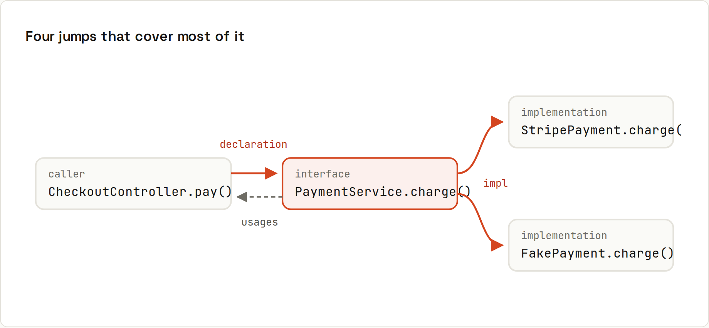

# Navigation

**Jump through a codebase the way you think about it.** In a big project you spend more time reading code than writing it. Navigation lets you follow a call, find who uses something, and get back, in keystrokes.

## The jumps
| Jump | IntelliJ IDEA | VS Code |
|---|---|---|
| Go to declaration | <kbd>Ctrl</kbd>+<kbd>B</kbd> (or <kbd>Ctrl</kbd>+click) | <kbd>F12</kbd> (or <kbd>Ctrl</kbd>+click) |
| Go to implementation(s) | <kbd>Ctrl</kbd>+<kbd>Alt</kbd>+<kbd>B</kbd> | <kbd>Ctrl</kbd>+<kbd>F12</kbd> |
| Find usages | <kbd>Alt</kbd>+<kbd>F7</kbd> | <kbd>Shift</kbd>+<kbd>Alt</kbd>+<kbd>F12</kbd> |
| Call hierarchy | <kbd>Ctrl</kbd>+<kbd>Alt</kbd>+<kbd>H</kbd> | <kbd>Shift</kbd>+<kbd>Alt</kbd>+<kbd>H</kbd> |
| File structure / outline | <kbd>Ctrl</kbd>+<kbd>F12</kbd> | <kbd>Ctrl</kbd>+<kbd>Shift</kbd>+<kbd>O</kbd> |
| Go to class / symbol | <kbd>Ctrl</kbd>+<kbd>N</kbd> / <kbd>Ctrl</kbd>+<kbd>Alt</kbd>+<kbd>Shift</kbd>+<kbd>N</kbd> | <kbd>Ctrl</kbd>+<kbd>T</kbd> |
| Go to file | <kbd>Ctrl</kbd>+<kbd>Shift</kbd>+<kbd>N</kbd> | <kbd>Ctrl</kbd>+<kbd>P</kbd> |
| Go to line | <kbd>Ctrl</kbd>+<kbd>G</kbd> | <kbd>Ctrl</kbd>+<kbd>G</kbd> |
| Back / forward | <kbd>Ctrl</kbd>+<kbd>Alt</kbd>+<kbd>←</kbd> / <kbd>→</kbd> | <kbd>Alt</kbd>+<kbd>←</kbd> / <kbd>→</kbd> |
| Recent locations | <kbd>Ctrl</kbd>+<kbd>Shift</kbd>+<kbd>E</kbd> | – |
| Search text in all files | <kbd>Ctrl</kbd>+<kbd>Shift</kbd>+<kbd>F</kbd> | <kbd>Ctrl</kbd>+<kbd>Shift</kbd>+<kbd>F</kbd> |
| Next / previous error | <kbd>F2</kbd> / <kbd>Shift</kbd>+<kbd>F2</kbd> | <kbd>F8</kbd> / <kbd>Shift</kbd>+<kbd>F8</kbd> |
| Type hierarchy | <kbd>Ctrl</kbd>+<kbd>H</kbd> | – (via extensions) |
| Quick documentation | <kbd>Ctrl</kbd>+<kbd>Q</kbd> | hover, or <kbd>Ctrl</kbd>+<kbd>K</kbd> <kbd>Ctrl</kbd>+<kbd>I</kbd> |

## Back is the most underrated shortcut
Dive three definitions deep to understand something, then press **Back** until you're where you started. Mouse users can use the side buttons, which map to the same action in both IDEs.

## Declaration vs implementation
On an interface method (`PaymentService.pay()`), *go to declaration* lands on the interface. *Go to implementation* lists the classes that actually implement it (`StripePaymentService`, `FakePaymentService`). In Spring projects, that's how you find the code that really runs.

## Find usages vs text search
Find usages knows the code: it finds calls of **this** `total()` method, not other methods named `total`, not comments, and it includes calls through interfaces. Text search finds strings everywhere, including configs and templates: use it for things that aren't code symbols (a URL, a config key, an error message).

## Search Everywhere
IntelliJ's <kbd>Shift</kbd> <kbd>Shift</kbd> searches classes, files, symbols, actions and settings at once. Tips:
- CamelCase humps: `PSS` finds `PaymentServiceStub`.
- `Cart:42` opens `Cart` at line 42.
- Include library classes with the checkbox (or press <kbd>Shift</kbd> <kbd>Shift</kbd> twice).

VS Code's <kbd>Ctrl</kbd>+<kbd>P</kbd>: type a file name; prefix `>` for commands, `@` for symbols in the file, `#` for symbols in the workspace, `:` for a line.

## Reading library code
<kbd>Ctrl</kbd>+<kbd>B</kbd> into a library class opens its source (IntelliJ downloads sources automatically for Maven/Gradle dependencies; otherwise it decompiles). Reading how Spring or the JDK implements something is one of the best ways to learn.

## Bookmarks
IntelliJ: <kbd>F11</kbd> toggles a bookmark, <kbd>Shift</kbd>+<kbd>F11</kbd> lists them; <kbd>Ctrl</kbd>+<kbd>Shift</kbd>+<kbd>digit</kbd> sets a numbered one, <kbd>Ctrl</kbd>+<kbd>digit</kbd> jumps to it. VS Code: the *Bookmarks* extension.
