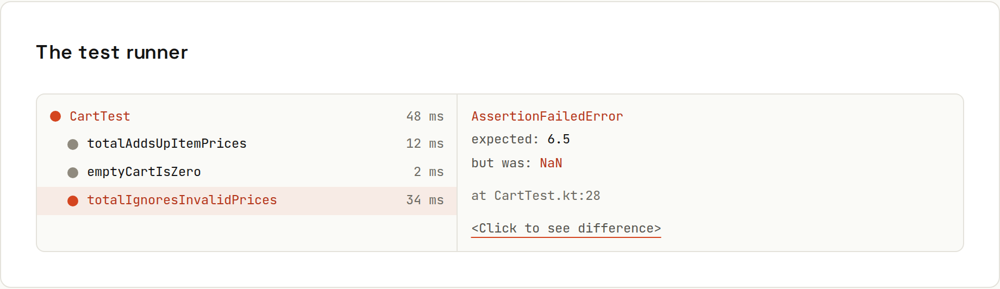

# Testing in the IDE

**Run one test in a second, see exactly why it failed.** The IDE's test runner shows every test as a tree, with timings, failures and diffs, and lets you rerun or debug a single test.

## Running tests
| Action | IntelliJ IDEA | VS Code |
|---|---|---|
| Run test / file at caret | <kbd>Ctrl</kbd>+<kbd>Shift</kbd>+<kbd>F10</kbd> | <kbd>Ctrl</kbd>+<kbd>;</kbd> then <kbd>C</kbd> |
| Re-run last | <kbd>Ctrl</kbd>+<kbd>F5</kbd> | <kbd>Ctrl</kbd>+<kbd>;</kbd> then <kbd>L</kbd> |
| Debug test at caret | right-click gutter ▶ → *Debug* | <kbd>Ctrl</kbd>+<kbd>;</kbd> then <kbd>Ctrl</kbd>+<kbd>C</kbd> |
| Run all tests in the project | right-click `src/test` → *Run 'All Tests'* | Testing view → ▶ at the top |
| Toggle test ↔ implementation | <kbd>Ctrl</kbd>+<kbd>Shift</kbd>+<kbd>T</kbd> | – |
| Run with coverage | gutter ▶ → *Run with Coverage* | Testing view → *Run with Coverage* |
| Rerun failed tests only | ⟳ with the red mark in the Run window | Testing view → *Rerun Failed Tests* |

The green ▶ icons in the gutter next to each test class and method (IntelliJ) and the *Run Test \| Debug Test* CodeLens (VS Code) are the fastest way in. VS Code needs the language's test extension (Java Test Runner, Vitest/Jest extension, Kotlin support).

## Reading a failure
Click a failed test: the output shows the assertion message and stack trace; IntelliJ offers **<Click to see difference>** for `assertEquals` on strings and objects, a side-by-side diff of expected vs actual. The stack trace lines are clickable and jump to the failing assertion.

For the real `CartTest` from the Java guide, a broken expectation reports `expected: <1000> but was: <1050>` ([[java/Testing with JUnit]]).

## Create a test
IntelliJ: in a class, <kbd>Ctrl</kbd>+<kbd>Shift</kbd>+<kbd>T</kbd> → *Create New Test…*: pick JUnit 5, the methods to test, and it creates `src/test/java/.../CartTest.java` in the matching package. <kbd>Alt</kbd>+<kbd>Insert</kbd> inside a test class generates test methods, `@BeforeEach` and so on.

## Coverage in the gutter
After a coverage run, the gutter shows which lines tests executed (green), partially executed branches (yellow) and never executed (red). Uncovered branches in important logic are where the next test should go; 100 % isn't the goal.

## Test-driven workflow
1. Write a failing test for the behaviour you want.
2. <kbd>Ctrl</kbd>+<kbd>Shift</kbd>+<kbd>F10</kbd>: red.
3. Use quick fixes (<kbd>Alt</kbd>+<kbd>Enter</kbd> → *Create method*) to generate the missing code.
4. Implement until green, <kbd>Ctrl</kbd>+<kbd>F5</kbd> to rerun.
5. Refactor with the test as a safety net ([[ides/Refactoring]]).

## Continuous testing
- IntelliJ: the *Toggle auto-test* button in the Run window reruns tests on every change.
- Vitest/Jest in watch mode (`npx vitest`) rerun affected tests on save; the VS Code extensions show results inline.
- Gradle: `./gradlew test --continuous`.

## When the IDE and the build disagree
A test passes in the IDE but fails in CI (or the other way round)? Usual suspects: a different JDK, the IDE not delegating to Gradle, environment variables set only in the run configuration, test order dependence, or time zone/locale differences. Run `./gradlew test` locally to reproduce what CI sees ([[ides/Running and Run Configurations]]).
