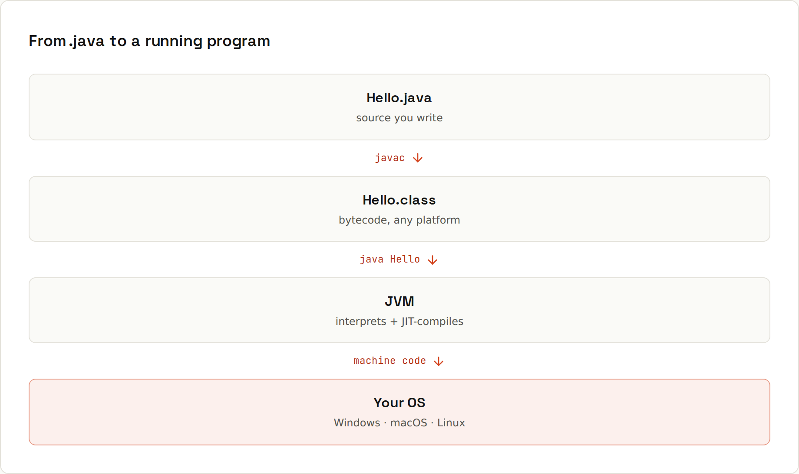

# Java

**Java** is a statically typed, object-oriented language that compiles to bytecode and runs on the **JVM** (Java Virtual Machine), on any operating system. It powers enterprise backends, Android's foundations, big data tools, Minecraft, and a large part of the software a company like a retailer runs every day.

> Every example on these pages was compiled and run on **JDK 25** (Temurin 25.0.4.1, the current LTS); the source files are in `code/java/`. The build and test examples are a real Gradle/Maven project (`code/java/cart-project/`) with 9 passing JUnit tests. For the newest release, see the [Java 27 wiki](https://lfdiego.xyz/wiki/java27/).



## Learning path
| Step | Read | You'll be able to… |
|---|---|---|
| 1 | [[java/How Java Runs]] · [[java/Installing the JDK]] | compile and run a program, understand JDK/JRE/JVM |
| 2 | [[java/Syntax Basics]] · [[java/Switch and Pattern Matching]] · [[java/Methods]] · [[java/Arrays]] | write everyday code |
| 3 | [[java/Primitive Types]] · [[java/References and Memory]] · [[java/Strings]] | predict what `==`, copies and overflow do |
| 4 | [[java/Anatomy of a Class]] · [[java/Classes and Objects]] · [[java/Records and Enums]] · [[java/Access Modifiers and Packages]] | model data properly |
| 5 | [[java/Interfaces and Polymorphism]] · [[java/Inheritance and Composition]] · [[java/Sealed Types]] | design with types |
| 6 | [[java/Exceptions]] · [[java/Generics]] | handle errors, write reusable type-safe code |
| 7 | [[java/Collections]] · [[java/Maps and Hashing]] | pick the right data structure |
| 8 | [[java/Lambdas and Functional Interfaces]] · [[java/Streams]] · [[java/Optional]] | write modern, declarative Java |
| 9 | [[java/Date and Time]] · [[java/Files and IO]] | work with the real world |
| 10 | [[java/Concurrency Basics]] · [[java/Virtual Threads and Executors]] · [[java/Garbage Collection]] | understand threads and memory |
| 11 | [[java/Build Tools]] · [[java/Testing with JUnit]] | build, test and ship a project |
| 12 | [[java/Modern Java]] | know what changed from Java 8 to 25 |

When something breaks: [[java/Common Errors]] (compiler and runtime messages, searchable). Quick lookups: [[java/Cheat Sheet]], [[java/Glossary]].

## Hello, JVM
```java
public class Hello {
    public static void main(String[] args) {
        System.out.println("Hello, JVM");
    }
}
```
```sh
java Hello.java
```
```
Hello, JVM
```

## Why Java?
- **Runs everywhere** the JVM runs, with the same bytecode.
- **Fast**: the JIT compiler turns hot code into optimised machine code at runtime.
- **Huge ecosystem**: Spring Boot, Maven Central with hundreds of thousands of libraries, excellent IDEs.
- **Backwards compatible**: code from 20 years ago still runs.
- **Modern**: records, pattern matching, virtual threads, and a new release every six months.

## Related
- [[Kotlin]]: Java's concise cousin on the same JVM
- [[IDEs]]: IntelliJ IDEA is the standard Java IDE
- [Java 27 wiki](https://lfdiego.xyz/wiki/java27/): every JEP of the latest release, measured
