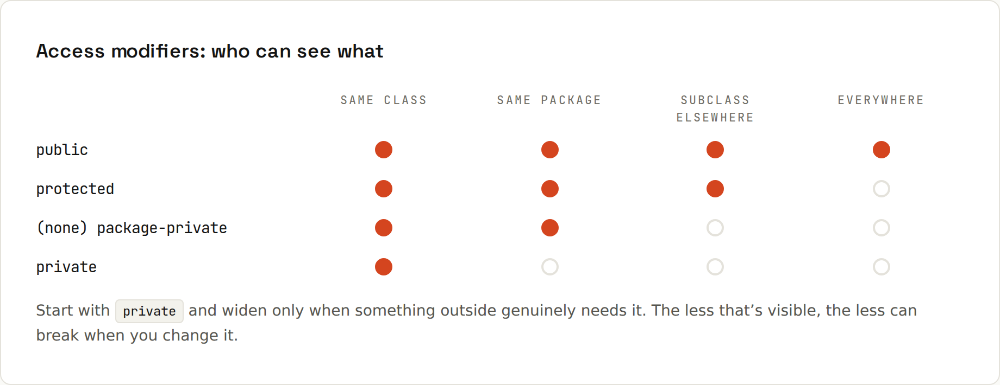

# Access Modifiers and Packages

Access modifiers decide **who can see what**. Packages group related classes and are the unit of the default access level.



| Modifier | Same class | Same package | Subclass (other package) | Everywhere |
|---|---|---|---|---|
| `private` | ✅ | ❌ | ❌ | ❌ |
| *(none)* "package-private" | ✅ | ✅ | ❌ | ❌ |
| `protected` | ✅ | ✅ | ✅ | ❌ |
| `public` | ✅ | ✅ | ✅ | ✅ |

**Rule of thumb:** make everything as private as possible. Fields `private`, helper methods `private`, classes that are only used inside their package without modifier. Only the API you want others to use is `public`.

## Packages
```java
package shop.checkout;          // first line of the file

import java.util.List;          // one type
import java.util.*;             // all types of a package (explicit imports are usual)
import static java.lang.Math.max;   // a static member
```
- The package matches the folder: `src/main/java/shop/checkout/PaymentService.java`.
- Names are lowercase, usually a reversed domain: `com.mediamarktsaturn.orders`, `xyz.lfdiego.wiki`.
- `java.lang` (String, Math, System…) is imported automatically.
- Two classes with the same name in different packages? Import one, fully qualify the other: `java.util.Date` vs `java.sql.Date`.

## Organising packages
Two common styles:
| By layer | By feature |
|---|---|
| `shop.controller`, `shop.service`, `shop.repository` | `shop.cart`, `shop.checkout`, `shop.catalog` |
| easy to start | scales better: related code together, package-private keeps internals hidden |

Feature packages plus package-private classes give real encapsulation: only a feature's public entry point is visible to the rest.

## Other modifiers
| Modifier | On | Means |
|---|---|---|
| `static` | fields, methods, nested classes | belongs to the class, not an instance |
| `final` | variables, fields | assigned once |
| `final` | methods / classes | can't be overridden / extended |
| `abstract` | methods / classes | no body / can't be instantiated ([[java/Inheritance and Composition]]) |
| `sealed`, `non-sealed`, `permits` | classes, interfaces | restrict who may extend ([[java/Sealed Types]]) |
| `synchronized` | methods, blocks | one thread at a time ([[java/Concurrency Basics]]) |
| `volatile` | fields | changes are visible to all threads immediately |
| `transient` | fields | skipped by Java serialisation |
| `default` | interface methods | method with a body in an interface |

## Modules (Java 9+)
Above packages, the **module system** (`module-info.java`) declares which packages a JAR exports and which modules it requires. Public classes in non-exported packages are invisible to other modules: "public, but only inside my library". The JDK itself is modular; most applications still run on the classpath without their own `module-info.java`. The [Java 27 wiki](https://lfdiego.xyz/wiki/java27/) has a modules example.
