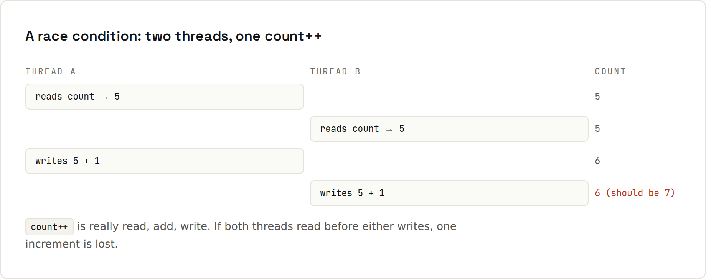

# Concurrency Basics

**Threads share memory, and that's where bugs hide.** Running work in parallel makes programs faster and more responsive, but two threads touching the same variable without coordination produce results that are wrong only *sometimes*. Output from `code/java/Race.java`.

## A race condition, for real


Two threads each increment three counters a million times:
```java
Runnable work = () -> {
    for (int i = 0; i < 1_000_000; i++) {
        count++;                                   // read, add, write: not atomic
        synchronized (lock) { safeCount++; }       // 1. lock
        atomic.incrementAndGet();                  // 2. atomic variable
    }
};
Thread a = new Thread(work), b = new Thread(work);
a.start(); b.start();
a.join(); b.join();
```
```
expected 2000000: plain=1982151 synchronized=2000000 atomic=2000000
```
The plain counter lost ~18,000 increments: both threads read the same old value, both wrote value + 1. Run it again and you get a different wrong number. That's what makes concurrency bugs so nasty: tests pass, production fails occasionally.

## Three ways to fix it
1. **Lock** the critical section: `synchronized (lock) { … }` or a `ReentrantLock`. Only one thread at a time.
2. **Atomic variables**: `AtomicInteger`, `AtomicLong`, `LongAdder` (fastest under heavy contention).
3. **Don't share mutable state**: give each task its own data and combine the results at the end:
```java
try (ExecutorService pool = Executors.newFixedThreadPool(4)) {
    Future<Long> f1 = pool.submit(() -> sum(1, 500_000));
    Future<Long> f2 = pool.submit(() -> sum(500_001, 1_000_000));
    System.out.println("sum 1..1000000 in two tasks = " + (f1.get() + f2.get()));
}
```
```
sum 1..1000000 in two tasks = 500000500000
```
Option 3 is the most robust. Immutable objects (records, `List.of`) can be shared freely.

## The toolbox
| Tool | Use it for |
|---|---|
| `ExecutorService` | running tasks on a managed pool of threads ([[java/Virtual Threads and Executors]]) |
| `Future<T>` | the result of a submitted task (`get()` waits) |
| `CompletableFuture<T>` | chaining and combining async results |
| `ConcurrentHashMap` | a map many threads can update safely |
| `AtomicInteger` / `AtomicLong` / `LongAdder` | lock-free counters |
| `ReentrantLock`, `ReadWriteLock` | locks with timeouts and fairness |
| `CountDownLatch`, `Semaphore` | wait for N events; limit concurrent access |
| `BlockingQueue` | producer/consumer hand-off |
| `volatile` | a flag written by one thread, read by others |
| virtual threads | thousands of blocking tasks (HTTP, DB) cheaply |

## Thread-safe collections
```java
ConcurrentHashMap<String, Integer> hits = new ConcurrentHashMap<>();
try (ExecutorService pool = Executors.newFixedThreadPool(8)) {
    for (int i = 0; i < 10_000; i++) {
        String page = i % 2 == 0 ? "/home" : "/cart";
        pool.submit(() -> hits.merge(page, 1, Integer::sum));
    }
}
```
```
ConcurrentHashMap hits = {/cart=5000, /home=5000}
```
`merge` is atomic on `ConcurrentHashMap`. With a plain `HashMap`, you'd lose updates or even corrupt the map. Note: `if (!map.containsKey(k)) map.put(k, v)` is **not** atomic even on a `ConcurrentHashMap`; use `putIfAbsent`/`computeIfAbsent`.

## CompletableFuture: combine async results
```java
CompletableFuture<String> user = CompletableFuture.supplyAsync(() -> { sleep(100); return "Ada"; });
CompletableFuture<Integer> orders = CompletableFuture.supplyAsync(() -> { sleep(150); return 3; });
String summary = user.thenCombine(orders, (u, o) -> u + " has " + o + " orders").get();
```
```
Ada has 3 orders (after 150 ms, not 250)
```
Both calls run at the same time. Errors propagate and can be handled:
```java
CompletableFuture<Integer> failing = CompletableFuture.supplyAsync(() -> { throw new IllegalStateException("service down"); });
failing.exceptionally(e -> -1).get();
```
```
exceptionally: -1
```
With virtual threads, plain blocking code in parallel tasks is often simpler than long `thenCompose` chains; **structured concurrency** (preview, see the [Java 27 wiki](https://lfdiego.xyz/wiki/java27/)) makes that safe.

## Visibility: `volatile`
Without synchronisation, one thread may never see another's write (CPU caches, compiler reordering). A stop flag must be `volatile` (or an `AtomicBoolean`):
```java
private volatile boolean running = true;
```
`volatile` guarantees visibility, not atomicity: `volatile int count; count++` is still a race.

## Deadlocks
Thread 1 holds lock A and waits for B; thread 2 holds B and waits for A: both wait forever. Avoid by always acquiring locks in the same order, holding them briefly, and preferring higher-level tools (concurrent collections, executors, immutability). `jstack <pid>` (or `jcmd <pid> Thread.print`) shows deadlocked threads.

## Rules of thumb
- Prefer **immutable** data and **no shared state**.
- Use the `java.util.concurrent` tools rather than raw `Thread` and `wait/notify`.
- Keep critical sections small; never call slow I/O while holding a lock.
- Test concurrency code under load, and treat "works on my machine" as meaningless.
