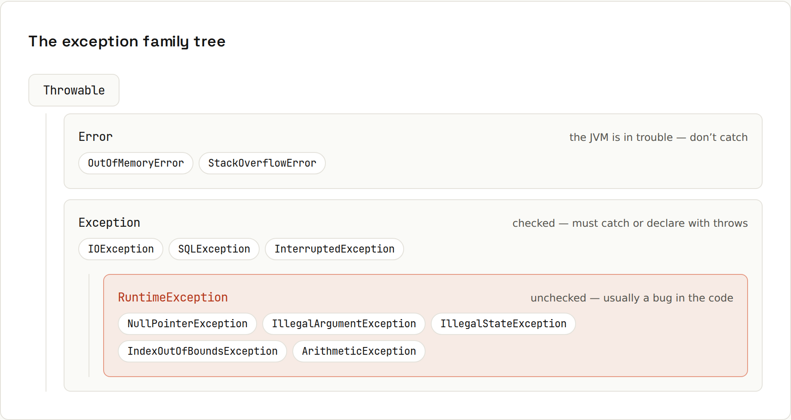

# Exceptions

An exception **unwinds the call stack** until something catches it. Java splits them into **checked** exceptions the compiler forces you to handle, and **unchecked** ones that usually mean a bug. Output from `code/java/Exceptions.java`.



| Branch | Examples | Meaning | Compiler |
|---|---|---|---|
| `Error` | `OutOfMemoryError`, `StackOverflowError` | the JVM is in trouble; don't catch | – |
| checked `Exception` | `IOException`, `SQLException` | expected failures outside your control | must catch or declare `throws` |
| `RuntimeException` (unchecked) | `NullPointerException`, `IllegalArgumentException`, `IndexOutOfBoundsException` | usually a bug or invalid input | optional |

## Reading a stack trace
```java
static void checkout(String customer) { greet(customer); }
static void greet(String customer) { System.out.println("Hello " + customer.toUpperCase()); }
// main: checkout(null);
```
```
Exception in thread "main" java.lang.NullPointerException: Cannot invoke "String.toUpperCase()" because "customer" is null
	at Exceptions.greet(Exceptions.java:85)
	at Exceptions.checkout(Exceptions.java:84)
	at Exceptions.main(Exceptions.java:81)
```
Read **top-down**: the exception type and message, then where it happened (`greet`, line 85), then who called it. In real applications, look for the first line in **your** code; framework lines above and below are context. With `Caused by:` sections, the **last** cause is usually the root problem.

## try / catch / finally
```java
static List<String> readUsers(Path file) {
    try (var reader = Files.newBufferedReader(file)) {
        return reader.lines().toList();
    } catch (NoSuchFileException e) {
        System.out.println("  no file yet: " + e.getMessage());
        return List.of();                        // expected: no file yet
    } catch (IOException e) {
        throw new UncheckedIOException("Could not read users", e);
    } finally {
        System.out.println("  import finished");  // always runs
    }
}
```
```
readUsers:
  no file yet: users-that-do-not-exist.csv
  import finished
  -> []
```
- Catch blocks are checked top to bottom; more specific types first (`NoSuchFileException` is an `IOException`).
- `finally` runs whether or not an exception happened (even after `return`).
- Multi-catch: `catch (ClassCastException | NullPointerException e)`.

## try-with-resources
Anything `AutoCloseable` (files, streams, database connections, HTTP clients) declared in `try ( … )` is closed automatically, in reverse order, even on exceptions:
```java
try (var a = new Resource("A"); var b = new Resource("B")) {
    System.out.println("  working with " + a.name + " and " + b.name);
    throw new IllegalStateException("boom");
} catch (IllegalStateException e) {
    System.out.println("  caught " + e.getMessage() + " after closing");
}
```
```
  open A
  open B
  working with A and B
  close B
  close A
  caught boom after closing
```
Never close resources by hand in `finally` again.

## Your own exception
```java
static class OutOfStockException extends RuntimeException {
    OutOfStockException(String sku) { super("Out of stock: " + sku); }
}
static void order(String sku) {
    if (stock.getOrDefault(sku, 0) == 0) throw new OutOfStockException(sku);
    System.out.println("ordered " + sku);
}
```
```
ordered TEA
caught: Out of stock: CAKE
```
Extend `RuntimeException` for most application exceptions; extend `Exception` (checked) only if every caller really must handle it.

## Keep the cause
```java
try {
    return Integer.parseInt(input);
} catch (NumberFormatException e) {
    throw new IllegalArgumentException("Invalid price '" + input + "'", e);   // keep the cause
}
```
```
Invalid price '12,50', caused by: java.lang.NumberFormatException: For input string: "12,50"
```

## Do and don't
| Instead of | Prefer | Why |
|---|---|---|
| `catch (Exception e) { }` | `catch (IOException e) { log.warn("Import failed", e); }` | an empty catch hides bugs forever; catch the specific type and at least log it |
| `e.printStackTrace();` | `log.error("Payment failed for order {}", id, e);` | a logger with context gets the error into your logs |
| `throw new RuntimeException(e.getMessage());` | `throw new RuntimeException("Could not save order " + id, e);` | pass the cause, or the original stack trace is lost |
| exceptions for normal control flow | `if`, `Optional`, return values | exceptions are slow and hide the logic |
| catching `NullPointerException` | fix the null ([[java/References and Memory]]) | an NPE is a bug |

## Checked exceptions and lambdas
Lambdas in streams can't throw checked exceptions. Wrap them: `catch (IOException e) { throw new UncheckedIOException(e); }`. Forgetting to handle a checked exception is a compile error:
```
Cart3.java:7: error: unreported exception IOException; must be caught or declared to be thrown
        return Files.readString(Path.of("cart.txt"));
                               ^
```
The full list of common runtime exceptions and their messages: [[java/Common Errors]].
