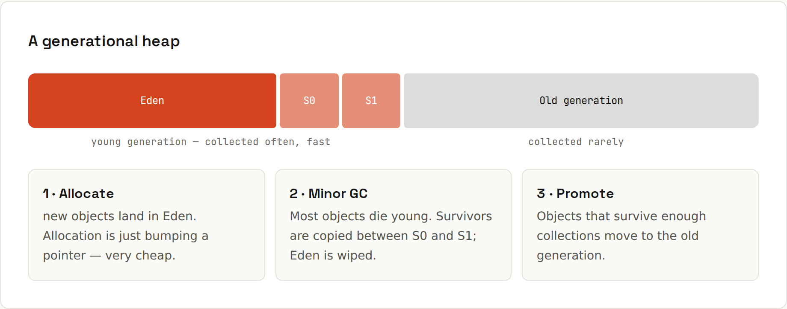

# Garbage Collection

**You allocate; the JVM cleans up what nothing points to.** The garbage collector (GC) frees objects that are no longer reachable from your code. Modern collectors are built on one observation: **most objects die young.** Output from `code/java/GcInfo.java`.



## Reachability
An object stays alive while it's reachable from a **GC root**: local variables of running methods, static fields, active threads. Everything else is garbage, even if objects point at each other in a cycle. You never free memory yourself; you just stop referencing things.

## Generations
| Area | Holds | Collected |
|---|---|---|
| **Eden** | new objects | very often, very fast (most are already dead) |
| **Survivor** (S0/S1) | objects that survived a few young collections | with Eden |
| **Old generation** | long-lived objects (caches, sessions, config) | rarely, more expensive |

A young collection only touches live objects, so allocating millions of short-lived objects is cheap:
```java
for (int i = 0; i < 200_000; i++) { byte[] garbage = new byte[1024]; }   // short-lived: dies young
```
With G1 and a 64 MB heap:
```
max heap: 64 MB
collector: G1 Young Generation
collector: G1 Concurrent GC
collector: G1 Old Generation
allocated ~200 MB of short-lived arrays, GC runs so far: 5
```
200 MB allocated in a 64 MB heap: no problem, because almost everything died immediately.

## The collectors
| Collector | Trade-off | Enable with |
|---|---|---|
| **G1** (default) | balanced throughput and pauses | – (default since Java 9) |
| **ZGC** | pauses under a millisecond, uses more CPU/memory | `-XX:+UseZGC` |
| **Parallel** | max throughput, longer pauses: batch jobs | `-XX:+UseParallelGC` |
| **Serial** | tiny heaps, single core, small containers | `-XX:+UseSerialGC` |

Same program, other collectors:
```
collector: ZGC Minor Cycles
collector: ZGC Minor Pauses
collector: ZGC Major Cycles
collector: ZGC Major Pauses
allocated ~200 MB of short-lived arrays, GC runs so far: 44
```
```
max heap: 61 MB
collector: Copy
collector: MarkSweepCompact
allocated ~200 MB of short-lived arrays, GC runs so far: 9
```
(ZGC is generational since Java 21, the only mode since Java 23.) Measured pause times and throughput for all collectors: the [Java 27 wiki](https://lfdiego.xyz/wiki/java27/) on garbage collectors.

**Start with the default.** Switch only when measurements show a problem: ZGC for latency-sensitive services with large heaps, Serial for tiny containers.

## Sizing the heap
```sh
java -Xms512m -Xmx2g -jar app.jar     # start at 512 MB, cap at 2 GB
java -XX:MaxRAMPercentage=75 -jar app.jar   # in containers: 75 % of the container limit
java -XX:+UseZGC -Xmx4g -jar app.jar
jcmd <pid> GC.heap_info               # inspect a running JVM
java -Xlog:gc -jar app.jar            # one log line per collection
```
Without `-Xmx`, the JVM takes 25 % of the machine's (or container's) memory.

## Leaks still happen
GC only frees **unreachable** objects. Things you keep a reference to (a static map used as a cache, listeners you never remove, sessions that never expire) grow forever:
```java
static final List<byte[]> leak = new ArrayList<>();    // a static list that only grows
while (true) leak.add(new byte[1024 * 1024]);
```
```
OutOfMemoryError after keeping 30 MB: Java heap space
```
Finding leaks:
- `-XX:+HeapDumpOnOutOfMemoryError` writes a heap dump when it happens; open it in Eclipse MAT or IntelliJ.
- `jcmd <pid> GC.class_histogram` lists what fills the heap.
- **Java Flight Recorder** (`-XX:StartFlightRecording`) + JDK Mission Control show allocation hot spots.
- Bounded caches (Caffeine), `WeakHashMap` for metadata keyed by objects you don't own, removing listeners.

## Tips
- Don't call `System.gc()`; the JVM knows better.
- Don't write `finalize()` (deprecated for removal); use try-with-resources or `Cleaner`.
- Object pools for ordinary objects usually make things slower, not faster.
- Reduce allocation in hot loops only after profiling shows it matters.
