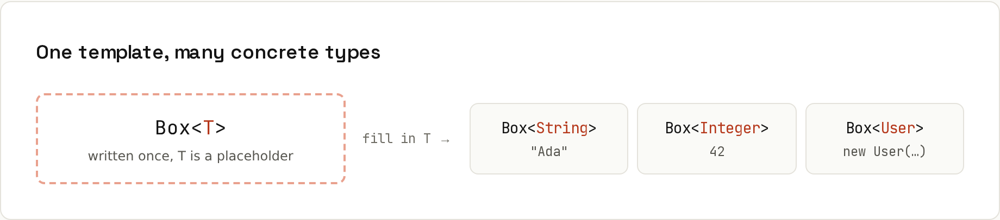

# Generics

Write it once, type-safe for any type. Generics let a class or method work with "some type `T`" while the compiler still checks that you never put a `User` into a `List<String>`. Output from `code/java/Generics.java`.



## Generic classes and methods
```java
static class Box<T> {
    private final T value;
    Box(T value) { this.value = value; }
    T get() { return value; }
    <R> Box<R> map(Function<? super T, ? extends R> f) { return new Box<>(f.apply(value)); }
}
record Pair<A, B>(A first, B second) {}
```
```java
Box<String> name = new Box<>("Ada");   // <> infers String
String s = name.get();                 // no cast needed
Box<Integer> len = name.map(String::length);
var p = new Pair<>("tea", 250);
```
```
Box(Ada) -> Box(3), s = Ada
Pair[first=tea, second=250], first is a String
```
Type parameter names: `T` (type), `E` (element), `K`/`V` (key/value), `R` (result).

## Bounded types
```java
// T must be comparable to itself
static <T extends Comparable<T>> T max(List<T> items) {
    return Collections.max(items);
}
```
```
max of ints: 9, max of strings: zucchini
```

## Wildcards: PECS
| Write | Accepts | Use when you… |
|---|---|---|
| `List<Number>` | exactly `List<Number>` | read and write `Number`s |
| `List<? extends Number>` | `List<Integer>`, `List<Double>`… | only **read** (Producer **E**xtends) |
| `List<? super Integer>` | `List<Integer>`, `List<Number>`, `List<Object>` | only **add** `Integer`s (Consumer **S**uper) |

```java
static double sum(List<? extends Number> numbers) { ... }       // reads Numbers
static void addDefaults(List<? super Integer> target) { target.add(1); target.add(2); }
```
```
sum(ints) = 6.0, sum(doubles) = 0.75
numbers = [1, 2], objects = [1, 2]
```
Why not just `List<Number>`? Because a `List<Integer>` is **not** a `List<Number>`: otherwise you could add a `Double` to a list of integers.

## Type erasure
Generic types exist only at compile time. At runtime a `List<String>` is just a `List`:
```
same runtime class: true
```
That's why you can't write `new T()`, `T[]`, `instanceof List<String>`, or overload `m(List<String>)` and `m(List<Integer>)`. Pass a `Class<T>` or a factory (`Supplier<T>`) when you need the type at runtime.

## Raw types: don't
Using `List` without a type argument turns the checks off. The compiler warns…
```
Generics.java:61: warning: [unchecked] unchecked call to add(E) as a member of the raw type List
        raw.add(42);                              // compiles, no error here...
               ^
```
…and the error shows up later, somewhere else:
```
raw type bites: class java.lang.Integer cannot be cast to class java.lang.String (java.lang.Integer and java.lang.String are in module java.base of loader 'bootstrap')
```
Raw types exist only for compatibility with pre-2004 code. Treat unchecked warnings as errors.

## Generics you use every day
`List<T>`, `Map<K, V>`, `Optional<T>`, `Stream<T>`, `Function<T, R>`, `Comparator<T>`, `CompletableFuture<T>`, `ResponseEntity<T>` (Spring). Reading their signatures is the main skill; writing your own generic classes is less common, generic **methods** a bit more.
