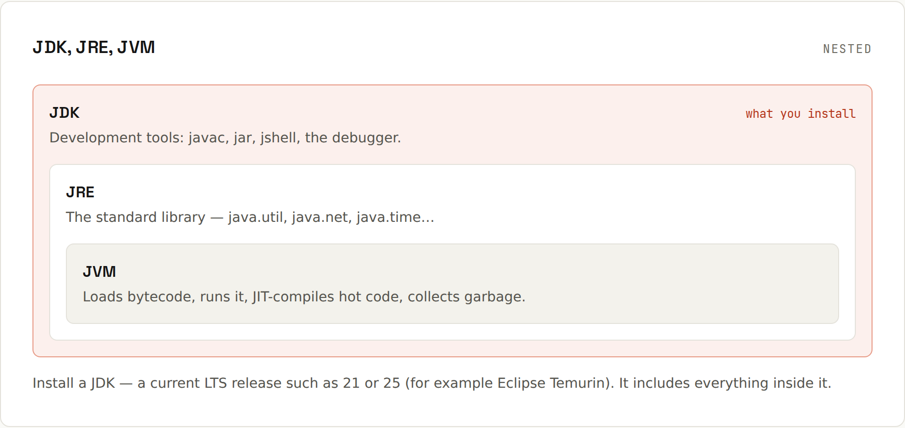

# How Java Runs

**Compile once to bytecode, run it on any JVM.** `javac` turns your source into platform-neutral bytecode. The JVM on each operating system runs that same bytecode, and compiles the hot parts to native code as it goes.


## The steps
```java
// Hello.java
public class Hello {
    public static void main(String[] args) {
        System.out.println("Hello, JVM");
    }
}
```
```sh
javac Hello.java   # → Hello.class (bytecode)
java Hello         # run it on the JVM (the class name, not the file!)
java Hello.java    # or compile + run a single file in one step
```
```
Hello, JVM
```
Since Java 22 the source launcher also finds other `.java` files in the same folder, so small multi-file programs run without a build tool.

Typical beginner mistake: `java Hello.class`:
```
Error: Could not find or load main class Hello.class
Caused by: java.lang.ClassNotFoundException: Hello.class
```
`java` expects a **class name** (`Hello`), not a file name.

## Inside the JVM
| Stage | What happens |
|---|---|
| **Class loading** | `.class` files are loaded from the classpath/module path when first needed |
| **Verification** | bytecode is checked for type safety before it runs |
| **Interpreter** | bytecode runs immediately, instruction by instruction |
| **JIT compilation** | methods that run often ("hot") are compiled to machine code: first quickly (C1), then heavily optimised (C2) |
| **Garbage collection** | unreachable objects are freed automatically ([[java/Garbage Collection]]) |

That's why Java programs "warm up": the first seconds are slower until the JIT has compiled the hot paths. Long-running servers are very fast; for fast start-up there are AOT caches and GraalVM native images (see the [Java 27 wiki](https://lfdiego.xyz/wiki/java27/) on the AOT cache).

## JDK, JRE, JVM


| | Contains | You need it to |
|---|---|---|
| **JVM** | the virtual machine that runs bytecode | – (part of the others) |
| **JRE** | JVM + standard library | run Java programs (no longer shipped separately since Java 11) |
| **JDK** | JRE + `javac`, `jar`, `jshell`, `jlink`, debugger, … | develop. **This is what you install** ([[java/Installing the JDK]]) |

## Bytecode is portable
The same `Hello.class` runs on Windows, macOS and Linux, on x64 and ARM. Look at it with `javap -c Hello`:
```
public static void main(java.lang.String[]);
  Code:
     0: getstatic     #7    // Field java/lang/System.out:Ljava/io/PrintStream;
     3: ldc           #13   // String Hello, JVM
     5: invokevirtual #15   // Method java/io/PrintStream.println:(Ljava/lang/String;)V
     8: return
```
Other languages compile to the same bytecode: [[Kotlin]], Scala, Groovy, Clojure. They all share the JVM and can call each other's libraries.

## Class file versions
Each Java version writes a class file version (Java 21 = 65, Java 25 = 69). An older JVM refuses newer classes:
```
Error: LinkageError occurred while loading main class RuntimeErrors
	java.lang.UnsupportedClassVersionError: RuntimeErrors has been compiled by a more recent version of the Java Runtime (class file version 69.0), this version of the Java Runtime only recognizes class file versions up to 65.0
```
Compiled with JDK 25, run on JDK 21. Fix: run on a newer JVM, or compile for the older one with `javac --release 21` (Gradle: toolchain / `options.release`, Maven: `maven.compiler.release`).

## jshell: try things instantly
```
$ jshell
jshell> "hello".repeat(3)
$1 ==> "hellohellohello"
jshell> 7 / 2
$2 ==> 3
jshell> /exit
```
Great for checking how a method behaves without writing a class.

## Programs, JARs and modules
- A real application is many classes, packed into a **JAR** (a zip of `.class` files plus a manifest): `java -jar app.jar`.
- Build tools create JARs and manage dependencies ([[java/Build Tools]]).
- `jlink` builds a trimmed runtime containing only the modules your app needs.
