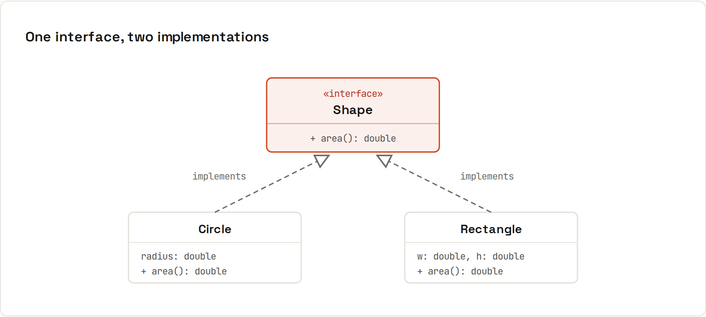

# Interfaces and Polymorphism

**Interfaces describe *what*. Classes decide *how*.** Code against the interface, and any implementation can be swapped in. That's polymorphism, and most of what object-oriented design is about. Output from `code/java/Polymorphism.java`.



## An interface and two implementations
```java
interface Shape {
    double area();
    default String describe() { return getClass().getSimpleName() + " with area " + "%.2f".formatted(area()); }
    static Shape unitSquare() { return new Rectangle(1, 1); }
}
record Circle(double radius) implements Shape {
    public double area() { return Math.PI * radius * radius; }
}
record Rectangle(double w, double h) implements Shape {
    public double area() { return w * h; }
}
```
```java
List<Shape> shapes = List.of(new Circle(1), new Rectangle(2, 3), Shape.unitSquare());
for (Shape s : shapes) System.out.println(s.describe());      // each shape answers its own way
double total = shapes.stream().mapToDouble(Shape::area).sum();
System.out.printf("total area %.2f%n", total);
```
```
Circle with area 3.14
Rectangle with area 6.00
Rectangle with area 1.00
total area 10.14
```
The loop doesn't know or care which shapes it gets. **One call, `s.area()`, many behaviours**: the JVM picks the implementation of the actual object at runtime (dynamic dispatch).

## What an interface can contain
| Member | Since | Example |
|---|---|---|
| abstract methods | always | `double area();` |
| constants | always | `int MAX = 10;` (implicitly `public static final`) |
| `default` methods | Java 8 | `describe()`: shared behaviour, overridable |
| `static` methods | Java 8 | `Shape.unitSquare()`: factories, helpers |
| `private` methods | Java 9 | helpers for default methods |

A class can implement **many** interfaces (`class Cart implements Iterable<Item>, Serializable`) but extend only one class.

## Why program to interfaces
```java
List<String> names = new ArrayList<>();      // variable typed as the interface
```
Later you can switch to another `List` without touching the code that uses `names`. Same idea at application scale:
```java
interface Notifier { void send(String msg); }
static class Checkout {
    private final Notifier notifier;
    Checkout(Notifier notifier) { this.notifier = notifier; }
    void pay(long cents) { notifier.send("paid " + cents + " ct"); }
}
new Checkout(msg -> System.out.println("[mail] " + msg)).pay(1999);
new Checkout(msg -> System.out.println("[sms]  " + msg)).pay(500);
```
```
[mail] paid 1999 ct
[sms]  paid 500 ct
```
`Checkout` works with any `Notifier`: e-mail, SMS, or a fake one in tests ([[java/Testing with JUnit]]). This is **dependency injection**, the core idea behind Spring. Since `Notifier` has a single abstract method, a lambda can implement it ([[java/Lambdas and Functional Interfaces]]).

## The four pillars of OOP
| Pillar | Meaning | In Java |
|---|---|---|
| **Encapsulation** | keep fields private; expose behaviour through methods | `private` fields, validating constructors |
| **Abstraction** | hide *how* behind *what* | interfaces, abstract classes |
| **Inheritance** | reuse and specialise a class | `extends` (prefer composition when unsure) |
| **Polymorphism** | one call, many behaviours | interface/overridden methods, dynamic dispatch |

## Interfaces in the standard library
| Interface | Implement it to… |
|---|---|
| `Comparable<T>` | give objects a natural order (`Collections.sort`, `TreeSet`) |
| `Iterable<T>` | use your class in a for-each loop |
| `AutoCloseable` | use it in try-with-resources ([[java/Exceptions]]) |
| `Runnable`, `Callable<V>` | run it on a thread ([[java/Concurrency Basics]]) |
| `Comparator<T>`, `Function`, `Predicate`… | pass behaviour as a value |

## `@Override`
Put `@Override` on every method that implements or overrides one. If the signature doesn't match (typo, wrong parameter type), the compiler complains instead of silently creating a new method.
