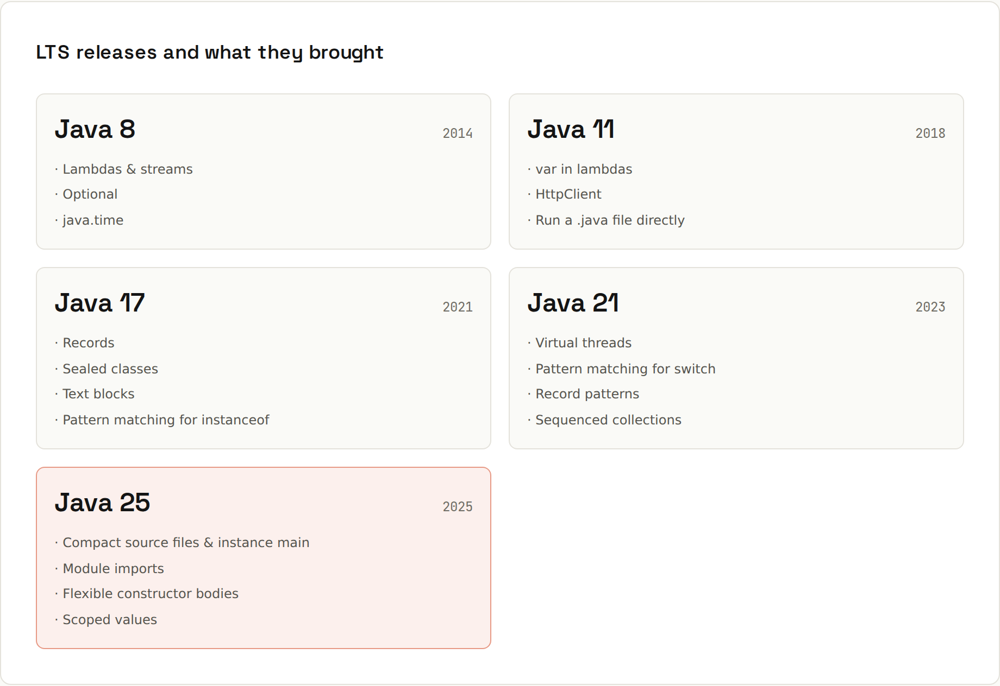

# Modern Java

**Java moves fast now: a new release every six months, a new LTS every two years.** If you learned Java from an old tutorial, a lot has changed. Long-term-support releases are the ones most projects run.



## What each LTS brought
| Release | Year | Highlights | Page |
|---|---|---|---|
| **Java 8** | 2014 | lambdas & streams, `Optional`, `java.time`, default methods | [[java/Lambdas and Functional Interfaces]], [[java/Streams]] |
| **Java 11** | 2018 | `var` (10), `HttpClient`, run a `.java` file directly, `String.strip/isBlank/repeat/lines` | [[java/How Java Runs]] |
| **Java 17** | 2021 | records, sealed classes, text blocks, switch expressions, pattern matching for `instanceof`, helpful NPE messages | [[java/Records and Enums]], [[java/Sealed Types]] |
| **Java 21** | 2023 | virtual threads, pattern matching for `switch`, record patterns, sequenced collections, generational ZGC | [[java/Virtual Threads and Executors]], [[java/Switch and Pattern Matching]] |
| **Java 25** | 2025 | compact source files & instance `main`, module imports, flexible constructor bodies, scoped values, compact object headers, stream gatherers (24), `synchronized` without pinning (24) | this page |

Non-LTS releases in between (22, 23, 24, 26, 27) deliver features step by step, often as **preview** first (`--enable-preview`). The current release is Java 27 (September 2026): see the [Java 27 wiki](https://lfdiego.xyz/wiki/java27/).

## Old Java → modern Java
| Old | Modern |
|---|---|
| `new ArrayList<>(Arrays.asList("a", "b"))` for a constant list | `List.of("a", "b")` |
| a class with fields, constructor, getters, `equals`, `hashCode`, `toString` | `record Point(int x, int y) {}` |
| `if (o instanceof Circle) { Circle c = (Circle) o; … }` | `if (o instanceof Circle c) { … }` |
| `switch` with `break` and fall-through | `switch` expression with `->` |
| `"line1\n" + "line2\n"` | text block `"""` |
| `for` loop + `if` + `add` to build a list | stream `filter`/`map`/`toList` |
| `Date`, `Calendar`, `SimpleDateFormat` | `java.time` |
| `new Thread(…)`, thread pools for blocking I/O | virtual threads |
| `Map<String, String> m = new HashMap<String, String>()` | `var m = new HashMap<String, String>()` |
| `list.get(list.size() - 1)` | `list.getLast()` |
| `public static void main(String[] args)` in a class | `void main()` in a compact source file |

## Compact source files (Java 25)
```java
// CompactHello.java: no class declaration, no static, no String[] args
void main() {
    var name = IO.readln("Your name: ");
    IO.println("Hello, " + name);
}
```
```sh
java CompactHello.java
```
```
Your name: Ada
Hello, Ada
```
Great for learning and small scripts. The class is implicit; methods and fields can be declared at the top level; `java.base` is imported automatically. On Java 21 the same file fails:
```
CompactHello.java:2: error: unnamed classes are a preview feature and are disabled by default.
void main() {
^
  (use --enable-preview to enable unnamed classes)
```

## Module imports (Java 25)
```java
import module java.base;      // everything exported by java.base: List, Map, Path, Stream, …
```

## Flexible constructor bodies (Java 25)
Statements (validation, computing arguments) may come **before** `super(…)`/`this(…)`, as long as they don't use `this`:
```java
class PositiveAmount extends Amount {
    PositiveAmount(long cents) {
        if (cents <= 0) throw new IllegalArgumentException("must be positive");
        super(cents);
    }
}
```

## Staying current
- Upgrade LTS to LTS at least; the jump from 8 → 17/21/25 is the big one (modules, removed APIs, `javax` → `jakarta` in Jakarta EE/Spring Boot 3).
- `jdeprscan` and `jdeps` find deprecated/internal API usage.
- Build with `--release N` for the oldest Java you must support.
