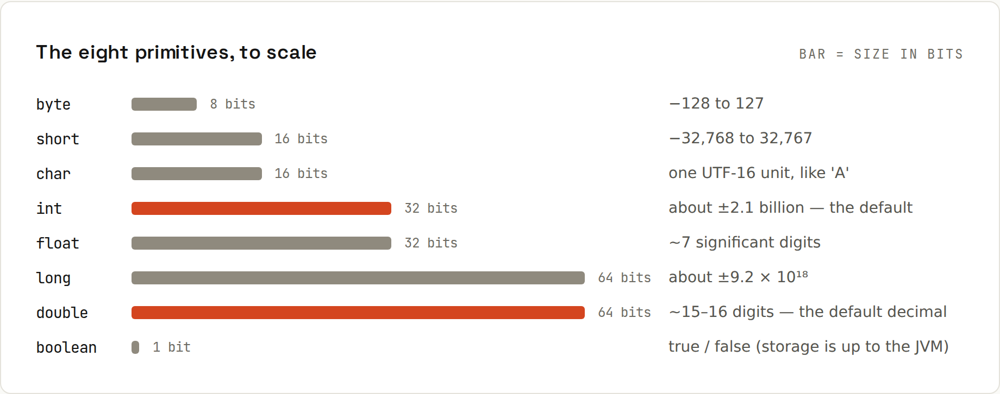

# Primitive Types

Eight primitive types hold their value **directly** in the variable. Everything else is an object, and variables hold a reference to it ([[java/References and Memory]]).



| Type | Size | Range / values | Default | Literal |
|---|---|---|---|---|
| `byte` | 8 bit | −128 … 127 | 0 | `(byte) 7` |
| `short` | 16 bit | −32,768 … 32,767 | 0 | `(short) 7` |
| `int` | 32 bit | −2,147,483,648 … 2,147,483,647 (±2.1 billion) | 0 | `42`, `1_000_000`, `0xFF`, `0b1010` |
| `long` | 64 bit | ±9.2 × 10¹⁸ | 0L | `3_000_000_000L` |
| `float` | 32 bit | ~7 significant digits | 0.0f | `3.14f` |
| `double` | 64 bit | ~15–16 significant digits | 0.0 | `3.14`, `1e-9` |
| `char` | 16 bit | one UTF-16 code unit | `'\u0000'` | `'A'`, `'\n'` |
| `boolean` | – | `true` / `false` | false | `true` |

Everyday choice: `int` for counts, `long` for IDs/timestamps/money in cents, `double` for measurements, `boolean` for flags. `byte`/`short`/`float` mainly for binary data and memory-critical arrays.

## Surprises, all real output
From `code/java/Memory.java`:
```java
System.out.println("int max = " + Integer.MAX_VALUE + ", +1 = " + (Integer.MAX_VALUE + 1));
System.out.println("0.1 + 0.2 = " + (0.1 + 0.2));
System.out.println("(int) 3.99 = " + (int) 3.99 + ", Math.round(3.5) = " + Math.round(3.5) + ", (byte) 200 = " + (byte) 200);
System.out.println("10 / 3 = " + 10 / 3 + ", 10.0 / 3 = " + 10.0 / 3 + ", 1 / 0.0 = " + 1 / 0.0);
System.out.println("char + int: 'A' + 1 = " + ('A' + 1) + ", (char) ('A' + 1) = " + (char) ('A' + 1));
```
```
int max = 2147483647, +1 = -2147483648
0.1 + 0.2 = 0.30000000000000004
(int) 3.99 = 3, Math.round(3.5) = 4, (byte) 200 = -56
10 / 3 = 3, 10.0 / 3 = 3.3333333333333335, 1 / 0.0 = Infinity
char + int: 'A' + 1 = 66, (char) ('A' + 1) = B
```
| Surprise | Why | What to do |
|---|---|---|
| `MAX_VALUE + 1` is negative | integer **overflow** wraps around silently | `long`, `Math.addExact` (throws), `BigInteger` |
| `0.1 + 0.2 != 0.3` | binary floating point can't represent 0.1 exactly | never `double` for money: cents in `long`, or `BigDecimal` |
| `(int) 3.99` is 3 | casting truncates toward zero | `Math.round`, `Math.floor`, `Math.ceil` |
| `(byte) 200` is −56 | narrowing keeps the low 8 bits | check ranges before casting |
| `10 / 3` is 3 | int ÷ int = int | make one operand `double`: `10.0 / 3` |
| `1 / 0.0` is `Infinity` | IEEE 754 floating point | but `1 / 0` (ints) throws `ArithmeticException: / by zero` |
| `'A' + 1` is 66 | `char` is a number (UTF-16 code) | cast back: `(char) ('A' + 1)` |

## Money
```java
long priceCents = 1999;                         // simple and exact
BigDecimal price = new BigDecimal("19.99");     // exact decimals; use the String constructor
price.multiply(new BigDecimal("3")).setScale(2, RoundingMode.HALF_UP);
```
`new BigDecimal(0.1)` would capture the binary error; always pass a String.

## Conversions
- **Widening** (int → long → double) is automatic and safe (except precision loss for huge longs → double).
- **Narrowing** (double → int, int → byte) needs an explicit cast and can lose data.
- `Integer.parseInt("42")`, `Double.parseDouble("3.5")`, `String.valueOf(42)`, `Integer.toString(255, 16)` → `"ff"`.

## Wrapper classes and autoboxing
Collections can't hold primitives, so each has a wrapper class: `Integer`, `Long`, `Double`, `Character`, `Boolean`… Java converts automatically (**autoboxing**):
```java
List<Integer> scores = new ArrayList<>();
scores.add(90);           // int 90 → Integer.valueOf(90)
int first = scores.get(0); // Integer → int (unboxing)
```
Two traps:
```java
Integer i1 = 127, i2 = 127, i3 = 128, i4 = 128;
System.out.println("127 == 127: " + (i1 == i2) + ", 128 == 128: " + (i3 == i4) + ", equals: " + i3.equals(i4));
```
```
127 == 127: true, 128 == 128: false, equals: true
```
1. `==` on wrappers compares **references**; values −128…127 are cached, larger ones aren't. Always use `equals` (or unbox).
2. Unboxing `null` throws `NullPointerException`: `Integer count = map.get("x"); int c = count;`.

## Useful constants and methods
`Integer.MAX_VALUE`, `Long.MIN_VALUE`, `Double.NaN`, `Math.abs/min/max/pow/sqrt`, `Math.floorMod(-7, 3)` (= 2, unlike `-7 % 3` = −1), `Integer.compare(a, b)`, `Character.isDigit(c)`.
