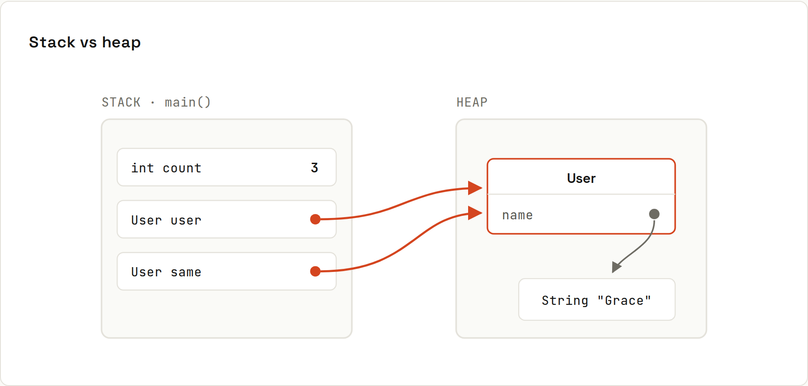

# References and Memory

**Primitives hold values. Everything else holds a reference.** Objects live on the **heap**, and variables only point at them. That one fact explains most "why did that change too?" moments. Output from `code/java/Memory.java`.



## Stack and heap
| | Stack | Heap |
|---|---|---|
| Holds | local variables and parameters of running methods (primitives, references) | all objects (`new …`, arrays, strings) |
| Per | thread | whole JVM, shared |
| Freed | automatically when the method returns | by the garbage collector when unreachable ([[java/Garbage Collection]]) |
| Size | small (default ~512 KB–1 MB per thread) | large (`-Xmx`) |
| Too much | `StackOverflowError` (usually endless recursion) | `OutOfMemoryError` |

## Copying a primitive vs a reference
```java
int count = 3;
int copy = count;
copy++;
System.out.println("count=" + count + " copy=" + copy);

User user = new User("Ada");
User same = user;             // copies the reference only
same.setName("Grace");
System.out.println("user.getName() = " + user.getName());
```
```
count=3 copy=4
user.getName() = Grace
```
`user` and `same` are two arrows to **one** object. Same with collections:
```java
List<String> a = new ArrayList<>(List.of("x"));
List<String> b = a;
b.add("y");
```
```
a = [x, y]
```
Need an independent copy? `new ArrayList<>(a)`, `List.copyOf(a)` (unmodifiable), `array.clone()`, or a copy constructor. For immutable objects (String, records with immutable fields, `List.of`), sharing is harmless: that's a big reason to prefer immutability.

## Passing to methods: always by value
```java
static void rename(User u) { u.setName("Changed"); }       // changes the object
static void reassign(User u) { u = new User("New"); }      // changes only the local copy
static void increment(int x) { x++; }
```
```
after rename(): Changed
after reassign(): Changed
after increment(count): 3
```
The method gets a **copy of the arrow**. Following it (`u.setName`) reaches the caller's object; bending it (`u = new User(…)`) doesn't affect the caller's arrow.

## `==` vs `equals`
- `==` on objects asks **"same object?"**
- `equals` asks **"same content?"** (if the class implements it: [[java/Classes and Objects]])

```java
System.out.println("Objects.equals(null, \"x\") = " + Objects.equals(s1, "x"));
```
```
Objects.equals(null, "x") = false
```
Compare strings with `.equals()`, or `Objects.equals(a, b)` when either side might be null. Details for strings: [[java/Strings]].

## null
A reference can point nowhere: `null`. Calling a method on it throws:
```
java.lang.NullPointerException: Cannot invoke "String.length()" because "s" is null
```
Since Java 14 the message names the null variable (with debug info, which IDEs and build tools include by default). Defences:
- initialise fields in constructors; prefer `final` fields,
- return empty collections and `Optional` instead of `null` ([[java/Optional]]),
- validate early: `Objects.requireNonNull(customer, "customer")`,
- annotations like JSpecify `@Nullable` + IDE checks, or [[Kotlin]], whose type system tracks nullability.

## How much memory does an object use?
Roughly: a 12–16 byte header + fields (int 4, long/double 8, reference 4 with compressed pointers), rounded up to 8 bytes. An `Integer` is ~16 bytes versus 4 for an `int`, which is why `int[]` beats `List<Integer>` for millions of numbers. Java 25 shrinks headers further with compact object headers (see the [Java 27 wiki](https://lfdiego.xyz/wiki/java27/)).
