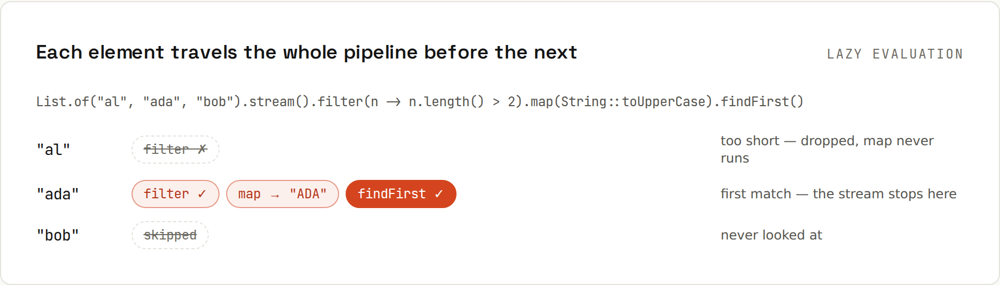

# Streams

A stream pipeline **describes the result, not the loop**. Streams are **lazy**: nothing runs until a terminal operation (`toList`, `findFirst`, `count`…) pulls elements through, one at a time, stopping as soon as it can. Output from `code/java/Streams.java`.

```java
List<String> adults = users.stream()
        .filter(u -> u.age() >= 18)
        .map(User::name)
        .sorted()
        .toList();
```
```
adults = [Ada, Alan, Grace]
```

## Laziness, visible


```java
Optional<String> first = Stream.of("al", "ada", "bo", "grace")
        .filter(n -> { System.out.println("  filter " + n); return n.length() > 2; })
        .map(n -> { System.out.println("  map    " + n); return n.toUpperCase(); })
        .findFirst();
```
```
  filter al
  filter ada
  map    ada
  result ADA
```
"bo" and "grace" are never looked at: `findFirst` had its answer. And without a terminal operation, nothing runs at all:
```
--- no terminal operation, nothing ran
```

## Anatomy
| Part | Examples |
|---|---|
| **source** | `list.stream()`, `Stream.of(…)`, `Arrays.stream(a)`, `IntStream.range(0, 10)`, `Files.lines(path)`, `map.entrySet().stream()` |
| **intermediate** (lazy, return a stream) | `filter`, `map`, `flatMap`, `sorted`, `distinct`, `limit`, `skip`, `peek`, `takeWhile`, `mapMulti`, `gather` |
| **terminal** (runs the pipeline) | `toList`, `collect`, `forEach`, `count`, `sum`, `min`/`max`, `findFirst`, `anyMatch`/`allMatch`/`noneMatch`, `reduce` |

## Collectors
```java
Map<String, List<String>> byCity = users.stream()
        .collect(Collectors.groupingBy(User::city, TreeMap::new, Collectors.mapping(User::name, Collectors.toList())));
Map<Boolean, Long> adultsVsMinors = users.stream()
        .collect(Collectors.partitioningBy(u -> u.age() >= 18, Collectors.counting()));
double averageAge = users.stream().mapToInt(User::age).average().orElse(0);
IntSummaryStatistics stats = users.stream().mapToInt(User::age).summaryStatistics();
String csv = users.stream().map(User::name).collect(Collectors.joining(", ", "[", "]"));
Map<String, Integer> ageByName = users.stream().collect(Collectors.toMap(User::name, User::age));
```
```
groupingBy city = {Helsinki=[Linus, Bo], London=[Ada, Alan], New York=[Grace]}
partitioningBy adult = {false=2, true=3}
average age = 38.2, stats = IntSummaryStatistics{count=5, sum=191, min=12, average=38.200000, max=85}
joining = [Ada, Linus, Grace, Alan, Bo], toMap(Ada) = 36
```

## More operations
```
anyMatch(age > 80) = true, allMatch(age > 10) = true, count(London) = 2
oldest = Grace
flatMap = [a, b, c]
IntStream.rangeClosed(1, 5).sum() = 15, iterate = [1, 2, 4, 8, 16, 32, 64, 128]
distinct + skip + limit = [1, 2]
reduce = 10
takeWhile = [1, 2]
mapMulti = [a, b, c]
gather windowFixed(2) = [[1, 2], [3, 4], [5]]
```
| Operation | Source line |
|---|---|
| oldest | `users.stream().max(Comparator.comparingInt(User::age))` |
| flatMap | `nested.stream().flatMap(List::stream)`: lists of lists → one stream |
| iterate | `Stream.iterate(1, x -> x * 2).limit(8)`: infinite, so `limit` it |
| reduce | `Stream.of(1, 2, 3, 4).reduce(0, Integer::sum)` |
| gather | `.gather(Gatherers.windowFixed(2))`: stream gatherers, final in Java 24 |

## Primitive streams
`mapToInt`, `IntStream`, `LongStream`, `DoubleStream` avoid boxing and offer `sum`, `average`, `summaryStatistics`, `range`. Convert back with `boxed()`.

## A stream is single-use
```java
Stream<String> once = Stream.of("x");
once.count();
once.count();
```
```
reuse: stream has already been operated upon or closed
```
Keep the **collection**, create a new stream each time.

## Streams aren't always better
A plain loop is fine, often clearer for complex logic with early exits, several accumulators or checked exceptions. Rules of thumb:
- One stream per clear transformation; if it needs comments, split it or use a loop.
- No side effects in `map`/`filter` (no adding to outside lists): use a collector.
- `parallelStream()` only for large CPU-heavy work, measured; it uses the shared ForkJoinPool and often makes small tasks slower.

## `toList()` vs `collect(Collectors.toList())`
`stream.toList()` (Java 16+) returns an **unmodifiable** list; `Collectors.toList()` a mutable `ArrayList` (unspecified, but in practice). Prefer `toList()`.
