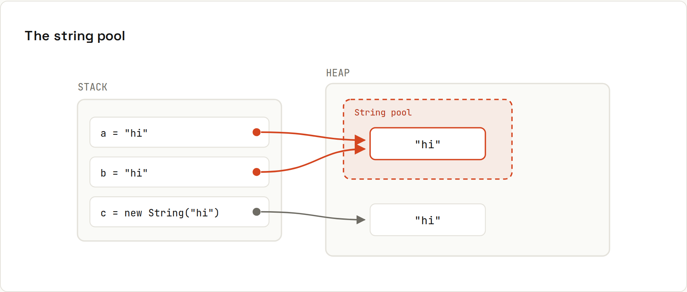

# Strings

**Strings are immutable**: every "change" makes a new one. That makes them safe to share between threads and to use as map keys, but building strings in a loop needs a `StringBuilder`. Output from `code/java/Strings.java`.

## The string pool and `==`


```java
String a = "hi";
String b = "hi";              // same pooled object as a
String c = new String("hi");  // forces a brand-new object
System.out.println("a == b: " + (a == b));
System.out.println("a == c: " + (a == c));
System.out.println("a.equals(c): " + a.equals(c));
System.out.println("a == c.intern(): " + (a == c.intern()));
```
```
a == b: true
a == c: false
a.equals(c): true
a == c.intern(): true
```
String **literals** are stored once in a pool, so `a == b` happens to be true. Strings from input, files, `substring` or concatenation at runtime are new objects. `==` "working" in a test and failing in production is a classic bug. **Always compare with `equals`.**

## Immutability
```java
String s = "hello";
s.toUpperCase();                          // result thrown away!
System.out.println("after s.toUpperCase(): " + s);
s = s.toUpperCase();
System.out.println("after s = s.toUpperCase(): " + s);
```
```
after s.toUpperCase(): hello
after s = s.toUpperCase(): HELLO
```

## Methods you'll use
| Method | Example → result |
|---|---|
| `length()` | `"hello".length()` → `5` |
| `charAt(i)` | `"hello".charAt(1)` → `e` |
| `substring(a, b)` | `"hello".substring(1, 4)` → `ell` (b is exclusive) |
| `indexOf` / `lastIndexOf` | `"hello".indexOf("l")` → `2`, last → `3` (−1 if absent) |
| `contains`, `startsWith`, `endsWith` | `"hello".contains("ll")` → `true` |
| `split(regex)` | `"a,b,,c".split(",")` → `[a, b, , c]` |
| `strip()` / `isBlank()` | `" hi ".strip()` → `hi`, `"  ".isBlank()` → `true` |
| `repeat(n)` | `"ab".repeat(3)` → `ababab` |
| `formatted(…)` | `"%s is %d".formatted("Ada", 36)` → `Ada is 36` |
| `String.join` | `String.join(", ", List.of("a", "b", "c"))` → `a, b, c` |
| `equalsIgnoreCase`, `compareTo` | `"Java".equalsIgnoreCase("JAVA")` → `true`; `"apple".compareTo("banana")` → `-1` |
| `replace` / `replaceAll(regex)` | `"a-b-c".replace("-", "+")` → `a+b+c`; `"a1b22c".replaceAll("[0-9]+", "#")` → `a#b#c` |
| `lines()`, `chars()` | streams of lines / characters |
| `toUpperCase(Locale.ROOT)` | locale-safe case conversion |

`split` takes a **regular expression**: `"a.b".split(".")` returns an empty array because `.` matches everything; use `split("\\.")`.

## Formatting
```java
System.out.println(String.format("%-8s|%6.2f|%05d|%x", "left", 3.14159, 42, 255));
```
```
left    |  3.14|00042|ff
```
| Code | Means |
|---|---|
| `%s` | any value (`toString()`) |
| `%d` | integer; `%,d` adds thousands separators |
| `%.2f` | decimal with 2 places |
| `%-8s` / `%6s` | left / right aligned in 8 / 6 columns |
| `%05d` | zero-padded |
| `%x` | hexadecimal |
| `%n` | platform newline |

For user-facing numbers and dates use locale-aware formatters (`NumberFormat.getCurrencyInstance(Locale.GERMANY)` → `19,99 €`, [[java/Date and Time]]).

## Building strings: `StringBuilder`
```java
// Slow: a brand-new String on every iteration
String slow = "";
for (int i = 0; i < n; i++) slow += "x";

// Fast: one growable buffer
var fast = new StringBuilder();
for (int i = 0; i < n; i++) fast.append("x");
```
Measured with 20,000 appends on the test machine:
```
20000 appends: += 346 ms, StringBuilder 1.51 ms (same result: true)
```
Each `+=` copies the whole string so far: quadratic time. A single `a + b + c` expression is fine (the compiler optimises it); only loops are the problem.
```java
var sb = new StringBuilder();
for (String name : List.of("Ada", "Grace", "Linus")) sb.append(name).append(',');
sb.setLength(sb.length() - 1);
```
```
StringBuilder: Ada,Grace,Linus, reversed: suniL,ecarG,adA
```
Often simplest of all: `String.join(",", names)` or `Collectors.joining(",")`.

## Text blocks
Multi-line strings (Java 15+): see [[java/Switch and Pattern Matching]].

## Characters and Unicode
A `char` is a UTF-16 code unit; emoji and some characters need **two** (`"😀".length()` is 2). Use `codePoints()` to iterate real characters. Always specify `StandardCharsets.UTF_8` when converting bytes ↔ strings (the default is UTF-8 since Java 18).
