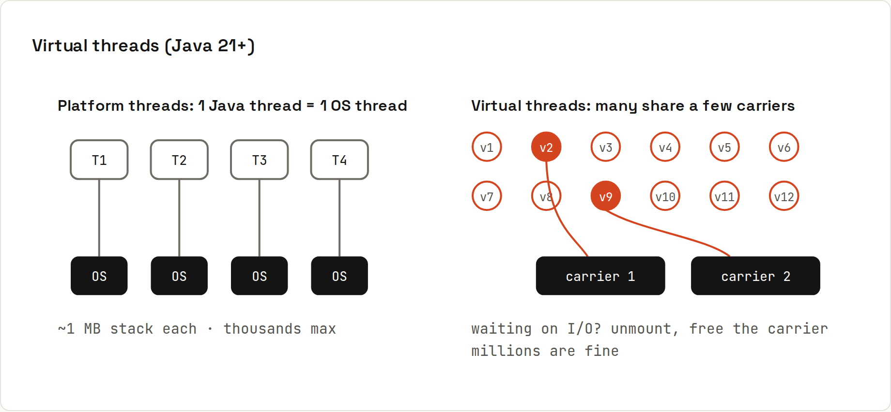

# Virtual Threads and Executors

An **executor** runs tasks on threads for you. Since Java 21, **virtual threads** make threads so cheap that you can use one per task, even for tens of thousands of concurrent blocking operations. Output from `code/java/VirtualThreads.java`.



## Platform vs virtual threads
| | Platform thread | Virtual thread |
|---|---|---|
| Backed by | one OS thread each | the JVM; mounted on a few OS "carrier" threads while running |
| Memory | ~1 MB stack reserved | a few hundred bytes, growing as needed |
| How many | thousands at most | millions |
| While blocked (I/O, sleep) | the OS thread waits | unmounted; the carrier runs other virtual threads |
| Good for | CPU-heavy work (a pool sized to the core count) | many tasks that mostly **wait** (HTTP, database, files) |

## Measured
10,000 tasks, each "calling a service" that takes 100 ms, on a 4-core machine:
```java
static String fetchUser(int id) {
    try { Thread.sleep(Duration.ofMillis(100)); }        // simulated network call
    catch (InterruptedException e) { Thread.currentThread().interrupt(); }
    return "user" + id;
}
static long run(ExecutorService executor, int tasks) {
    long t0 = System.nanoTime();
    try (executor) {
        IntStream.range(0, tasks).forEach(i -> executor.submit(() -> fetchUser(i)));
    }   // close() waits for every task to finish
    return (System.nanoTime() - t0) / 1_000_000;
}
```
```
CPU cores: 4
10000 tasks x 100 ms, fixed pool of 200 platform threads: 5036 ms
10000 tasks x 100 ms, one virtual thread per task:     170 ms
```
The pool can only wait on 200 calls at a time (10,000 / 200 × 100 ms = 5 s). Virtual threads wait on all 10,000 at once. The code is plain, blocking, easy-to-read Java: no callbacks, no reactive streams.

## Creating threads
```java
Thread vt = Thread.ofVirtual().name("pizza-oven").start(() ->
        System.out.println("running in " + Thread.currentThread().getName() + ", virtual=" + Thread.currentThread().isVirtual()));
Thread pt = Thread.ofPlatform().start(() -> System.out.println("platform thread, virtual=" + Thread.currentThread().isVirtual()));
```
```
running in pizza-oven, virtual=true
platform thread, virtual=false
```
Usually you don't create threads yourself but use an executor.

## Executors
| Executor | Use for |
|---|---|
| `Executors.newVirtualThreadPerTaskExecutor()` | blocking I/O tasks: one new virtual thread per task |
| `Executors.newFixedThreadPool(n)` | CPU-bound work; `n` ≈ number of cores |
| `Executors.newSingleThreadExecutor()` | tasks that must run one after another |
| `Executors.newScheduledThreadPool(n)` | delayed and periodic tasks (`scheduleAtFixedRate`) |
| `ForkJoinPool.commonPool()` | parallel streams, `CompletableFuture` defaults |

Since Java 19, `ExecutorService` is `AutoCloseable`: `try (var executor = …) { … }` waits for all tasks, then shuts down. Without it, call `shutdown()` + `awaitTermination()`, or the JVM may not exit.

## Guidelines for virtual threads
- **Don't pool** virtual threads: create one per task. To limit concurrency (e.g. max 10 calls to an API), use a `Semaphore`.
- **Not faster for CPU work**: computation still needs cores.
- **`synchronized` is fine since Java 24**: earlier, blocking inside `synchronized` "pinned" the carrier thread (the [Java 27 wiki](https://lfdiego.xyz/wiki/java27/) measures this: 108 ms on JDK 27 vs 25 s on JDK 21 for the same test).
- **ThreadLocal** works but copying heavy objects into millions of threads is wasteful; prefer **scoped values** (final in Java 25).
- Frameworks: Spring Boot (`spring.threads.virtual.enabled=true`), Tomcat/Jetty and Helidon can run each request on a virtual thread.

## Interrupting and timeouts
```java
Future<String> f = executor.submit(() -> fetchUser(1));
f.get(2, TimeUnit.SECONDS);   // TimeoutException if slower
f.cancel(true);               // interrupts the thread
```
Blocking methods throw `InterruptedException` when interrupted: catch it, restore the flag (`Thread.currentThread().interrupt()`), and stop.
